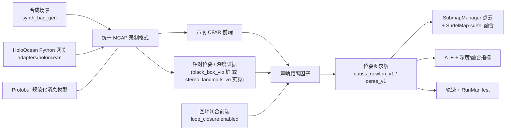
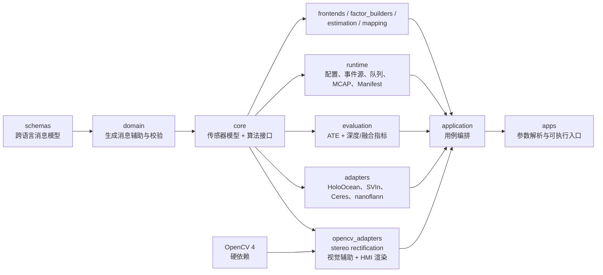
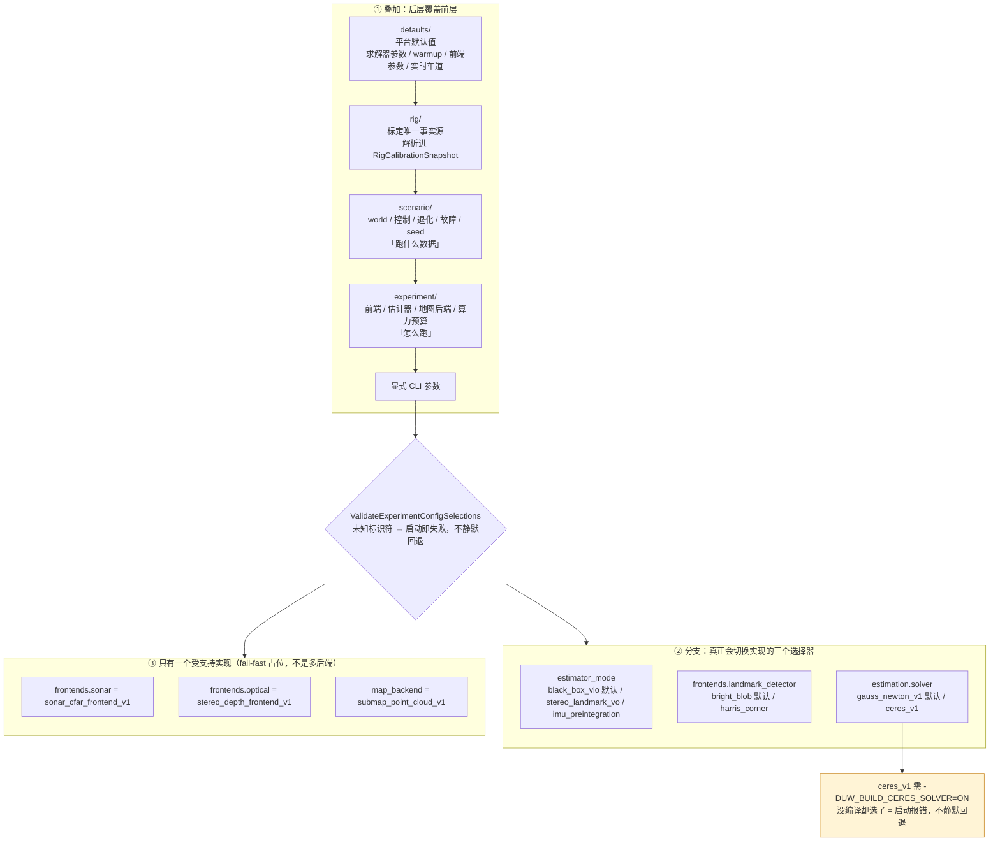

# uw_slam

> 面向水下自主平台的声学—光学融合 SLAM 工程框架

[](https://isocpp.org/)
[](https://www.python.org/)
[](https://docs.ros.org/en/jazzy/)
[](./LICENSE)

`uw_slam` 把水下 SLAM 中的核心消息与接口、传感器前端、因子构建、状态估计、地图管理、
仿真接入和评测拆成可独立演进的模块。跨语言数据统一使用 Protobuf，录制与
回放统一使用 MCAP，算法核心不依赖 HoloOcean。

## 导航

- [这个仓库是什么](#这个仓库是什么)
- [核心能力](#核心能力)
- [快速开始](#快速开始)
- [运行端到端 Demo](#运行端到端-demo)
- [架构](#架构)（含[一张图看懂代码与框架](#一张图看懂代码与框架)）
- [开发指南](#开发指南)
- [配置与外部接入](#配置与外部接入)
- [参与开发](#参与开发)
- [已知边界](#已知边界)
- [许可证与代码出处](#许可证与代码出处)
- [延伸阅读](#延伸阅读)

## 这个仓库是什么

第一次接触本仓库，建议先建立一个坐标：**一条主线** 和 **一条铁律**。

### 一条主线：离线 SLAM 管线

把传感器数据（相机/声呐/IMU/深度）录成统一的 MCAP bag（合成数据由
`apps/synth_bag_gen` 生成，真实数据由 `adapters/holoocean` 从 HoloOcean 仿真器录制），
再由 `apps/replay_demo` 回放：声呐 CFAR 前端 + 立体视觉前端 + IMU 预积分产出证据 →
因子构建 → Gauss-Newton/LM 位姿图求解（可选 Ceres 后端）→ 回环闭合（可选）→
轨迹/地图/评测指标。合成数据已端到端跑通并有确定性回放测试保护；一份真实 HoloOcean
双目录制也已能进入离线 VO 管线（其求解器尚未收敛到可作为基准的水平，见
[已知边界](#已知边界)）。

> 历史：本仓库曾并行维护第二条主线（ROV 实时驾驶辅助/闭环，面向 BlueROV2 竞赛），
> 已于 2026-09 整体剥离以聚焦声光融合 SLAM 本体；完整快照保存在
> `archive/rov-realtime-line2` 分支。

### 一条铁律

**依赖只能单向**：`domain → core → {frontends, factor_builders, estimation,
mapping, runtime, evaluation, adapters, opencv_adapters} → application → apps`。
HoloOcean、OpenCV、Ceres 等第三方头文件被隔离在 `adapters/` 各子目录里，
算法核心（`include/`、`src/` 下按角色分区的生产代码）一行都不能 include 它们。
`tools/lint/check_no_ros_in_core.sh` 在 CI 和本地验证里强制检查这条不变量。
具体见[架构](#架构)一节。

想先看图再读字，直接跳到[一张图看懂代码与框架](#一张图看懂代码与框架)。

当前仓库整体处于“骨架 + 每层至少一条真实可跑的端到端链路”阶段，不是生产系统。
每项能力的真实状态（包括没做完的）见[核心能力](#核心能力)表和[已知边界](#已知边界)。

## 核心能力

| 能力 | 当前实现 | 状态 |
|---|---|---|
| 核心消息与接口 | Protobuf 提供跨语言规范化消息模型（观测、量测证据、因子、状态、地图、健康、目标航迹、标定，`schemas/proto/uw/domain/`）；`measurement_api` 提供算法接口 | 已实现并有跨模块 round-trip 测试 |
| 声呐前端 | CFAR 检测、极坐标转换、DBSCAN 聚类；声呐目标提取（多目标检测 + 配置驱动参数校验） | 已实现并有固定 fixture 回归测试 |
| 光学相对位姿 | 立体特征点 VO：blob/Harris 双模检测 + NCC 匹配 + RANSAC 刚体拟合，从左右相机帧实时算相对位姿；RANSAC 拟合附带数值 SE(3) 协方差，白化进 relative-pose 因子 | 已实现并接入 Demo（`estimator_mode: stereo_landmark_vo`）；跟踪失败按健康状态分级，单帧失败不丢失参考 keyframe |
| 回环闭合 | `LoopClosureFrontend`：位姿邻近候选检索 + 立体三角化 + 重访匹配 + RANSAC + Huber 稳健损失 | 已实现并接入 `replay_demo`（`defaults` 层 `loop_closure.enabled`，默认关）；v1 是位姿邻近检索而非外观检索（无 DBoW2），固定用 Harris 检测器，见[回环闭合 Demo](#4-回环闭合对比-demo) |
| 声光深度融合 | 声呐弧投影、跨模态关联、后验深度优化、局部点云/surfel 地图交接 | 已实现九场景矩阵；CTest 强制执行最低有效覆盖 gate，质量收益与延迟 gate 仍为 opt-in |
| 状态估计 | Eigen 手写 Gauss-Newton/LM（默认）；Ceres 适配器（`estimation.solver: ceres_v1`，需 `-DUW_BUILD_CERES_SOLVER=ON`）作为基准候选项 | 已实现；求解器可切换但默认未换——切换默认值要等 `tools/bench/solver_benchmark.sh` 的实测数据 |
| 地图与评测 | `SubmapManager`（点云子图）+ `SurfelMap`（置信度加权 surfel 融合、离群抑制、自由空间挖掘，nanoflann 空间索引适配器）；ATE、深度/融合和点云 Chamfer/completeness/outlier/F-score 指标 | ATE/深度/融合已用于现有验证；点云指标已有 API/单测但尚未接 Demo 或门禁；尚无 RPE |
| 可复现实验 | 四层 YAML 配置、不可变 `RunManifest`、确定性 MCAP 回放 | Manifest 已写 git/config/标定 hash、平台、seed 和起止时间；完整数据/依赖 provenance 仍待补齐 |
| 仿真接入 | HoloOcean Python 网关、统一 MCAP 格式录制、相机标定、版本化实时场景/任务 manifest（`adapters/holoocean/scenarios/`） | 已在原生 Windows HoloOcean 2.3.0 录制真实双目 bag 并离线回放；当前 Linux 开发机未重新运行仿真器 |

主要技术栈：

| 范围 | 技术 |
|---|---|
| 算法与运行时 | C++17、Eigen、yaml-cpp、OpenCV 4（硬依赖，经 `opencv_adapters` 边界接入） |
| 核心消息与接口 | Protobuf、`measurement_api` |
| 录制与回放 | MCAP |
| 仿真与数据集适配 | Python 3.10+、HoloOcean |
| 候选求解器 | Ceres（可选构建 `-DUW_BUILD_CERES_SOLVER=ON`）、nanoflann（FetchContent，总是启用） |
| 构建与验证 | CMake 3.22+、CTest、GoogleTest、pytest |

## 快速开始

以下流程不需要 HoloOcean 或 Unreal Engine。它会构建项目、运行 C++/Python
测试、检查依赖规则、生成合成 MCAP，并运行回放 Demo。

### 1. 准备环境

推荐 Linux 开发环境。基础依赖包括：

- CMake 3.22+、支持 C++17 的 GCC；
- Eigen3、Protobuf/`protoc`、GoogleTest、yaml-cpp、OpenCV 4（`core`、`calib3d`、`imgproc`）；
- Python 3.10+、`venv` 和 `pip`；
- 首次配置时可访问网络，以获取 MCAP C++ SDK 和 nanoflann（FetchContent）。

仓库提供了 apt 优先、conda-forge 回退的安装助手：

```bash
./tools/setup_dev_env.sh
```

如果脚本使用 conda 回退路径，请按其输出把 `uw_slam_build` 环境的 `bin` 目录
加入 `PATH`。yaml-cpp 不在该脚本当前的自动安装列表中，系统缺少它时需通过 apt
安装 `libyaml-cpp-dev`，或用下面的命令补全 conda 构建环境；该示例保留现有依赖并
显式安装新的 OpenCV 硬依赖。conda-forge 上不加版本号的 `opencv` 已解析到 5.x，
与 `find_package(OpenCV 4 REQUIRED ...)` 不兼容，必须显式钉住 `opencv=4.*`：

```bash
conda install -n uw_slam_build -c conda-forge \
  eigen libprotobuf protobuf gtest yaml-cpp "opencv=4.*" cmake
```

### 2. 一键验证

```bash
tools/verify_pipeline.sh --out-dir /tmp/uw_slam_verify/readme_smoke
cat /tmp/uw_slam_verify/readme_smoke/summary.txt
```

验证目录会保存每一步的命令、日志、耗时和状态，并产出：

| 产物 | 内容 |
|---|---|
| `summary.txt` | 构建、测试、lint、数据生成和回放结果 |
| `synthetic.mcap` | 带 ground truth 的合成观测 |
| `demo_trajectory.tum` | TUM 格式估计轨迹 |
| `demo_run_manifest.json` | 本次运行实际使用的配置与版本信息 |

C++/Python 测试的用例数量随代码持续变化，`summary.txt` 和实际测试命令才是最终
依据，本 README 不固化具体数字。

## 运行端到端 Demo

希望逐步调试时，可以手动执行同一条管线。

### 构建

使用系统依赖：

```bash
cmake -S . -B build
cmake --build build -j"$(nproc)"
```

使用 `uw_slam_build` conda 环境：

```bash
export PATH="$HOME/miniconda3/envs/uw_slam_build/bin:$PATH"
cmake -S . -B build \
  -DCMAKE_PREFIX_PATH="$HOME/miniconda3/envs/uw_slam_build"
cmake --build build -j"$(nproc)"
```

可选构建开关（都默认关闭）：

| 开关 | 作用 | 前置条件 |
|---|---|---|
| `-DUW_BUILD_CERES_SOLVER=ON` | 编译 `adapters/ceres` 的 `ceres_v1` 求解器适配器 | `CMAKE_PREFIX_PATH` 上有 Ceres（conda-forge 可装；依赖较重：SuiteSparse/glog/gflags） |
| `-DUW_SANITIZER=address` / `thread` | ASan+UBSan / TSan 插桩 | TSan 有已知假阳性，见 [CLAUDE.md](./CLAUDE.md) 的记录 |
| `-DUW_COVERAGE=ON` | gcov 覆盖率插桩 | 配合 `tools/run_quality_checks.sh coverage` |

构建产物在 `build/bin/` 下，全部可执行入口：

| 可执行 | 作用 |
|---|---|
| `synth_bag_gen` | 合成 MCAP bag 生成器（轨迹 + 声呐/相机/证据/GT） |
| `replay_demo` | 离线回放主链：MCAP → 前端 → 因子图 → 求解 → 轨迹/地图/评测 |
| `synth_stereo_gen` | 单帧静态场景立体图 + GT 深度网格生成器（光学基线评测用） |
| `optical_baseline_eval` | 光学基线评测：`StereoOpticalDepthFrontend` 对合成深度打分 |
| `acoustic_optic_scenario_matrix` | 声光融合九场景矩阵（真实组件端到端接线，无 MCAP 往返） |
| `bag_audit` | 规范化 bag 审计：topic 存在性、计数、时戳单调性、TF 链解析 |

### 1. 默认合成场景（ground-truth+noise 桩）

```bash
build/bin/synth_bag_gen \
  --experiment configs/experiment/synthetic_smoke.yaml \
  --out /tmp/synthetic.mcap

build/bin/replay_demo \
  --bag /tmp/synthetic.mcap \
  --experiment configs/experiment/synthetic_smoke.yaml \
  --out /tmp/demo

cat /tmp/demo_trajectory.tum
```

在默认合成场景中，求解器通常在 4–7 次迭代内收敛，ATE RMSE 约为
0.08–0.10 m（2026-08-26 起；此前记录的 0.06–0.07 m 是 `synth_bag_gen` 三路
噪声共享一个 RNG、彼此消耗顺序意外耦合产生的某次具体实现，见下方「已经踩过的
坑」，拆成独立流后这是新基线）；不同 seed 会产生波动，这不是验收阈值。声呐只
有距离而没有仰角，且当前版本不联合优化路标，首次观测的 elevation 误差会影响
x/y 估计。算法与误差来源详见[代码库参考文档](./docs/uw-slam-codebase-reference-2026-08-18.md)
（该文档记录的具体数字是拆流前的旧基线，未逐一回填）。

命令行参数会覆盖 `--experiment` 中的同名配置，适合快速做单变量试验。

### 2. 立体 VO 变体（相对位姿从图像实时算）

把 `--experiment` 换成 `configs/experiment/synthetic_smoke_vo.yaml` 可以跑同一场景
的 `estimator_mode: stereo_landmark_vo` 变体——相对位姿因子改由
`stereo_landmark_vo_frontend` 从合成的左右相机帧实时计算，而不是从 bag 里读取
`synth_bag_gen` 写入的 ground-truth+noise 证据；ATE 量级与默认桩相当（约
0.10 m）。

### 3. 声光融合 Demo

`configs/experiment/acoustic_optic_demo.yaml` 用同一条 `synth_bag_gen`/
`replay_demo` 管线跑一个声光目标真正落在相机窄视场内的场景
（`configs/scenario/acoustic_optic_demo.yaml`），产出真实的 `ACCEPTED` 声光关联，
并开启 `min_acoustic_optic_accepted`/`min_acoustic_optic_map_points` 两个非零 gate
（seed 42 实测 12 个 keyframe 中 3 个 accepted / 3 个 acoustic-optic map point）；默认
`synthetic_smoke.yaml` 的三个目标不在相机视场内，这两个 gate 保持关闭，见
[配置说明](./configs/README.md) 的「P0 非放空 gate」一节。九场景矩阵（含刻意构造的
故障/退化场景及其预期拒绝）由 `acoustic_optic_scenario_matrix` 承载，CTest 里有对应
的确定性 + 最低有效覆盖 gate 测试。

### 4. 回环闭合对比 Demo

```bash
# 同一份 bag，两个 experiment，唯一区别是 defaults 里 loop_closure.enabled
build/bin/synth_bag_gen \
  --experiment configs/experiment/synthetic_loop_closure_vo.yaml \
  --out /tmp/loop.mcap

build/bin/replay_demo --bag /tmp/loop.mcap \
  --experiment configs/experiment/synthetic_loop_closure_vo.yaml --out /tmp/loop_off
build/bin/replay_demo --bag /tmp/loop.mcap \
  --experiment configs/experiment/synthetic_loop_closure_vo_enabled.yaml --out /tmp/loop_on
```

场景是一整圈回到起点的合成轨迹（同一批 landmark 会被真正重访）。实测（production
默认参数，2026-08-26 起，`synth_bag_gen` 拆分独立 RNG 流之后的新基线）：关闭回环
ATE rmse≈0.4805 m（48/48 matched）；开启后找到 2 条回环边，ATE≈0.4754 m——改善依然
很小，纯 VO 死推算一整圈的漂移本来就比短弧场景大得多，回环 v1 的位姿邻近检索
（`candidate_search_radius_m=3.0`）在这个量级的死推算漂移下能找到的候选依然有限，
这本身是 v1 边界而不是 bug（此前记录的 1.261m/1 条边是拆流前旧噪声实现下的具体
数字，方向性结论不变）。手工放宽搜索半径反而让 ATE 恶化到 9.24 m（Harris 角点
跟合成高亮图案不是同一套外观假设，错误匹配数量多到 Huber 压不住——这个对照实验
数字是旧基线下测的，未重新验证），完整记录见
`configs/experiment/synthetic_loop_closure_vo_enabled.yaml` 头部注释和
[配置说明](./configs/README.md) 的「回环闭合对比 demo」一节。回环闭合要求
`estimator_mode: stereo_landmark_vo` 且 rig 带相机，默认关闭。

### 5. 真实数据：HoloOcean 录制

`configs/experiment/real_holoocean_vo.yaml` 用于回放已有的真实 HoloOcean 双目录制
（约 76 MB、50 个 keyframe，不含声呐/IMU/DVL）。2026-08-23 复核实测产出 46 条 VO
相对位姿、47 个 keyframe，对齐后 ATE RMSE 为 `4.32138 m`，求解器 30 次迭代后仍
`stalled`。根因已定位到具体机制但未修复：这台真实机体左右相机的标定基线不是纯 y 轴
平移（见 `configs/rig/example_auv_real_camera.yaml` 头部注释，x/z 分量占基线量级的
15-17%），`cv::stereoRectify` 为满足行对齐约束必须对两个相机施加一个不小的旋转，
这个旋转把 left 相机主点从标定值 `cx≈256` 搬到 `cx≈170`（用 `alpha=-1` 复核过，
与裁切策略无关，也不是实现 bug）。`stereo_landmark_vo_frontend` 的 Harris
角点/时序匹配/RANSAC 只在近乎平行基线的合成数据上验证过，在这组主点大幅偏移、需要
真实旋转对齐的真实标定上表现变差——跟 `camera_rectifier` 此前因双线性重采样削弱
纹理被搁置的已知风险是同一类问题，需要后续联合调参才能恢复，详见
[生产就绪度路线图 2.4 节](./docs/archive/uw-slam-production-readiness-and-roadmap-2026-08-21.md#24-真实-holoocean-录制回放)
的复核记录。这证明录制数据能进入离线 VO 管线，不代表真实重建已经跑通。

### 6. 求解器基准（可选）

`configs/experiment/synthetic_stress.yaml`（1000 keyframe、无相机 rig）和
`synthetic_smoke_ceres.yaml`/`synthetic_stress_ceres.yaml`/`real_holoocean_vo_ceres.yaml`
（`estimation.solver: ceres_v1`）服务于 gauss_newton_v1 vs ceres_v1 的对比：

```bash
cmake -S . -B build -DUW_BUILD_CERES_SOLVER=ON \
  -DCMAKE_PREFIX_PATH="$HOME/miniconda3/envs/uw_slam_build"   # 需先 conda 装 ceres
cmake --build build -j"$(nproc)"
tools/bench/solver_benchmark.sh            # 打印对比表；不是 pass/fail gate
```

基准脚本跑 smoke（12 keyframe）/ stress（1000 keyframe）两档，可选加真实 bag；
“默认求解器要不要换”是架构文档第 20 节明确记录的延后决策，要靠这份基准数据关闭。

## 架构

### 一张图看懂代码与框架

下图把两件事画在一起：**① 分层架构与允许的依赖方向**（lint 强制，不是示意）、
**② 离线 SLAM 管线的数据流**。
本节后面的 Mermaid 图是它的分解视图，需要跳转到具体模块时再看。

[](./docs/architecture.png)

> 图中依赖方向来自 `tools/lint/check_layer_dependencies.py` 的 `ALLOWED` 表和
> `cmake/Libraries.cmake` 的 target 链接关系；核对基准 2026-09-04。点击可看大图。

### 离线数据流



### 依赖方向



依赖只允许从左向右（`domain → core → {frontends, factor_builders, estimation,
mapping, runtime, evaluation, adapters, opencv_adapters} → application → apps`）。`include/`、`src/` 下的生产
代码不能包含 HoloOcean 或第三方 vendor 头文件，也不能使用旧的手写 `uw/...`
include 路径。OpenCV 4 是构建硬依赖，`opencv2/...` 头与 OpenCV 类型只允许出现在
`adapters/opencv/`（lint 角色名 `opencv_adapters`）边界内；Ceres 只允许出现在
`adapters/ceres/`；nanoflann 只允许出现在 `adapters/spatial_index/`。
`tools/lint/check_no_ros_in_core.sh`（实际实现在
`tools/lint/check_layer_dependencies.py`）会强制检查这一切。Protobuf schema 是
C++ 与 Python 跨语言规范化消息模型的唯一来源。

几个边界内已实现的组件：

- `opencv_adapters::StereoRectificationContext`（`adapters/opencv/include/opencv_adapters/stereo_rectifier.hpp`）：
  任意 plumb-bob 畸变、不同内参、非平行/非水平的一般离轴 stereo rig 的 rectify，
  产出 rectified images 和带新 `calibration_version` 的 derived
  `RigCalibrationSnapshot`，已接入 `apps/replay_demo`。
- `adapters/ceres` 的 `ceres_v1` 求解器与 `adapters/spatial_index` 的 nanoflann
  `SurfelSpatialIndex`：`estimation`/`mapping` 层只见纯虚接口，实现在 `adapters`
  层注入（`application` 负责把两边接到一起）。

### Live/Replay 统一输入主链

`apps/replay_demo` 不对同一个 MCAP 文件按 topic 多次扫描、也不再用时间差反推
keyframe id——一次 `uw::runtime::McapEventSource` 顺序扫描（按 `logTime` 排序，未知
topic/schema 不匹配/payload 解析失败都计入 `EventSourceReport`，不会静默丢失）
把 bag 拆成规范化的 `uw::runtime::CanonicalEvent`，经
`uw::application::PumpEvents` 分发进 `PipelineInputPort`；`replay_demo` 用的
实现是 `ReplayInputAccumulator`（`include/application/replay_input_accumulator.hpp`），
身份只认 wire 里的 `ObservationId`/`MeasurementEvidence.source_observations`，
空 id、`(sensor_id, observation_id)` 重复、evidence 引用不存在的 source
observation 都进 `ReplayInputDiagnostics` 并使整个 run 以非零退出码失败。

这套 `EventSource`/`PipelineInputPort` 接口与来源无关——`tests/integration/
event_source_parity_test.cpp` 验证同一批事件经 MCAP 与内存两种 `EventSource`
注入，应用侧观察到的顺序完全一致。**已完成**：规范事件契约（`CanonicalEvent`/
`canonical_topics.hpp`）、MCAP `EventSource`、与来源无关的
`PipelineInputPort`/`PumpEvents`、`replay_demo` 输入阶段的迁移。
**尚未完成**：供应商 SDK 直连的 `EventSource` 实现、Start/Stop/Drain 完整生命
周期、异步 recorder tap 的成品化。新代码不允许绕过 `PipelineInputPort` 直接用
`ReadMcapMessages<T>`/vendor SDK 消息喂给算法层——`ReadMcapMessages<T>` 本身仍
保留给 `bag_audit` 等评测/审计工具用，但不再是 replay 主链的入口。

规范 topic 词表（`include/runtime/canonical_topics.hpp`，也是 bag 审计的依据）：

| Topic | 消息 |
|---|---|
| `/raw/camera/left`、`/raw/camera/right` | `uw.domain.ImageFrame` |
| `/raw/sonar_frame` | `uw.domain.SonarFrame` |
| `/raw/imu`、`/raw/dvl`、`/raw/vehicle_state` | `uw.domain.ImuSample` / `DvlSample` / `VehicleState` |
| `/evidence/depth`、`/evidence/relative_pose` | `uw.domain.MeasurementEvidence` |
| `/evidence/map` | `uw.domain.MapEvidence` |
| `/health` | `uw.domain.HealthReport` |
| `/gt/state` | `uw.domain.StateSnapshot`（仅评测支路可消费，`CanonicalTopicRole::kReferenceOnly`） |

### 坐标系与符号约定

两条最容易踩的约定，画在同一张图上对照看：


- `PressureDepthMeasurement.depth_m` 是**正向下**的水深，而 world/body 是 Z-up，
  所以位姿 `z = -depth_m`；`OpticalDepthPriorMeasurement`/`FusedDepthMeasurement`
  以及关联记录里的 `depth_m` 则是相机 optical frame 的**正向前**距离。**同名字段、
  不同坐标与符号语义，不要直接混用。**
- 从相机系解出的相对位姿要用 rig 标定的 camera→body 外参做共轭
  `T_body = T_cam_body · T_cam · T_cam_body⁻¹`，才能喂给以 body frame 定义的相对
  位姿因子。方向搞反时单元测试全绿、实跑 ATE 停在 6.67 m 不收敛。

### 仓库结构

| 目录 | 职责 |
|---|---|
| `schemas/proto/` | 跨语言规范化消息模型和 C++/Python 代码生成输入 |
| `include/`、`src/` | 手写 C++ 公共头文件与实现，按角色分区（`domain`、`sensor_models`、`measurement_api`、`frontends`、`factor_builders`、`estimation`、`mapping`、`runtime`、`evaluation`、`adapters`、`application`） |
| `apps/` | 可执行入口源码（见上文入口表）；可复用算法和用例编排分别位于对应层与 `application` 层 |
| `tests/` | 消息格式与接口一致性（`contracts/`）、按层单元测试（`{core,frontends,factor_builders,estimation,mapping,runtime,evaluation,adapters}/`）、集成/确定性回放（`integration/`）、lint 自测（`lint/`）与工具测试（`tools/`） |
| `cmake/` | 集中式 CMake：`Dependencies.cmake`、`Libraries.cmake`、`Applications.cmake`、`Tests.cmake` |
| `adapters/holoocean/` | HoloOcean Python 网关（仿真录制 → 规范化 MCAP） |
| `adapters/wit_imu/` | HWT9053-485 外挂 IMU 数据链（真实硬件） |
| `adapters/opencv/`、`adapters/ceres/`、`adapters/spatial_index/` | OpenCV / Ceres / nanoflann 的边界隔离实现 |
| `baselines/` | 外部基线（如 `sonar_camera_reconstruction`）运行脚本，不链接进本仓库构建 |
| `configs/` | `defaults → rig → scenario → experiment` 分层配置 |
| `tools/` | 环境安装、代码生成、lint、求解器基准（`bench/`）和完整验证脚本 |
| `docs/` | 文档中心、架构/参考/路线图文档、`archive/` 历史过程记录 |
| `external_repos/` | 只读参考/移植来源，不纳入本仓库版本控制 |

## 开发指南

### C++ 测试

```bash
cmake --build build -j"$(nproc)"
ctest --test-dir build --output-on-failure
```

测试分层：

- **消息格式与接口一致性测试**（CTest 标签 `contract.*`，源码在 `tests/contracts/`）：
  验证 Protobuf round-trip 和模块边界；
- **单元测试**（`unit.<layer>.*`，源码按层放在
  `tests/{core,frontends,factor_builders,estimation,mapping,runtime,evaluation,adapters}/`）：
  验证前端、因子雅可比、求解器、地图、运行时和评测；`tests/lint/` 是 lint 脚本自身的测试；
- **集成/回放测试**（`integration.*`，源码在 `tests/integration/`）：确定性回放（同一
  bag/config/seed 运行两次，输出必须逐字节一致）、事件源一致性、两个实时冒烟 app、
  光学基线冒烟、声光场景矩阵确定性 + 最低有效覆盖 gate。

### Python 适配器测试

```bash
# HoloOcean 网关（不需要 HoloOcean 安装；详见 adapters/holoocean/README.md）
cd adapters/holoocean
python3 -m venv .venv
.venv/bin/pip install -e ".[dev]"
../../tools/codegen/gen_py.sh        # 生成 schema_pb2/（未入库）
.venv/bin/python -m pytest tests
cd ../..

```

如果修改了 Protobuf schema，先重新生成 Python 绑定再跑 HoloOcean 侧测试（CI 也在
pytest 前重生成）。

### 架构约束检查

```bash
tools/lint/check_no_ros_in_core.sh
```

提交改动前，推荐直接运行完整验证：

```bash
tools/verify_pipeline.sh
```

额外质量检查使用独立构建目录，不会覆盖普通 `build/`：

```bash
tools/run_quality_checks.sh sanitizer       # ASan + UBSan，全量 CTest
tools/run_quality_checks.sh coverage        # gcov 摘要；目前只报告、不设覆盖率门槛
tools/run_quality_checks.sh static-analysis # cppcheck；未安装时跳过，目前不作为失败 gate
```

TSan 可通过 `-DUW_SANITIZER=thread` 手动构建，但当前预编译 protobuf/gtest 未插桩会
产生已知假阳性，因此尚未接入 CI。

未显式指定 `--out-dir` 时，日志写入
`${TMPDIR:-/tmp}/uw_slam_verify/<timestamp>/`。

## 配置与外部接入

### 分层配置

配置按以下顺序合并：

```text
defaults → rig → scenario → experiment → 显式 CLI 参数
```

下图把两件容易混淆的事分开画：**叠加**（四层 YAML，后层覆盖前层）与**分支**（真正
会切换实现的三个选择器）。写错标识符不会静默按硬编码管线跑，而是启动即失败。



| 层 | 描述内容 |
|---|---|
| `defaults/` | 平台级默认：求解器与迭代参数、warmup、reliability 信息上限、各前端参数、回环闭合开关 |
| `rig/` | 具体载体的传感器内外参与噪声模型（解析进 `RigCalibrationSnapshot` protobuf） |
| `scenario/` | world、控制、退化、故障和随机 seed——描述"跑什么数据" |
| `experiment/` | 前端、估计器、可靠性策略、地图后端和算力预算——描述"怎么跑" |

`experiment/*.yaml` 里的 `rig`/`scenario`/`defaults` 路径相对 `configs/` 目录解析
（不是相对 experiment 文件所在目录）。`replay_demo` 会按配置校验所有选择器，
未知值启动即失败（不会静默按硬编码管线跑）。当前**真正驱动分支**的三个选择器：

| 字段 | 可选值 | 说明 |
|---|---|---|
| `estimator_mode` | `black_box_vio`（默认）/ `stereo_landmark_vo` / `imu_preintegration` | 相对位姿证据来源：桩 / 从图像实时算 / IMU 预积分边（PREP-B-01，按 `/keyframe/boundary` 切区间） |
| `frontends.landmark_detector` | `bright_blob`（默认）/ `harris_corner` | 立体 VO 内部检测器：合成高亮块 vs 真实图像纹理 |
| `estimation.solver` | `gauss_newton_v1`（默认）/ `ceres_v1` | 位姿图求解后端；`ceres_v1` 需 `-DUW_BUILD_CERES_SOLVER=ON`，选了但没编译会启动报错 |

仍只有一个受支持实现的字段：`frontends.sonar`（`sonar_cfar_frontend_v1`）、
`frontends.optical`（`stereo_depth_frontend_v1`）、`map_backend`
（`submap_point_cloud_v1`）。字段明细见[配置说明](./configs/README.md)。

### HoloOcean Python 网关

`adapters/holoocean/` 把 HoloOcean 观测写成与 C++ 回放一致的 MCAP/Protobuf 格式。
坐标变换、确定性随机化、时间语义、统一格式写入器都有测试；需要真实 HoloOcean 的
入口（`HoloOceanSession`）写完但未在本机实测（本机没有 HoloOcean/UE5）。安装和
代码生成步骤见 [HoloOcean 适配器文档](./adapters/holoocean/README.md)。

## 参与开发

在提交修改前，请遵守这些项目不变量：

1. **不要修改 `external_repos/` 的子仓库。** 它们是只读参考和移植来源。
2. **保持单向依赖。** `domain → core → {frontends, factor_builders, estimation,
   mapping, runtime, evaluation, adapters, opencv_adapters} → application → apps`；
   第三方库只进 `adapters/` 对应边界。
3. **先改 schema。** 新增跨语言规范化消息字段时修改 `schemas/proto/`，不要在 C++ 与
   Python 中维护两套平行结构。
4. **保留代码出处。** 移植第三方实现前先阅读 [`NOTICE`](./NOTICE)，保留版权头并
   补充来源、移植范围和有意排除的内容。
5. **保证确定性。** 随机数使用显式 seed 和局部 RNG，不使用隐藏的全局随机状态。
6. **验证完整路径。** 至少运行相关单元测试和依赖 lint；影响管线时运行
   `tools/verify_pipeline.sh`；不要只信单元测试——本仓库多个关键 bug（z 轴 anchor、
   相机→body 外参方向）都是单元测试全绿、实跑 demo 才发现的，见
   [CLAUDE.md](./CLAUDE.md) 的「已经踩过的坑」。

新增 frontend 或 factor builder 时，把头文件放进 `include/frontends/`（或
`include/factor_builders/`）、实现放进 `src/frontends/`（或 `src/factor_builders/`）、
测试放进 `tests/frontends/`（或 `tests/factor_builders/`），并把新文件加进
`cmake/Libraries.cmake`/`cmake/Tests.cmake` 中对应架构层 target 的源文件列表——这些
target 按架构层合并，不要为单个实现新建 target 或 `CMakeLists.txt`。更多工程约定和
已经踩过的坑见 [`CLAUDE.md`](./CLAUDE.md)。

## 已知边界

- **位姿图估计不消费稠密光学深度**：位姿图只用声呐、相对位姿、深度（和可选回环）
  证据；声光融合的输出是并行存进地图层的证据（点云 submap + surfel），不参与位姿
  估计。`stereo_landmark_vo` 是纯视觉里程计，不融合 IMU，也不是完整的 VIO 前端。
- **回环闭合 v1 是位姿邻近检索**：没有外观检索（DBoW2 类）；候选半径默认 3 m，
  在死推算漂移大的场景很难触发；固定用 Harris 检测器，与合成高亮图案外观假设不
  匹配（见回环 Demo 一节）。`platform_loop_closure.yaml` 默认关，保证其余
  experiment 零行为变化。
- **求解器默认仍是 Eigen 手写 Gauss-Newton/LM**：Ceres 适配器（`ceres_v1`）已存在
  并可切换，但默认值切换要等 `tools/bench/solver_benchmark.sh` 的基准数据；GTSAM
  未接入。
- **`map_backend` 仍只有一个受支持值**：`SurfelMap` 已经存在并被声光地图桥使用，
  但它不是 `map_backend` 的第二个可选值——配置层面还切换不了。
- **位姿图只优化 keyframe，不联合优化路标**；声呐 elevation 初值不会被后续因子精化。
- **reliability 多路信息上限目前只实现固定常数**，尚未实现完整的自适应策略。
- **真实 HoloOcean bag 的 VO 尚未收敛**（ATE 4.32 m，根因见 Demo 一节）。
- **`camera_rectifier` 是有限去畸变原语**（平行基线假设下逐目 plumb-bob 去畸变），
  未接入 `replay_demo`；`replay_demo` 现在用的是 `opencv_adapters` 的一般双目
  rectification，不依赖这个原语。在现有真实 bag 上直接启用旧原语会因重采样削弱
  纹理而降低 VO 跟踪率（50/50 → 8/50），仍需联合调参。
- **点云指标（Chamfer/completeness/outlier/F-score）已有 API/单测但尚未接 Demo 或
  门禁**；尚无 RPE 指标。

## 许可证与代码出处

本项目采用 [GNU GPL v3](./LICENSE)。整体使用 GPLv3，是因为声呐距离因子的部分残差
公式移植自 GPLv3 的 SVIn。声呐 CFAR 前端的部分实现来自 MIT 许可的
`sonar_camera_reconstruction`。

每一处移植的文件、上游版本、保留内容和有意排除的内容均记录在
[`NOTICE`](./NOTICE)。使用或继续移植这些实现前，请先核对该文件。

## 延伸阅读

建议按任务选择文档（[文档中心](./docs/README.md) 有完整的路由表和权威范围说明）：

| 想了解的内容 | 文档 |
|---|---|
| 不确定应该先读哪份文档 | [文档中心](./docs/README.md) |
| 作为新贡献者第一次读代码、理清调用链 | [新人上手指南](./docs/uw-slam-newcomer-guide.md) |
| 逐阶段读懂离线 SLAM 管线（主线一）的机制与数学 | [离线 SLAM 管线深度走读](./docs/uw-slam-offline-slam-pipeline-deep-dive-2026-08-28.md) |
| 不读代码，先弄懂这套系统在做什么 | [两条主线通俗讲解](./docs/两条主线通俗讲解-2026-08-28.md) |
| 两条主线各自用了什么估计理论、为什么这么选 | [声光融合 SLAM 技术剖析](./docs/声光融合SLAM技术剖析-2026-08-28.md) |
| 长期模块边界、状态机、可靠性和 Gate 设计 | [声光 SLAM 平台架构](./docs/acoustic-optic-slam-platform-architecture-2026-08-17.md) |
| 当前代码里实际存在的类型、算法和数据流 | [代码库参考](./docs/uw-slam-codebase-reference-2026-08-18.md) |
| 验证某个功能、该加载什么环境 | [测试与验证指南](./docs/testing-and-verification-guide-2026-08-20.md) |
| ROV 竞赛牵引的一年期平台路线 | [ROV 平台落地路线图](./docs/ROV平台落地路线图.md) |
| 合同平台参数与到货前准备工作 | [ROV 平台到货前准备工作规格](./docs/ROV平台到货前准备工作规格-2026-09-02.md) |
| 某个设计当初为什么这么定（实施计划、代码审查、早期方案） | [docs/archive/](./docs/archive/) 历史过程记录 |
| 配置字段与覆盖关系 | [配置说明](./configs/README.md) |
| HoloOcean Python 入口 | [HoloOcean 适配器](./adapters/holoocean/README.md) |
| 外部参考仓库的拉取与角色 | [外部仓库说明](./external_repos/README.md) |
| 移植许可证与 provenance | [NOTICE](./NOTICE) |
| 仓库开发约定与工程陷阱 | [CLAUDE.md](./CLAUDE.md) |

> 提示：代码库参考（2026-08-18 版）最后核对于 2026-08-22；此后变更以本 README、
> 深度走读和源码为准。`docs/archive/` 下的内容是历史过程记录，其中的数字与任务
> 状态不代表现状（包括主线二剥离前的实时闭环相关记录）。
