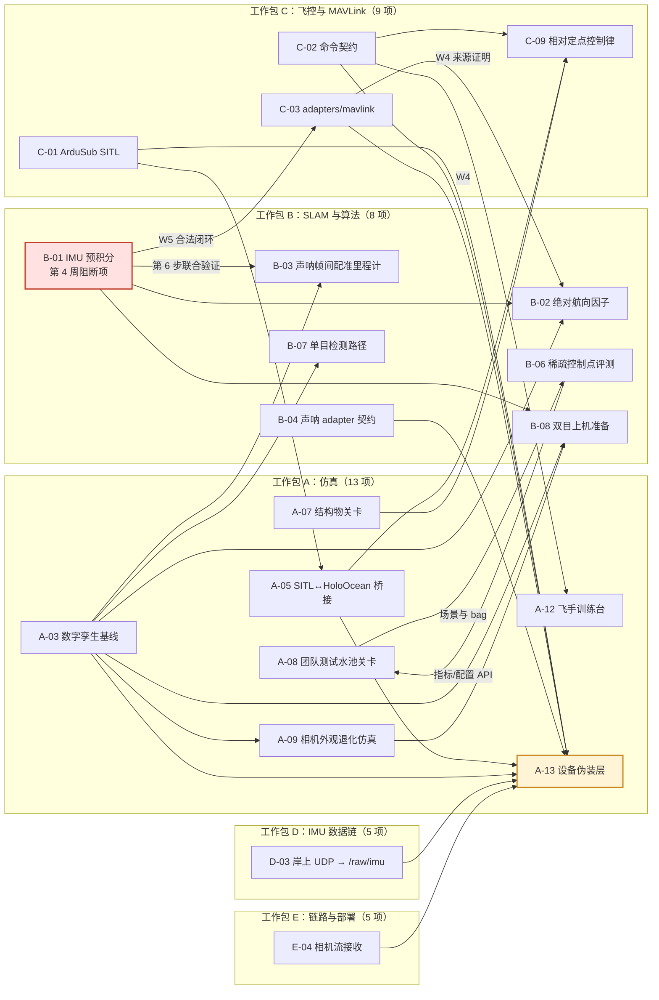

# ROV 平台到货前准备工作规格

> 2026-09-07 注记：仓库主线二（ROV 实时闭环/在线辅助，含 `OnlineAssistPipeline`、
> `/cmd/*` 控制话题链）已整体剥离，快照在 `archive/rov-realtime-line2` 分支。本规格
> 中涉及这些模块的任务（PREP-C-02 等）暂停，硬件/标定/IMU/相机/声呐准备类任务不受
> 影响（其中 PREP-B-06 稀疏控制点评测的实现与文档也已移除）；文中的实现
> 描述以该归档分支为准。

> 状态：草案 v1.3 · 2026-09-03 · 第四周范围与验收边界已复审
> 输入依据：`docs/ROV平台参数.md`（合同技术附件转写）、团队决策（HWT9053-485 外挂 IMU；供应商不做任何算法优化；**后续会另行挂载一套双目相机**，型号与时间待定；**DVL 后期也不加装**）
> 修订：v1.1 2026-09-02——D-1 改为分阶段表述，A-03 改为单/双目可配，新增 PREP-B-08 双目上机准备与双目带宽策略；v1.2 2026-09-02——PREP-B-03 展开为六步实施方案，新增 PREP-A-13 设备伪装层，DVL 排除，PREP-F-01 已执行，全文审校（任务计数、排期、若干技术细节修正）；v1.3 2026-09-03——第四周复审：统一“已实现/已本地验证/已外部验证”状态，B-01 禁止真值/旧 VO 提示进入算法路径，B-02 增加航向来源证明，C-03/A-13 按周拆分，修正 A-08/B-06 依赖并恢复 A-06 排期。
> 上游文档：`docs/ROV平台落地路线图.md`（一年期路线图）、`docs/specifications/` 三份在线系统规格
> 本文档只覆盖"平台到货之前、不依赖实物就能做"的工作；到货后的水池闭环仍以路线图第 5 节为准。

---

## 0. 文档定位

合同签的是一台标准 BlueROV2 Heavy（ArduSub 飞控、单目 IMX462 云台相机、无 DVL）加一台 768 波束前视成像声呐（只出灰度图，不出波束原始数据）。供应商不提供 SDK/ROS 节点，也不做任何飞控、SLAM、感知算法优化。这意味着：

1. **仓库当前的光学主线（双目 VO + 回环闭合）在到货形态（单目）下不可用**，第一阶段的相对位姿来源要重新选；团队计划后续挂载双目，届时这条主线回归，所以所有单目改造都必须保持双目可配。
2. **飞控层面的一切工作都要自己做**，但 BlueROV2 开源栈（ArduSub / BlueOS / MAVLink / SITL）本身就是为这种用法设计的，关键是选对介入层级。
3. **仿真环境（HoloOcean 2.3.0 + UE5，Windows↔WSL2 ROS2 桥接已实跑）是现在唯一能验证上述两点的手段**，所以仿真侧准备工作最先启动。

本文档把这些准备工作拆成 6 个工作包（WP-A ～ WP-F）、共 43 项任务（A 13、B 8、C 9、D 5、E 5、F 3），每项给出目标、现状、具体做法、涉及文件、验收标准、依赖和估算工时。任务编号 `PREP-<WP>-<nn>`，供路线图和后续 traceability 引用。角色标签沿用路线图第 7 节：`技术负责人` / `SDK/平台集成` / `光学与任务感知` / `HMI 与系统验证`。

状态词在全文中有固定含义：**已实现**表示产物已落盘但未完成运行环境验收；**已本地验证**表示当前 Linux 工作区中的单元、集成或离线测试通过；**已外部验证**表示规格点名的 SITL、Windows HoloOcean、真实手柄或真实设备运行已经留存证据。fixture、fake backend、dry-run 和模板不能替代外部验证。

---

## 1. 合同平台与仓库当前假设的差异

| 维度 | 仓库/路线图当前假设 | 合同实际 | 影响 |
|---|---|---|---|
| 相机 | AI-D 双目或自建双目；`estimator_mode` 只有 `black_box_vio`（桩）和 `stereo_landmark_vo` | 单目 IMX462 云台相机，1080p，IR-CUT 自动切换不可手控 | 到货形态下双目 VO、回环闭合（要求 `stereo_landmark_vo`）整条链不可用，单目做目标检测、HMI 和声光尺度补偿；后续双目挂载后整条链回归，见 D-1 分阶段表述和 PREP-B-08 |
| 相对位姿来源 | 双目 VO 或桩 | 无 DVL，无双目 | 必须新增 IMU 预积分 + 声呐帧间配准作为相对位姿来源 |
| IMU | rig `imu_noise` 200 Hz 占位值；无预积分 frontend/factor builder | 内置 MPU6000（无零偏/ARW 指标）+ 外挂 HWT9053-485 200 Hz | 预积分因子是最高优先级新增算法；噪声参数到货后 Allan 实测 |
| 绝对航向 | 无航向因子 | ArduSub EKF 磁航向 ±1°，受推进器电流干扰 | 新增航向因子，协方差按电流门控 |
| 深度 | `PressureDepthMeasurement` + depth factor 已有 | 内置深度传感器 | 直接映射，无新增 |
| 飞控 | 飞手命令为 8 推进器推力值直发 HoloOcean（`/uw/pilot/thrusters`） | ArduSub 拥有推进器；外部只能通过 MAVLink 下设定值 | 命令契约要从"推力"升到"设定值"层级；新增 MAVLink adapter |
| 声呐 | HoloOcean `ImagingSonar` 140°×20°、768 方位 bin、1.2 MHz、10 Hz | 750 kHz/1.2 MHz 双模、40 Hz、2.5 mm 距离分辨率、只出灰度图 | 几何匹配好；需确认 SDK 图像是极坐标还是扇形笛卡尔；带宽必须压缩 |
| 链路 | 无带宽模型 | tether 实测 10–40 Mbps | 声呐原始数据塞不进 tether，adapter 必须压缩/抽稀；fault injector 缺带宽画像 |
| 算力 | 未明确 | 伴侣计算机为树莓派（BlueOS） | 管线在岸上 Linux 跑，所有传感器数据经 tether |
| 许可证 | 仓库 GPLv3 | 声呐 SDK 为私有二进制 | SDK adapter 做独立进程，不链进 GPL 库 |

---

## 2. 架构决策（本文档的前提，需技术负责人确认）

| 编号 | 决策 | 理由 | 可逆性 |
|---|---|---|---|
| D-1 | **相对位姿来源按能见度和量程分工，不依赖任何单一传感器；按传感器到位时序分两个阶段**。<br>**阶段 1（到货形态：单目 + 声呐 + IMU + 深度 + 磁航向）**：IMU 预积分给高频短时相对位姿，声呐帧间配准给中长时相对位姿并覆盖任务量程，深度和磁航向给绝对参考；单目相机不做位姿估计，做目标检测、HMI，并通过声光关联（相机给方向、声呐给距离）为检测目标补米制尺度。<br>**阶段 2（双目挂载后）**：近距离、能见度好的时段以双目 VO 为最精确的相对位姿来源，回环闭合、声光深度融合、双目光学深度前端回归主线；远距离、浑浊、夜间时段仍由声呐配准 + IMU 预积分兜底，双目退为目标检测。因子图不区分主次，三类相对位姿因子并存，按各自可用性和协方差加权。 | 阶段 1：单目无尺度且无 DVL；场景文件里目标的光学可探测距离 6 m、声学 12 m，"寻找养殖区"是几十米量级搜索，只有声呐覆盖这个量程；IMX462 解决的是弱光不是浑浊，红外补光在水中有效距离极短且 IR-CUT 自动切换不可手控。阶段 2：仓库双目 VO 在真实 HoloOcean 数据上 ATE 0.67 m、非平行基线下曾崩到 4.32 m，说明双目上机后也需要其他来源兜底，而不是回到"双目为主"。 | 阶段 1 新增的 IMU/航向/声呐配准因子在阶段 2 全部保留；阶段切换只是 `estimator_mode` 多一个分支并打开双目相关 frontend，不需要改因子图结构。 |
| D-2 | **飞控只做前两层**：参数调优 + 岸上外环（外部导航回灌 EKF3 + GUIDED/MANUAL 设定值），**不改 ArduSub 固件** | 3 全职 + 1 兼职 + 1 实习生的人力扛不起固件维护和刷写安全责任；Water Linked DVL 走的就是外部导航接口，成熟 | 第三层（Lua 脚本 / 固件修改）只在前两层实测证明某控制律做不到时再开 |
| D-3 | **飞手/自主命令契约定义在设定值层级**（手动轴 + 模式，或位置/速度目标 + 坐标系），推力直控降为 HoloOcean 仿真后端的一种实现 | 真机上不存在推力直控入口 | HoloOcean 推力通路保留 |
| D-4 | **SLAM 位姿以相对增量回灌 ArduSub EKF3**（`VISION_POSITION_DELTA`），回环修正只更新地图和 HMI，不回灌 | 绝对位姿跳变会打乱 EKF；仓库四车道队列的 `localization`/`correction` 车道区分正好对应 | 若实测 EKF 对绝对位姿容忍度足够，可切 `VISION_POSITION_ESTIMATE` |
| D-5 | **算力全部在岸上**，ROV 侧只跑 BlueOS 自带服务 + 一个 IMU 转发 extension | 树莓派跑不动管线 | 无 |
| D-6 | **HoloOcean 承担感知仿真，ArduSub SITL 承担控制仿真**，两者通过 SITL JSON 物理后端打通（可行性待 PREP-A-05 验证） | 现有两个仿真器各有所长；打通后能在下水前验证完整闭环 | 打通失败则两者独立使用，控制层用 HoloOcean 推力方案 + 自写简易控制器代替 |

---

## 3. 工作包 A：仿真（HoloOcean 2.3.0 + UE5）

### PREP-A-01 量化 HoloOcean 的 GPU/tick 预算

> 状态：已完成（2026-09-02，两轮共 11 种配置，报告 `adapters/holoocean/docs/perf/tick_budget_2026-09-02.md`，脚本 `adapters/holoocean/tools/tick_budget.py`）。要点：(1) 基线的 `frames_per_sec: 20` 把所有配置钉在 20 ticks/s，之前记忆里的"12–13 Hz"没有复现；(2) 不限帧率时瓶颈是每 tick ≈15 ms 的固定开销加相机/声呐每帧 ≈60 ms 渲染，显存只用 3.4 GB；(3) 合同速率（IMU 200 Hz → ticks 200）下 RTF ≈ 0.1，**`SIM-TIME-005` 的 RTF ≥ 1 在本机任何接近合同速率的配置下都达不到**；(4) 传感器 Hz 必须整除 ticks_per_sec，30 fps 不可精确表示。结论写成两个 profile（realtime：ticks 25、RTF≈1；fidelity：ticks 200、RTF≈0.1、外部时钟源）进入仿真规格 `SIM-PERF-001..003`，A-03 与 A-13 按此调整。

- **目标**：得到一张"传感器配置 → 实际 tick 率 / 每 tick 墙钟时间"的表，作为后续所有实时仿真规格的边界。
- **现状**：`blue_rov_aid_sv1213_base.json` 配 `ticks_per_sec: 100`，实测（2026-08-27 记录）只有每秒 12–13 个 tick。加 1080p 相机和 40 Hz 声呐后只会更慢，但没有数据。
- **做法**：
1. 在 Windows HoloOcean 侧跑一个固定 60 s 的场景，分别测量以下配置的实际 tick 率和 GPU 占用：(a) 当前配置；(b) 去掉双目、单路相机 960×540 @20 Hz；(c) 单路 1920×1080 @30 Hz；(d) (c) + 声呐 40 Hz、768×512；(e) (c) + 声呐 20 Hz、768×256。
2. 每种配置记录：tick 率、每 tick 墙钟 ms、声呐单帧渲染 ms、GPU 显存。
3. 结果写进 `docs/specifications/holoocean-realtime-closed-loop-simulation-spec.md` 的性能一节（现有 `SIM-*` 条目里若无对应项则新增 `SIM-PERF-00x`）。
- **涉及文件**：`adapters/holoocean/scenarios/blue_rov_aid_sv1213_base.json`（派生 5 份测试配置放 `adapters/holoocean/scenarios/perf/`）、新脚本 `adapters/holoocean/tools/tick_budget.py`。
- **验收**：表格填满 5 行；明确写出"实时闭环仿真是否慢于实时、慢多少"，以及 `SYS-RT-*` 延迟指标中哪些能在仿真里验证、哪些不能。
- **依赖**：无。**工时**：2 人日。**角色**：`HMI 与系统验证`。

### PREP-A-02 确认 UE5 工程可重新打包

> 状态：**已完成（2026-09-03）**。验收实跑通过：用未改动的 HoloOcean 2.3.0 客户端加载自建世界包 `UwWorlds/UwSmokeLevel`（`packagemanager.installed_packages()` 同时列出 `Ocean` 与 `UwWorlds`），BlueROV2 + 768×512 声呐 + 640×480 相机 + IMU，10 秒起环境，150 tick 内声呐帧非零像素约 17%、峰值 0.47，相机帧到达，机体在推力下前进 2.2 m。全链路（除四步桌面操作）已脚本化在 `adapters/holoocean/tools/ue5/`，坑与步骤见 `adapters/holoocean/docs/ue5-world-packaging.md`。工程 `C:\Users\pengb\HoloOcean`（`v2.3.0`），打包产物 `C:\Users\pengb\uw_worlds_build`，包装在 `%LOCALAPPDATA%\holoocean\2.3.0\worlds\UwWorlds`（1 GB）。A-06/07/08 三个关卡即可在此工程里建。
> 第 1 周探测记录（2026-09-02，保留）：当时结论是"当前不可打包，缺三项前置，且有一个架构后果"：
> - 本机现状：HoloOcean 2.3.0 Python 客户端 + 打包好的 `Ocean` 世界包（`%LOCALAPPDATA%\holoocean\2.3.0\worlds\Ocean`，含 `Rooms/ModernOffice/CorporateOffice/ExampleLevel/Tank/SimpleUnderwater/PierHarbor/OpenWater/FlatUnderwater/Dam` 十个关卡）；`C:\Users\pengb\holoocean_client` 只是 pip 包源码，不是引擎工程。**没有 Unreal Engine、没有 Visual Studio、没有任何 `.uproject`。** 磁盘剩余 371 GB，GPU RTX 4070 Laptop 8 GB。
> - 缺的三项：(1) UE 5.3 编辑器（HoloOcean 开发文档指定 5.3）；(2) Visual Studio 2022；(3) `byu-holoocean/HoloOcean` 引擎工程源码——私有仓库，需要把 GitHub 账号绑定到 Epic Games 账号才有读取权限（本机记忆里上次尝试就卡在这一步，SSH 22 端口又被沙箱代理挡住）。
> - 架构后果：HoloOcean 官方文档 `develop/env-docs/package-env.rst` 明确写着，**公开仓库只含 ExampleLevel，`PierHarbor`/`Dam` 等打包世界用了购买的资产，仅 BYU 实验室成员可得**。所以自己打包出来的是一个只含我们自建关卡的**新世界包**，与官方 `Ocean` 包并存（`packagemanager.install()` 支持多包），官方关卡不能改、不能混入。养殖区/结构物/水池三个关卡都得从零建，包括水面、两个 PostProcessVolume、灯光（文档 `create-env.rst` 有完整步骤，水材质不能用 UE 自带 Water 插件）。
> - ~~下一步（拍板项）~~ **已拍板投入（2026-09-02）**：Epic Games Launcher 与 VS2022 Community（NativeGame 工作负载 + MSVC 14.38 + Win11 SDK）已由 `C:\Users\pengb\uw_slam_holoocean_check\uw_install_ue_prereqs.ps1` 通过 winget 安装；UE 5.3 本体、Epic 登录、GitHub 绑定、克隆引擎工程、烘焙与打包冒烟关卡为手动步骤，逐步说明与验收写在 `adapters/holoocean/docs/ue5-world-packaging.md`。

- **目标**：确认在 Windows 那台机器上能拿到 HoloOcean 的 UE5 工程源码、加一个空关卡、重新打包出 HoloOcean 能加载的 world。
- **现状**：本机 `~/.local/share/holoocean/2.3.0/worlds/Ocean` 是打包好的二进制世界，只含自带关卡（`holoocean-ros` 示例配置里用到的有 `OpenWater`/`PierHarbor`/`SimpleUnderwater`，完整清单以 HoloOcean 2.3.0 文档为准）。自定义关卡（网箱、缆绳、水池）必须走工程打包。
- **做法**：
1. 取得 HoloOcean UE5 工程（官方 GitHub 组织下的 engine 仓库，或按其文档申请）；记录版本、UE5 版本、磁盘占用。
2. 安装匹配版本的 UE5 编辑器 + Visual Studio 工具链，首次编译。
3. 加一个只有一块平地和一根圆柱的关卡 `UwSmokeLevel`，打包，替换到 HoloOcean worlds 目录，用 `holoocean.make()` 指定新 world 名加载成功并拿到 `ImagingSonar` 一帧。
4. 把整个流程（工具版本、命令、耗时、坑）写成 `adapters/holoocean/docs/ue5-world-packaging.md`。
- **验收**：新关卡能被 HoloOcean Python 加载，声呐帧非空；文档能让第二个人独立复现。
- **依赖**：无。**工时**：3–5 人日（首次编译 UE5 工程本身可能占一整天）。**角色**：`光学与任务感知`。
- **风险**：工程源码获取不到或 UE5 版本不兼容。此时 PREP-A-06/07/08 降级为"只用 `spawn_prop` 几何体近似"，并在路线图风险表登记。

### PREP-A-03 把 agent 改成合同机器的数字孪生

> 状态：已实施（2026-09-03），**5 分钟 HoloOcean 实跑验收未执行**（本机无仿真器，需在 Windows 主机上分别以 `--profile fidelity` / `--profile realtime` 跑 mono 与 stereo 两份配置各 5 分钟仿真时间，再用 `bag_audit` 核对 topic 集合与频率）。已落地：(1) 场景文件 `adapters/holoocean/scenarios/blue_rov_contract_base.json` + `blue_rov_contract_mono.json` + `blue_rov_contract_stereo.json`——按"一份基线加覆盖层"实现：派生文件用 `uw_extends`/`uw_sensor_subset` 引用基线（mono 只留 `MainCamera`），`uw_profiles` 提供 fidelity（ticks 200、相机 1080p@25 Hz、声呐 40 Hz 768×512、IMU 200 Hz）与 realtime（ticks 25、960×540@12.5 Hz、声呐 5 Hz 768×256、IMU 25 Hz）两档，`uw_sonar_modes` 提供 `sonar_1200khz`（默认，50 m）/`sonar_750khz`（120 m，噪底加大近似），由 `realtime_ros_session.py --profile/--sonar-mode` 选择，`manifest.profile`/`sonar_mode` 记录所选；`scenario_manifest.py` 的必需传感器表改为"声呐/IMU/深度/姿态 + 至少一路算法相机，Left/Right 同在同缺"，速率整除检查改为比值判定（12.5 Hz @ 25 ticks 通过）。(2) `TopicMap` 新增 `main_camera`/`imu`，`algorithm_inputs` 从 manifest 的 `algorithm_topics` 派生；`realtime_ros_session.py`/`bridged_realtime_ros_session.py` 发布 `MainCamera`（`camera_main_link`）与 `/holoocean/auv0/IMU`（`sensor_msgs/Imu`），发布器表按 manifest 实际传感器生成，`VehicleState` 在 IMU 未触发的 tick 用最近一次 IMU 角速度继续发布。(3) 航向：`HeadingNoise`（σ=1° 高斯 + 每 100% 推力 3° 偏置，推力分数为整形后 8 路命令的归一化 L2 范数），系数来自场景 `uw_metadata.heading_noise_model`，旧基线无此块则行为不变。(4) `record_session.py` 把 `MainCamera` 写到新规范话题 `/raw/camera/main`（`kTopicCameraMain`，`bag_audit` 已识别）。(5) `holoocean_realtime_node.cpp` 相机订阅改由 `camera_roles` 参数（默认 `left,right,pilot` 与旧行为一致；mono 用 `main,pilot`）决定，sink 新增 `OnMainCamera`，占位 rig 的相机集随角色生成且 `camera_main` 在前——**该 ROS2 节点本机不能编译，只做了代码审读**。(6) `configs/rig/bluerov2_contract.yaml`：`camera_main` 在前，IMU/声呐/主相机外参为 CAD 待定初值，双目为 PREP-B-08 占位，`imu_noise` 为 HWT9053 标称级别推导值并注明换算，云台俯仰锁死 0°（开放问题 3）。与原文的偏差：基线的 PoseSensor 命名为 `PoseSensor`（旧基线叫 `ScoringPose`，而会话只识别 `PoseSensor` 键，旧基线实际从未发布过真值话题——遗留问题未在本任务里改）；声呐距离分辨率按 GPU 预算用 512 bin 而非合同 2.5 mm；测试见 `adapters/holoocean/tests/test_contract_scenarios.py`。

- **目标**：新增场景基线 `blue_rov_contract_base.json`，传感器集合、频率、安装位置、噪声与合同机器一致。
- **现状**：当前基线是双目 20 Hz + IMU 50 Hz + 声呐 10 Hz + `OrientationSensor` 真值，见第 1 节对比表。
- **做法**（逐字段）：
1. 相机：**单/双目可配，不删双目通路**。基线 JSON 里保留三路相机定义：`MainCamera`（对应 IMX462 云台相机，`CaptureWidth/Height` 按 PREP-A-01 结论选 1920×1080 或 960×540，`Hz` 30 或预算允许的最高值，位置从实物 CAD 填云台中心相对 `base_link`，云台俯仰角**锁死为一个固定值**并写进 rig）和 `LeftCamera`/`RightCamera`（对应未来双目，位置和基线按 PREP-B-08 的机械约束填占位值）。用两份派生配置区分阶段：`blue_rov_contract_mono.json`（只启用 `MainCamera`，阶段 1 默认）和 `blue_rov_contract_stereo.json`（三路全开，阶段 2 及双目相关回归测试）。`holoocean_realtime_node.cpp`、`realtime_ros_session.py`、`record_session.py` 的相机订阅/写入改为**按配置启用**，缺席的相机不订阅、不报错。
2. IMU：`IMUSensor` `Hz: 200`，噪声按 HWT9053 厂家标称换算成 HoloOcean 的 `AccelSigma`/`AngVelSigma`/`AccelBiasSigma`/`AngVelBiasSigma`（到货后按 PREP-D-05 Allan 实测回填）。安装位置填电子舱内实际位置。
3. 航向：保留 `OrientationSensor` 但**不再作为算法输入**，改为在 `realtime_ros_session.py` 里加噪声后发布为 `VehicleState.attitude`：高斯 σ=1°，外加一项与当帧推力命令范数成比例的偏置（系数可配，默认每 100% 推力 3°），模拟推进器电流磁干扰。
4. 声呐：`Hz` 提到 40（受 PREP-A-01 预算约束），保留 `Azimuth: 140`/`Elevation: 20`/`AzimuthBins: 768`；新增两份配置 `sonar_750khz`（`RangeMax: 120`）与 `sonar_1200khz`（`RangeMax: 50`），experiment 里二选一。两者 `AzimuthBins` 都保持 768——合同的 768 是输出波束数，与波束宽度（0.95°/0.6°）是两回事，波束宽度决定的是角向模糊而不是 bin 数；HoloOcean `ImagingSonar` 没有波束宽度参数，两种模式的角向分辨率差异**不能被仿真**，只能靠 `RangeSigma`/`AddSigma` 把 750 kHz 模式的噪声调大近似，这一局限记入 `SIM-SON-*` 条目。
5. 删除任何 DVL 传感器（当前基线没有，保持）。
6. `uw_metadata.vehicle_variant` 改为 `BlueROV2 Heavy contract 2026-09`，`dynamics_calibration_status` 保持 `nominal_not_pool_calibrated`。
7. `algorithm_topics`：mono 配置为 `/holoocean/auv0/MainCamera`、`/holoocean/auv0/ImagingSonar`、`/holoocean/auv0/VehicleState`、`/holoocean/auv0/IMU`；stereo 配置在此基础上加 `/holoocean/auv0/LeftCamera`、`/holoocean/auv0/RightCamera`。
- **涉及文件**：新 `adapters/holoocean/scenarios/blue_rov_contract_base.json` + `blue_rov_contract_mono.json` + `blue_rov_contract_stereo.json`；`adapters/ros2/src/holoocean_realtime_node.cpp`（当前固定订阅 left/right 两路，改为按参数启用任意子集）；`configs/rig/bluerov2_contract.yaml`（新 rig，`frame_tree` 含 `imu_link`/`camera_main_link`/`camera_left_link`/`camera_right_link`/`sonar_link`，单目与 IMU/声呐为实测初值，双目为 PREP-B-08 占位值，`imu_noise` 填 HWT9053 标称）；`docs/specifications/holoocean-realtime-closed-loop-simulation-spec.md` 的 `SIM-CAM-*`/`SIM-SON-*` 条目相应修订。
- **验收**：mono 和 stereo 两份配置都能被 `realtime_ros_session.py` 跑 5 分钟不报错；`bag_audit` 对两份录制的 topic 集合与频率跟本任务表格一致；rig 文件通过 `ValidateExperimentConfigSelections()`；现有双目回归（`real_holoocean_vo.yaml` 路径）在 stereo 配置下仍通过。
- **A-01 结论带来的调整（2026-09-02）**：mono/stereo 两份配置各再分 realtime/fidelity 两个 profile（共四份，或一份基线加 profile 覆盖层）；fidelity：`ticks_per_sec: 200`、`frames_per_sec: false`、IMU 200 Hz、相机 25 Hz（不是 30）、声呐 40 Hz；realtime：`ticks_per_sec: 25`、`frames_per_sec: true`、相机 960×540@12.5 Hz、声呐 5 Hz 768×256、IMU 25 Hz。验收里"跑 5 分钟"对 fidelity profile 指仿真时间 5 分钟（约 50 分钟墙钟）。
- **依赖**：PREP-A-01。**工时**：4 人日。**角色**：`SDK/平台集成`。

### PREP-A-04 单目配置录制回归测试

> 状态：已实施（2026-09-02）。实际发现比预期多：录制器对单目/IMU/声呐已独立写入，但**深度证据和真值只在双目对形成的 tick 上写**，单目 bag 里 `/evidence/depth` 和 `/gt/state` 为空——阶段 1 唯一的绝对 z 参考会被静默丢掉。已改为任意 tick 都写（无双目对时以 `tickN` 为 id，双目路径逐字节不变）。同时 `bag_audit` 原来要求 GT/深度/IMU/DVL 计数不超过左相机帧数、且左右相机必须同时存在，单目 bag 三项 FAIL；已改为只对 `kfN` 键的消息按双目关键帧数约束、逐 tick 消息不设上限、单侧相机视为单目而非"配对损坏"。`test_record_session_monocular.py` 三条用例 + 合成双目 bag 审计行为不变。

- **目标**：证明录制器在没有双目对的情况下不丢 IMU/声呐/单目帧。
- **现状**：路线图 2.4 节记录 `_write_keyframe()` 在缺双目对的 tick 上提前返回。`record_session.py` 当前 docstring 已改为"单目、声呐、IMU、DVL 各自独立写入，只有真双目对才推进 `kfN` 身份"，看起来已修，但**没有单目配置下的回归测试**。
- **做法**：在 `adapters/holoocean/tests/` 加 `test_record_session_monocular.py`：构造 100 个 tick、只有 `MainCamera`+`IMUSensor`+`ImagingSonar` 的假数据，断言写出的消息数等于各传感器发布数之和，且 `keyframe_index` 不推进但相机帧全部落盘。
- **验收**：测试通过；路线图 2.4/风险表对应条目改为"已修复并有回归测试"。
- **依赖**：无。**工时**：0.5 人日。**角色**：`SDK/平台集成`。

### PREP-A-05 验证 ArduSub SITL JSON 物理后端接 HoloOcean

> 状态：第 3 周**已完整执行（SITL 侧 + 真实 HoloOcean/UE5 侧）**（2026-09-03）——结论文档 `adapters/holoocean/docs/ardusub-sitl-bridge-feasibility.md`。**方案甲可行**：整条闭环在真实 HoloOcean 上跑通，机体静止时稳态 50.0 frames/s / **RTF 1.00**（跨会话区间 0.5–1.0，随 UE5 负载），全程 stale/dropped/foreign 全 0，SITL 接受回传 JSON 的全部六个必需字段，深度传感器 spawn 3.00 m 实读 3.09 m，**四轴符号（forward/right/down/yaw）在真实 HoloOcean 上全部正确**，并首次实测证实 HoloOcean 的 IMUSensor **含重力**（首帧 |accel| = 9.800 m/s²，此前只是 `imu.proto` 里的一条未验证假设）。规格预设的退路方案乙因 tick 率原因**不需要启用**。
> **但发现一个比 A-05 本身更重要的问题：HoloOcean 的 BlueROV2 几乎没有偏航阻尼**——实测 12.7 N·m 偏航力矩下稳态 62 rad/s（约每秒 10 圈），等效阻尼 ≈0.12 N·m·s/rad，比真机低一个数量级；把推力上限从真机 51.5 N 降到 HoloOcean 自己声明的 28.75 N 后偏航率只从 33.8 降到 30.2 rad/s，所以不是标定问题。**这直接影响 PREP-A-12 飞手训练台的手感可信度、PREP-C-07 参数基线与 PREP-C-09 控制律能否迁移到真机**；在核对 `holoocean-engine` 的 C++ 转动阻尼/惯量参数之前，不要把仿真里调出的姿态/航向增益搬到真机。A-05 验收里横移（+0.092 m/s，差 0.008 未过门限）和 DEPTH_HOLD（15 s 漂 3.13 m）两项未通过都是这个的下游后果，不是桥接缺陷。
> 以下为 SITL 侧的详细记录。**方案甲在 SITL 侧完全可行，且没有出现规格预期的"必须慢于实时"**：用同框架的 mock 刚体替代 HoloOcean，本机 WSL2 上稳态 **50.0 frames/s、RTF 1.00**，108 s 内 stale/dropped/foreign 全 0，深度传感器 spawn 3.00 m 实读 2.74–3.26 m，四轴符号（forward/right/down/yaw）全部正确且两次独立运行一致到 1%，DEPTH_HOLD 15 s 内保持 0.29–0.40 m。关键在于 JSON 后端的时间是被外部物理驱动的，把 `SIM_RATE_HZ` 与场景 `ticks_per_sec` 一起设成 50 即得 RTF=1，代价是 ArduSub 控制回路在仿真里以 50 Hz 运行（实测稳定）。交付：`ardusub_sitl_bridge.py`（WSL2 侧全部逻辑，含 mock 物理后端与 `--trace-csv`）、`holoocean_sitl_physics_host.py`（Windows 侧哑转发，不走 manifest 校验以免被迫拖入相机/声呐）、`scenarios/ardusub_sitl_bridge.json`（无渲染精简场景）、`tools/sitl_bridge_check.py`（验收驱动）、42 条离线单测。`tools/sitl/run_sitl.sh` 新增 `SITL_RATE_HZ`/`SITL_HOME`。
> 过程中定位到 7 项事实，其中两项是**第 1 周 PREP-C-01 的遗留问题**：(1) ArduSub 的 SITL 气压计是水压计、深度取 AMSL 海拔的相反数，`sim_vehicle.py` 默认 home 海拔 584 m 使 `press_abs` 一直是 −55925 hPa（`sitl_smoke.py` 打印了但没校验）；(2) `SIM_RATE_HZ` 默认 1200 而非 readme 写的 400。另外发现 **HoloOcean 自己的 BlueROV2 推进器表在偏航上不对称**（后侧两个斜推力臂只有前侧的 1/6），纯横移会产生大的寄生偏航——这条影响 `thrust_allocation.py`（PREP-C-02）的分配矩阵是否标定正确，是需要在 HoloOcean 上实测拍板的开放问题。**未做**：QGC 操控录屏（机体自转到每秒 10 圈的状态下录了没有说明力，等转动动力学问题关掉再补）、加回感知后的 RTF。

- **目标**：用 2–3 天判断"ArduSub 真实固件逻辑 + HoloOcean 传感器渲染 + uw_slam 感知"完整闭环是否可行；可行则升级为 S1 主仿真环境。
- **背景事实**：
- ArduPilot SITL 支持 `--model JSON` 物理后端：SITL 每个物理步通过 UDP（默认 9002 端口）发出一个二进制结构（magic、frame_rate、frame_count、16 路 PWM），外部程序回一段 JSON（`timestamp`、`imu.gyro`、`imu.accel_body`、`position`（NED）、`quaternion` 或 `attitude`、`velocity`（NED））。
- HoloOcean 2.3.0 `agents.py` 给 BlueROV2 提供两种控制方案：`AUV_THRUSTERS`（8 推进器力，HoloOcean 内部动力学）和 `AUV_FORCES`（自定义动力学，内部动力学除碰撞外全部关闭，由外部驱动）。
- **做法**：
1. 桥接程序 `adapters/holoocean/uw_holoocean_adapter/ardusub_sitl_bridge.py`（新）：收 SITL PWM → 按 BlueROV2 Heavy 推力分配矩阵（ArduSub `FRAME_CONFIG=2` Vectored 6DOF）算 8 路推力 → **方案甲**：以 `AUV_THRUSTERS` 喂 HoloOcean，用 HoloOcean 内部动力学，读回 `DynamicsSensor`/`IMUSensor`/`PoseSensor` 组 JSON 回 SITL；**方案乙**：自写刚体动力学（质量、附加质量、二次阻力、浮力偏置从 HoloOcean BlueROV2 默认参数抄），以 `AUV_FORCES` 把位姿写进 HoloOcean 只做渲染。先试甲，甲的问题是 HoloOcean tick 率（PREP-A-01）远低于 SITL 的主循环频率（ArduSub 默认 400 Hz），需要把 SITL 的 `--speedup` 和 `SIM_RATE_HZ` 降到 HoloOcean 能跟上的水平，并接受慢于实时。
2. 在 WSL2 装 ArduPilot 源码树，`sim_vehicle.py -v ArduSub -f vectored_6dof --model JSON --out=udp:<QGC 主机>:14550`，QGroundControl 连上能看到姿态随 HoloOcean 变化。
3. 验证项：STABILIZE 模式下 QGC 手柄能开动 HoloOcean 里的机体；DEPTH_HOLD 能定深（SITL 由 JSON 里的 `position` z 内部换算成水压，不需要单独的深度字段）；30 分钟不失步。
4. 写结论文档 `adapters/holoocean/docs/ardusub-sitl-bridge-feasibility.md`：可行/不可行、tick 率约束、慢于实时的倍数、下一步。
- **验收**：结论文档 + 一段 QGC 操控 HoloOcean 机体的录屏。不可行时明确记录卡在哪一步。
- **依赖**：PREP-A-01、PREP-C-01（SITL 环境）。**工时**：3 人日（时间盒，超过即停下来写结论）。**角色**：`SDK/平台集成`。

### PREP-A-06 UE5 关卡：养殖区

- **目标**：一个含网箱、浮球、缆绳、养殖区标志物的关卡，供"寻找养殖区"任务的检测器开发和评分。
- **做法**：
1. 几何：圆形或方形网箱 2–3 个（直径 5–10 m，深 3–5 m），网衣用半透明网格材质（光学可见、声学弱反射）；浮球沿箱沿排布（强反射）；系泊缆绳 4–8 根（细、弱反射）；一个可配置位置的标志物（按赛事历史规则形状）。
2. 材质要能分成 `strong`/`moderate`/`weak` 三档声学反射类别，跟 `adapters/holoocean/scenarios/*.yaml` 里 `acoustic_reflectivity_class` 字段对上（HoloOcean 声呐按材质/几何算回波，需实测三档在声呐图上能区分）。
3. 水体：浑浊度和悬浮颗粒可调（至少 2 档），光照白天/夜间 2 档。
4. 对应 `adapters/holoocean/scenarios/aquaculture_search.yaml` 改为引用新关卡，`props` 里改为关卡内置物体的 tag 和位置（不再靠 `spawn_prop`）。
- **验收**：关卡打包加载；声呐图上网箱边缘、浮球、缆绳三者可辨；`task_scorer.py` 的养殖区评分能在该关卡跑通一次 scripted pilot。
- **依赖**：PREP-A-02。**工时**：5–8 人日。**角色**：`光学与任务感知`。

### PREP-A-07 UE5 关卡：结构物巡检

- **目标**：按赛事历史规则的结构物尺寸建关卡，替代现在用 `spawn_prop` 圆柱/长方体拼的桩柱和横梁。
- **做法**：桩柱（直径、间距、根数按规则）、横梁、可选的管线/焊缝纹理；材质三档反射类别同 PREP-A-06；路径 waypoint 直接从 `structure_inspection.yaml` 的 `target.waypoints_m` 取；同时放几处"预期缺陷"贴图（锈蚀、附着物）作为后续视觉巡检检测器的目标。
- **验收**：同 PREP-A-06；`max_lateral_offset_p95_m`/`path_coverage_fraction` 评分可跑。
- **依赖**：PREP-A-02。**工时**：3–5 人日。**角色**：`光学与任务感知`。

### PREP-A-08 UE5 关卡：团队实际测试水池

> 状态：门禁中。原已实现的 PREP-B-06 控制点配置（`control_points` 字段 + `pool_example.yaml`）与指标 API 已随 2026-09 代码精简移除（快照在 `archive/rov-realtime-line2` 分支，恢复 PREP-B-06 时一并找回）；真实水池长宽深、池壁/池底材质、标记位置和可用日期仍未确认，尺寸确认前不得声明真实水池关卡已完成。

- **目标**：按团队实际会用的水池尺寸（长宽深、池壁池底材质）建关卡，池底和池壁放跟真实水池同位置、同尺寸的标记（例如 6–10 块 30 cm 方形反光/高反射板），用于 PREP-B-06 稀疏控制点评测的先行验证。
- **做法**：向水池方要图纸或实测尺寸；标记位置表写进 `configs/scenario/pool_<name>.yaml` 的 `control_points`（新字段，PREP-B-06 定义）。
- **验收**：本地层只验证真实尺寸配置通过 schema/指标 API；外部层要求关卡在 Windows HoloOcean 加载，并由 `replay_demo` 对该关卡录制的 bag 输出稀疏控制点误差。该 bag 随后作为 PREP-B-06“稀疏误差与全轨迹 ATE 相关性”验收输入。
- **依赖**：PREP-A-02、PREP-B-06 的指标/配置 API、真实水池尺寸。依赖方向为 **B-06 API → A-08 场景与 bag → B-06 相关性验证**。**工时**：2 人日。**角色**：`HMI 与系统验证`。

### PREP-A-09 相机外观退化仿真

> 状态：第四周待实施；范围锁定为 `ir_night` 与 H.264 4/6/8 Mbps，不扩展浑浊、色偏、任意码率或新指标。

- **目标**：量化 IMX462 夜间红外灰度模式和 tether 上 H.264 压缩对检测器/特征跟踪的影响。
- **做法**：
1. 在 `sensor_perturbation.py` 增加两种退化：`ir_night`（RGB→单通道，加 gamma 与颗粒噪声，模拟红外补光的近处过曝远处暗）与 `h264_recompress`（用 ffmpeg/PyAV 以 4/6/8 Mbps 编码再解码）。
2. 在 `configs/experiment/` 加对应 experiment，对 Harris 角点数、匹配数、目标检测召回率做退化前后对比，结果写进 `docs/`。
- **验收**：有一张“`ir_night` 或 H.264 4/6/8 Mbps × 强度 → Harris 角点数、匹配数、目标检测召回率”的表；第四周输出称为**仿真候选码率档位**。只有真实 IMX462 录制重复同一评测后，才能给出真机码率建议下限。
- **依赖**：PREP-A-03。**工时**：2 人日。**角色**：`光学与任务感知`。

### PREP-A-10 声呐仿真与真机差距量化工具

> 状态：已实施（2026-09-03）。`adapters/holoocean/tools/sonar_stats.py`：单段或 A/B 两段 MCAP 的 `SonarFrame` → 256 档直方图、无目标区 Rayleigh 底噪 σ（中位数反推阈值 + 截断 MLE + 量化修正）、目标区信杂比、逐距离行（全部/仅底噪）衰减曲线、逐波束均值、零/饱和比例；JSON + markdown 表 + 可选 PNG（matplotlib 为 `plot` extra）。`tests/test_sonar_stats.py` 六条：合成 Rayleigh 底噪 σ 反推误差 <10%、指数衰减曲线单调、两段对比给出噪声比、MCAP 往返与 CLI。对比流程与到货当天调 `AddSigma`/`MultSigma`/`RangeSigma` 的顺序写在 `adapters/holoocean/docs/sonar-stats-procedure.md`。**未做**：对真实 HoloOcean 录制运行（本机无仿真器），两种声呐模式互比待 A-03 基线在 Windows 侧录制后执行。已知局限：HoloOcean 把负噪声裁零，零单元不参与 Rayleigh 拟合，仿真侧 σ 只作相对比较。

- **目标**：声呐到货当天就能量化 HoloOcean 声呐参数（`AddSigma`/`MultSigma`/`RangeSigma` 等）跟真机的差距。
- **做法**：`adapters/holoocean/tools/sonar_stats.py`：输入一段 MCAP 的 `SonarFrame`，输出强度直方图、噪声底估计（无目标区域的 Rayleigh 参数）、目标区信杂比、距离方向的强度衰减曲线；支持两段 bag 对比出图。先用 HoloOcean 两种声呐配置互相对比验证工具本身。
- **验收**：脚本对现有 HoloOcean 录制可运行；文档说明到货后的对比流程。
- **依赖**：无。**工时**：1.5 人日。**角色**：`光学与任务感知`。

### PREP-A-11 合成训练数据生成

- **目标**：为单目相机的比赛检测器（养殖区标志物、结构物）自动生成带框标注的图像数据集。
- **做法**：利用 `PoseSensor` 真值 + 关卡内物体的已知包围盒 + rig 相机内参，投影得到 2D 框；`scenario_randomization.py` 已有的随机化（起点、物体位置、光照）扩展到浑浊度和夜间模式；输出 COCO 格式。HoloOcean 2.3.0 传感器列表里没有语义分割相机，不依赖它。
- **验收**：一次运行产出 ≥2000 张带标注图；抽检 50 张框位置正确。
- **依赖**：PREP-A-06（结构物数据在 PREP-A-07 完成后补跑一次）。**工时**：3 人日。**角色**：`光学与任务感知`。

### PREP-A-12 飞手训练台

> 状态：本地 harness 与外部验收分离（2026-09-03）。当前工作区可实现命令、录制和评分编排；缺少 A-06 完整关卡、Windows HoloOcean、真实 HMI/手柄和两名飞手数据时，不得标为已外部验证。

- **目标**：让比赛飞手在真机到货前用真实 HMI + 手柄在 HoloOcean 里练任务流程，并录下操作数据用于驾驶辅助调参。
- **做法**：`pilot_ros_bridge.py` 已把 `/uw/pilot/*` 接到 HoloOcean；补一个手柄→设定值命令（PREP-C-02 新契约）的小节点，HMI 用 `adapters/opencv/` 现有显示；每次训练自动录 MCAP（含飞手命令 topic）并跑 `task_scorer.py` 出分。
- **验收**：本地层要求 fake backend 下命令、录制、评分和 fail-closed 编排测试通过；外部层要求真实 HMI + 手柄驱动 HoloOcean 完成养殖区搜索任务，全程有评分和 MCAP，并保存两名飞手各 3 次的数据。
- **依赖**：PREP-A-06、PREP-C-02。**工时**：2 人日。**角色**：`HMI 与系统验证`。

### PREP-A-13 设备伪装层：让仿真器按真机设备的线上格式输出

> 状态：按里程碑拆分（2026-09-03）。第四周只交付 MAVLink 的真实 SITL 路径和 IMU emitter fixture；IMU 完整端到端依赖 PREP-D-03，外部时钟源在第五周，声呐/相机流按原排期后续实施。当前不存在“四个真机 adapter 已在伪装流验证”的完成事实。

- **目标**：真机的四个输入 adapter（MAVLink、HWT IMU、声呐 SDK 接收端、相机流）在到货前就在仿真上运行数周，到货联调只剩设备本身的差异。原则是"**同一套真机 adapter，两个后端**"：仿真器伪装成真机设备，而不是让管线伪装成仿真器。
- **现状**：当前链路 `holoocean_bridge_sensor_host.py`（Windows，持有 HoloOcean）→ 自定义 TCP 原始帧 → `bridged_realtime_ros_session.py`（WSL2，rclpy）→ ROS2 话题 → `holoocean_realtime_node`（C++ 网关）→ proto → `LiveEventSource`。其中 ROS2 话题和网关是仿真专用，真机上不存在（ROV 无 ROS；声呐走厂家 SDK、飞控走 MAVLink、IMU 走树莓派 UDP、相机走 gstreamer）。保持现状则 WP-C/D/E 新写的 adapter 到货前除 SITL（只覆盖 MAVLink）外没有测试台。
- **做法**：
1. **伪装流定义**（Windows 侧 sensor host 增加输出后端，原 TCP 原始帧后端保留）：

| 真机设备 | 真机线上格式 | 伪装方式 | 消费它的 adapter | |---|---|---|---| | ArduSub 飞控 | MAVLink over UDP | 首选 ArduSub SITL（PREP-A-05 打通后飞控逻辑为真）；退路：sensor host 用 pymavlink 直接发 `HEARTBEAT`/`ATTITUDE`/`SCALED_PRESSURE2`/`SYS_STATUS`/`BATTERY_STATUS`/`SYSTEM_TIME`，并收 `MANUAL_CONTROL`/`SET_POSITION_TARGET_LOCAL_NED`/`VISION_POSITION_DELTA` | PREP-C-03 `adapters/mavlink/` | | HWT9053 经树莓派 | UDP 上的 `ImuSample` protobuf + `HealthReport` | sensor host 把 HoloOcean IMU 按 PREP-D-02 同一 wire 格式发 UDP，复用同一段 PLL 时间戳与掉包统计代码（抽成共享模块） | PREP-D-03 岸上 IMU adapter | | 声呐 SDK | 极坐标灰度图（格式待厂家回复） | sensor host 把 HoloOcean 声呐按 PREP-B-04 定义的 adapter 内部格式（UDP 分片或共享内存）发出，带 PREP-E-01 的抽稀/压缩旋钮 | PREP-B-04 `adapters/sonar_sdk/` 接收端 | | IMX462 / 双目 | H.264 RTSP 或 UDP | sensor host 用 gstreamer 编码 HoloOcean 图像推流，码率、帧率、分辨率可配 | PREP-E-04 相机流接收 |

2. **执行链伪装**：手柄 → `PilotCommand`（PREP-C-02）→ MAVLink `MANUAL_CONTROL` → SITL → 推进器输出 → HoloOcean。SITL 不可行时 sensor host 内置简易姿态 + 定深控制器接 `PilotCommand`，只保证飞手能开，不用于调参。
3. **tether 伪装**：在伪装流发送端加带宽整形与延迟注入（复用 PREP-E-02 的画像参数），使带宽退化落在真实的编码/传输路径上，而不只是在 fault injector 里模拟。
4. **时钟**：HoloOcean 慢于实时，伪装流时间戳一律为**仿真时间**；MAVLink 流里的 `SYSTEM_TIME` 承担时钟源角色（与真机 ArduSub 行为一致）；`LiveEventSource` 与延迟 gate 增加"外部时钟源"模式，按流内时间戳而非墙钟计算——这是本任务唯一需要动核心层的地方，现有 ROS2 路径靠 `/clock` 话题，伪装路径要有等价机制。
5. **真值隔离**：四路伪装流均不得携带真值；真值只走评分器独立通道（`/uw/sim/ground_truth`），沿用 `scenario_manifest.py` 现有的"algorithm_topics 不得等于真值 topic"校验，扩展到伪装流配置。
6. **ROS2 降为旁路**：现有网关不删，用于 rviz 可视化、rosbag 备份和双目回归的既有路径；生产岸上进程不依赖 ROS2（符合 ROS2 隔离在 adapter 层的约束，避免真机路径多一次消息转换）。
7. **验收分层**：第四周的 emitter fixture 只验证设备线上格式、时间单调性和真值隔离；只有对应真机 adapter 已存在并消费该流后，才能把状态提升为端到端伪装流验证。
- **落地顺序**：MAVLink 与 IMU 两路先做（adapter 全新、最需要测试台，且 SITL 第 1 周就绪）；声呐伪装等 PREP-F-02 厂家回复图像格式后定内部格式；相机 gstreamer 推流最后做（影响 PREP-A-09 精度，不影响能否跑通）。
- **涉及文件**：`adapters/holoocean/uw_holoocean_adapter/holoocean_bridge_sensor_host.py`（增加 `--backend device_emulation`）、新 `device_emulation/{mavlink_emitter,imu_udp_emitter,sonar_emitter,camera_gst_emitter}.py`、`include/runtime/live_event_source.hpp`（外部时钟源模式）、`scenario_manifest.py`（伪装流配置校验）、`docs/specifications/holoocean-realtime-closed-loop-simulation-spec.md`（新增 `SIM-EMU-00x` 条目）与 traceability CSV。
- **验收**：W4——MAVLink adapter 在真实 SITL 流上通过、IMU emitter fixture 的 wire-format/时间/真值隔离测试通过；完整里程碑——四个真机 adapter 在伪装流上各跑 30 分钟无错，`live_ingress_smoke_test.sh` 有对应真实消费路径，10 Mbps 降级顺序符合 PREP-E-01，外部时钟源模式和真值隔离生效，layer lint 通过。
- **依赖**：共同依赖 PREP-A-03、PREP-C-01/C-02；MAVLink 路依赖 PREP-A-05 与 PREP-C-03 W4；IMU 端到端依赖 PREP-D-03；外部时钟源为第五周里程碑；声呐路依赖 PREP-B-04；相机路依赖 PREP-E-04。**工时**：MAVLink + IMU 3 人日，外部时钟源模式 2 人日，声呐 2 人日，相机 2 人日。**角色**：`SDK/平台集成`（伪装流）+ `技术负责人`（外部时钟源模式）。

---

## 4. 工作包 B：SLAM 与算法

### PREP-B-01 IMU 预积分 frontend + factor builder（最高优先级）

> 状态：第 2 周部分已实施（2026-09-03）——设计短文 `docs/imu-preintegration-design-2026-09-03.md`；`schemas/proto/uw/domain/measurement.proto` 的 `ImuPreintegrationMeasurement` 追加 from/to 关键帧、五个偏置雅可比、重力常量、样本数（append-only，字段 7–15）；`include/sensor_models/{so3,imu_preintegration}.hpp` 核心数学（Forster 流形预积分，按论文自推、加速度项改半步旋转以消除一阶系统漂移，蒙特卡洛/有限差分验证）；`include/measurement_api/frontend.hpp` 新窄接口 `InertialFrontend`；`include/frontends/imu_preintegration_frontend.hpp` frontend（imu_link 外参 + 杠杆臂、零阶保持、缺口/样本数 fail-closed）；20 条新单测通过，layer lint 通过。第 3 周续做（2026-09-03）——技术负责人拍板取设计短文第 6 节**方案 A**（独立 9 维惯性参数块）：`include/estimation/pose_graph_problem.hpp` 增加 `ParameterKind`/`ParameterRef`/`AddInertialState`/`MutableAllParameterBlocks`（位姿块在前、惯性块在后，纯位姿图的列布局与改动前完全一致），`gauss_newton_solver.cpp` 的列装配改成按块偏移且只对位姿块归一化四元数，Ceres 适配器把惯性块作为 9 维欧氏参数块加入；`include/factor_builders/imu_preintegration_{residual,factor_builder}.hpp` + `.cpp` 落地 15 维残差（全解析雅可比，四元数列链式法则精确）与 `imu_preintegration_v1` builder（LLT 白化、三类 fail-closed）。新增 20 条单测（残差 7、builder 7、估计器 5、Ceres 1）全绿，全仓 657 条 CTest 全绿，layer lint 通过，`synthetic_smoke` 实跑 ATE 0.0999 m / 4 迭代（落在 README 记录区间内，证明纯位姿路径未受影响）。**未做**（第 4 周）：`estimator_mode: imu_preintegration` 与 `replay_pipeline` 分支、`synth_bag_gen` IMU 合成输出与端到端 demo，因此规格验收项（合成 demo ATE ≤ 0.15 m、HoloOcean 真实 IMU 段）尚未验证。

> 第四周复审（2026-09-03）：隔离 worktree 的实验分支曾得到 441 个 IMU 样本、11 个 IMU 因子、12 个 depth 因子、**0 个 sonar range 因子**，27 次迭代、ATE 0.0642487 m。该结果使用 `/gt/state` 构造关键帧并用旧 `RelativePoseMeasurement` 初始化，违反真值隔离和“无 VO”验收，因此只保留为诊断反例，未被采用。

> 状态：**本地已验证（2026-09-03），外部待验收**。在干净工作树上按 `docs/archive/superpowers/plans/2026-09-03-imu-preintegration-closure.md` 重做，实施明细与四处设计偏差见设计短文第 8.6 节。落地内容：新 canonical 事件 `/keyframe/boundary`（`KeyframeBoundary`，不含位姿，进 localization 车道，accumulator 校验空 id/重复 id/capture_time 严格递增）；`synth_bag_gen` 的 0.75 s 静止预卷（规格要求 ≥0.5 s，留余量避免恰好等于下限） + 200 Hz IMU 流 + 边界事件（独立 salt 的 `imu_rng`，运动段改用五次 smoothstep 角度剖面使 `v₀ = 0` 在物理上成立）；`imu_stationary_initializer`（按窗口均值判定，`bias_accel` 只取沿重力分量，yaw 恒为规范零）；9 维 `inertial_prior_residual`；`replay_pipeline` 的 IMU 分支（anchor 取首个边界的 keyframe id、位姿固定而惯性块由先验约束、后续状态只由上一个已估状态经预积分传播）与求解前的结构奇异检查；`bag_audit` 增加边界审计与机器可读摘要。
>
> 规格验收项逐条实测（`configs/experiment/synthetic_imu_preintegration.yaml`）：算法路径不读 `/gt/state` 也不读旧 relative-pose——原始 / 删除 GT / GT 位姿偏移 3 m / GT 时间偏移 5 s 四次算法轨迹**逐字节相同**（`integration.imu_preintegration_smoke`）；三类因子均非零（imu 11 / sonar_range 36 / depth 12），`relative_pose_factor_count=0`；`initialization=stationary`；求解器 13 迭代收敛（cost 40.36 → 22.68）；**ATE rmse = 0.0858 m ≤ 0.15 m**。迭代数按规格只记录、不作 4–10 硬门槛。全仓 708 条 CTest 全绿，layer lint 与 realtime traceability lint 通过；`synthetic_smoke` 的 bag 与轨迹逐字节不变（4 迭代、ATE 0.0999721 m），证明纯位姿路径未受影响。
>
> **未做**：HoloOcean fidelity 200 Hz、30 s 录制的逐秒 ATE/漂移曲线、时间倒退数、缺口拒绝数（本机无仿真器）。这一项仍是外部表征要求，本地 synthetic smoke 通过**不**构成"B-01 已外部验证"。

- **目标**：把 `ImuSample` 序列在两个关键帧之间预积分成 `ImuPreintegrationMeasurement`，并以 factor builder 加进因子图，提供相对位姿（含旋转、平移、速度）约束。
- **现状**：第 2、3 周已完成预积分数学、frontend、15 维残差、factor builder、惯性状态和双求解器支持；第四周缺口是合法关键帧输入合同、静止初始化/先验、回放接线、三类因子共同生效和无泄漏端到端验收。
- **做法**：
1. `include/frontends/imu_preintegration_frontend.hpp` + `src/frontends/imu_preintegration_frontend.cpp`：Forster 等人的流形预积分（ΔR、Δv、Δp、协方差、对偏置的雅可比），输入 `ImuSample` 流和关键帧时间戳对，输出 `ImuPreintegrationMeasurement`。重力常量取 rig `gravity_mps2`。
2. `include/factor_builders/imu_preintegration_factor_builder.hpp` + `imu_preintegration_residual.hpp`（+ `.cpp`）：15 维残差（旋转 3、速度 3、位置 3、陀螺偏置 3、加速度偏置 3），雅可比**手推并用数值差分测试**（沿用 `sonar_range_residual` 的做法，不抄任何上游雅可比）。
3. 状态扩展：`estimation` 层给关键帧增加速度 + 偏置状态（`Pose3` 之外的 9 维），`Solver` 接口保持纯虚，GN 实现和 Ceres 适配器都要支持；这是本任务里对现有代码改动最大的一处，先出设计短文给技术负责人过目。
4. 新 `estimator_mode: imu_preintegration`，在 `config.cpp` 的选择器校验里注册；算法输入新增显式 `KeyframeBoundary` canonical 事件（keyframe id、capture time、来源，不含位姿），`replay_pipeline.cpp` 只能用该事件切预积分区间。`/gt/state` 只进入 evaluator，旧 relative-pose evidence 在该模式下既不能建关键帧也不能提供初值。
5. `synth_bag_gen` 在首个关键帧前生成不少于 0.5 s 静止预卷，再进入运动段；静止段用于估计 `bg0`、验证重力方向并建立 `v0/bg0/ba0` 先验。静止检测失败时使用显式宽速度先验，不得无条件固定零速度。rig 中 `sigma_*_bias` 表示初始偏置先验，`sigma_*_bias_walk_c` 只表示随机游走密度。
6. 测试：保留第 2、3 周解析轨迹和数值雅可比测试；新增关键帧事件解析、静止初始化、惯性先验、真值隔离、旧 VO 提示隔离、因子计数与无泄漏端到端测试。合成器使用独立 IMU RNG 流和 salt，不改变已有流的抽样顺序。
7. 加进 `cmake/Libraries.cmake` 的 `frontends`/`factor_builders` target 和 `cmake/Tests.cmake`。
- **验收**：合成 demo 的算法路径不读取 `/gt/state` 或旧 relative-pose/VO hint；IMU、depth、sonar range 因子计数均大于 0；求解器收敛且 ATE ≤0.15 m。迭代数必须记录，但在形成稳定基准前不作为 4–10 次硬门槛。HoloOcean fidelity 200 Hz、30 s 运行属于外部表征：要求有限输出、无时间倒退/区间缺口、报告逐秒 ATE/漂移曲线，不以“有界”一词代替量化报告。layer lint 必须通过。
- **依赖**：无（可先用 HoloOcean 默认 IMU）。**工时**：10–15 人日。**角色**：`技术负责人`。
- **注意**：z 轴 anchor 那类陷阱（CLAUDE.md）在这里以“速度和偏置的初值”形式再现：只有静止检测通过才可施加零速度先验；偏置初值和先验必须来自静止预卷与 rig，不得默认把整个惯性块固定为零。

### PREP-B-02 绝对航向因子

> 状态：契约需先行（2026-09-03）。`VehicleState.attitude` 是融合姿态而不是具有独立来源证明的磁航向，不能直接作为本因子的输入。

- **目标**：把有来源证明的磁航向作为 yaw 的绝对先验加进因子图，协方差按推进器电流门控，同时避免飞控航向经 SLAM 回灌飞控形成反馈环。
- **现状**：无航向因子；现有 `MeasurementEvidence` 没有航向 payload，`VehicleState` 只有融合姿态与供电电流。
- **做法**：
1. 在 `MeasurementEvidence` append-only 增加 `MagneticHeadingMeasurement`：绕重力轴的 yaw、方差、推进器电流、capture time、来源枚举/字符串和来源参数快照摘要。时间关联到最近关键帧，超过可配窗口则拒绝。
2. MAVLink adapter 只有在参数快照证明 yaw 源为罗盘时，才可把观测标为 `ardusub_compass_ekf`；无证明的 `VehicleState.attitude` 不转成航向 evidence。启用本因子时 `configs/ardusub/extnav.params` 固定 `EK3_SRC1_YAW=1`，禁止 ExternalNav yaw。
3. `include/factor_builders/heading_prior_factor_builder.hpp` + `heading_prior_residual.hpp`：残差为最短 yaw 差（不引入欧拉角状态，只在残差里计算绕重力轴角度）；`sigma = sigma0 + slope * current_a`，超过 current gate 时拒绝并记录原因。
4. anchor 的 yaw 只能用时间窗内首个有效航向观测初始化；没有观测时保留 yaw gauge 处理。消息契约、残差和 builder 可在 B-01 之前独立测试，回放接线等待 B-01 合法闭环。
- **验收**：单元层覆盖来源缺失、时间窗、±π 环绕、sigma 曲线和高电流拒绝；集成层检查启用 B-02 时参数快照拒绝 `EK3_SRC1_YAW=6`；B-01 通过后，在 HoloOcean 基线上对比 yaw 漂移、ATE 和拒绝计数。
- **依赖**：PREP-A-03；回放集成依赖 PREP-B-01；MAVLink 来源证明依赖 PREP-C-03 W4。**工时**：3 人日。**角色**：`技术负责人`。

### PREP-B-03 声呐帧间配准里程计

- **目标**：声呐帧之间的 2D（x、y、yaw）相对位姿估计，作为 IMU 预积分之外的第二个相对位姿来源，抑制长时漂移；阶段 1 无 DVL、无双目，它是唯一抑制长时漂移的手段（第 12 节第 5 条）。
- **前提澄清**：供应商飞控（ArduSub EKF3）在没有 DVL/外部导航时**不提供可用的水平位置**——横向位置是加速度计二次积分，几秒内漂掉，EKF 会标记位置不健康，POSHOLD 进不去；飞控现成能给的只有姿态、航向、深度。声呐**不接进飞控**，接进岸上 SLAM；SLAM 融合后的相对增量经 PREP-C-03 回灌 EKF3，飞控才第一次有可用的水平位置。链路：`声呐 SDK → SonarFrame → 配准前端 → SonarRegistrationMeasurement → 因子图（与 IMU 预积分/深度/航向联合）→ localization 车道增量 → VISION_POSITION_DELTA → EKF3`。
- **现状**：`sonar_cfar_frontend` 只做检测，无配准。契约已预留：`SonarRegistrationMeasurement` proto（`relative_pose` + `information_6x6_row_major` + `fitness` + `inlier_ratio`）、`/raw/sonar` 规范 topic、rig `sonar_link` 外参、`rigid_transform_fit.hpp` 的 RANSAC 刚体拟合、CFAR + DBSCAN 点簇输出。构建环境的 Eigen 自带 `unsupported/Eigen/FFT`，核心层不需要 OpenCV。
- **做法**（六步）：
1. **预处理**：极坐标强度图做对数压缩 + 中值去噪；768 波束 × N 距离 bin 降采样到约 256×256（配准每帧几毫秒）；可选用 CFAR 输出做掩膜只保留有回波区域。
2. **帧间配准，粗对齐 + 精化两级**：
- 粗对齐用相位相关（Fourier-Mellin 变体）：极坐标图转笛卡尔扇形图；先在幅度谱的对数极坐标上做相位相关得到旋转（量程已知，无尺度项）；再对旋转补偿后的图做相位相关得到平移。全程只用 FFT。
- 精化用点集：CFAR + DBSCAN 点簇在粗对齐初值上做 2D ICP，用 `FitRigidTransformRansac` 剔除外点，得到 x、y、yaw。
3. **不确定性从数据来，不拍常数**：相位相关峰的峰值旁瓣比（PSR）低于阈值直接拒绝该帧（开阔水域无特征）；把相关峰拟合成二维高斯得到**各向异性协方差**（沿平行墙运动时沿墙方向不可观测、峰拉长，协方差必须反映这一点，否则因子图会被"成功但方向上无约束"的配准带偏）；ICP 残差和内点率填 `fitness`/`inlier_ratio`；三者合成 `information_6x6_row_major`。
4. **2D 升 3D 机体位姿**：声呐只观测自身平面内运动，20° 垂直开角意味着 roll/pitch/heave 会污染配准——只在 IMU 角速度低于阈值时接受配准；z 差从深度取，roll/pitch 从 IMU 取；用 rig `sonar_link` 外参做共轭把声呐系增量转到机体系（`T_body = T_sonar_body · T_sonar · T_sonar_body⁻¹`，与 `camera_body_conjugation.hpp` 同模式；方向必须在 HoloOcean 真值上验证，相机共轭方向反了那次 ATE 停在 6.67 m 的教训同样适用）。
5. **关键帧策略与因子接入**：维护参考关键帧，后续帧都对参考帧配准（限制逐帧误差累积），平移 >0.2 m 或转角 >5° 或时长 >1 s 时换参考帧并输出一条 `SonarRegistrationMeasurement`；新建 `include/factor_builders/sonar_registration_factor_builder.hpp`（残差形式同相对位姿因子，信息矩阵来自量测本身而非配置常数）；IMU 预积分负责关键帧之间的高频约束，二者在因子图里是并列的相对位姿来源。
6. **HoloOcean 三场景验证**（都有真值）：桩柱码头场景看正常精度（60 s 段 ATE ≤1 m）；开阔水域场景看拒绝逻辑是否正确触发（不得输出假配准，拒绝计数进 `HealthReport`）；平行墙场景看各向异性协方差是否让沿墙漂移由 IMU 兜住而不是被错误约束。
- **涉及文件**：`include/frontends/sonar_registration_frontend.hpp` + `src/frontends/sonar_registration_frontend.cpp`；`include/factor_builders/sonar_registration_factor_builder.hpp` + `sonar_registration_residual.hpp`（+ `.cpp`）；`tests/frontends/sonar_registration_frontend_test.cpp`（合成极坐标图已知平移/旋转 + PSR 拒绝 + 各向异性协方差三类用例）、`tests/factor_builders/sonar_registration_residual_test.cpp`（数值雅可比）；加进 `cmake/Libraries.cmake` 的 `frontends`/`factor_builders` target 与 `cmake/Tests.cmake`；`replay_pipeline.cpp` 增加接入分支。
- **真机前置条件**：SDK 出的必须是极坐标图或可反投影回极坐标（PREP-F-02 第一条问题）；回复之前全部在 HoloOcean 声呐上开发。
- **验收**：第 6 步三场景各达标；与 IMU 预积分联合后优于任一单独来源；`check_layer_dependencies.py` 通过（核心层无 OpenCV/第三方 FFT）。
- **依赖**：PREP-A-03；第 1–5 步不依赖 PREP-B-01（相对位姿因子只需现有 `Pose3` 状态），第 6 步的联合验证依赖 PREP-B-01。**工时**：第 1–5 步 8 人日，第 6 步 2 人日。**角色**：`光学与任务感知`（第 1–4、6 步）+ `技术负责人`（第 5 步）。

### PREP-B-04 声呐 adapter 契约与厂家问题

- **目标**：在 SDK 到手前定好"SDK 灰度图 → `SonarFrame`"的映射，并把决定映射的问题在到货前问清楚。
- **现状**：`SonarFrame` 要求 `intensity_tensor`（`num_ranges × num_beams` 极坐标）+ `range_bins` + `azimuth_angles` + 频率/声速元数据；`sonar_cfar_frontend` 拒绝方位角非递增的帧。
- **做法**：
1. 向厂家确认（写进 PREP-F-02 问题清单）：(a) SDK 出的是极坐标（波束×距离）还是扇形笛卡尔图；(b) 每 ping 距离 bin 数上限及能否配置；(c) 时间戳来源和"时间同步"具体机制（PTP？NTP？主机打戳？）；(d) 图像位深（8/16 bit）；(e) 录制文件格式是否开放。
2. 写 `adapters/sonar_sdk/`（新，独立进程 + 独立 CMake，**不链进 GPL 库**，见 PREP-E-05）的接口设计文档，两种情况各一条路径：极坐标直接填；笛卡尔则反投影回极坐标（bilinear，方位按 768 波束等角采样）。
3. 预写"厂家录制文件 → MCAP"转换器骨架，留 SDK 读取函数的桩。
- **验收**：设计文档评审通过；转换器骨架对一个假造的极坐标文件能出合法 `SonarFrame`（通过 `bag_audit`）。
- **依赖**：无。**工时**：2 人日 + 等厂家回复。**角色**：`SDK/平台集成`。

### PREP-B-05 IMU Allan 方差与噪声参数工具

> 状态：已实施（2026-09-03）。`tools/calib/imu_allan.py`（在 `adapters/holoocean/.venv` 下运行）：读 `/raw/imu`，按 capture_time 排序，逐轴去均值，重叠 Allan 偏差（τ 从 0.01 s 起、对数分布、每个 τ ≥9 簇），白噪声取 −1/2 斜率段在 τ=1 s 的值，偏置不稳定性取最小值/0.664，随机游走取三项联合非负最小二乘模型的 K（纯斜率窗拟合在 2000 s 录制上偏高 30%，联合模型在 20% 内），三轴取最大，输出 rig `imu_noise` YAML（含 `sigma_*_bias_walk_c`）+ JSON 曲线 + 可选 PNG。`adapters/holoocean/tests/test_imu_allan.py` 五条：合成 200 Hz 2000 s 流白噪声反推 <20%、随机游走 <30%；纯白噪声流不虚构游走；过短录制报错；MCAP 乱序写入按 capture_time 读回；CLI 端到端。`tools/calib/README.md` 写了真机采集流程（装舱后、推进器断电、≥8 h、温度记录）和 HoloOcean 验证配方，含从引擎源码确认的 `IMUSensor` 噪声离散化换算（σ_c = Sigma/√Hz，walk = BiasSigma·√Hz）。**未做**：对真实 HoloOcean IMU 录制反推（验收项 <20%）待 Windows 侧录制；换算里「传感器 tick 频率 = Hz 而非 ticks_per_sec」的假设留待该录制确认。

- **目标**：到货后静置一晚采数据，脚本直接输出 rig `imu_noise` 的 `sigma_gyro_c`/`sigma_accel_c`/`sigma_gyro_bias`/`sigma_accel_bias`。
- **做法**：`tools/calib/imu_allan.py`：输入 MCAP 的 `/raw/imu`，按标准 Allan 偏差流程（τ 从 0.01 s 到 1 h 对数分布）拟合白噪声（斜率 −1/2）和偏置不稳定性（平台段），输出 YAML 片段和 Allan 曲线图；用 HoloOcean IMU 录制（噪声参数已知）验证脚本能反推出设定值（误差 <20%）。
- **验收**：对 HoloOcean 录制反推成功；文档说明真机采集流程（装舱后、推进器断电、≥8 小时、温度记录）。
- **依赖**：无。**工时**：1.5 人日。**角色**：`SDK/平台集成`。

### PREP-B-06 稀疏控制点评测

> 状态：第 3 周曾交付"定义"部分（2026-09-03），但相关代码（scenario YAML 新字段 `control_points`（`tag`/`position_m`/`size_m`/`reflectivity_class`，`reflectivity_class` 沿用 `adapters/holoocean/scenarios/*.yaml` 的 `acoustic_reflectivity_class` 词表，同一份标记表可同时驱动 UE5 关卡和本指标）落进 `include/runtime/config.hpp` 的 `ScenarioControlPoint` + `src/runtime/config.cpp` 解析（重复 tag／缺字段／size ≤ 0 加载期拒绝）、模板 `configs/scenario/pool_example.yaml`、指标 `include/evaluation/control_point_metrics.hpp` + `.cpp`、13 条单测）已随 2026-09 代码精简移除（定义短文 `docs/sparse-control-point-evaluation-2026-09-03.md` 与实现代码一并移除，快照均在 `archive/rov-realtime-line2` 分支）。重启本项时先从归档分支恢复。

- **目标**：没有稠密真值轨迹时，用池底/池壁已知位置的标记评估定位精度。
- **现状**：`evaluation` 层 ATE 依赖完整 GT 轨迹。
- **做法**：
1. scenario YAML 新增 `control_points`（tag、世界坐标、几何尺寸、反射类别）。
2. 声呐/相机检测到控制点时（先靠人工在回放里标，后靠 CFAR 检测 + 最近邻关联）记录"估计位姿下的控制点位置 vs 已知位置"误差，输出 RMSE/p95 和逐点表。
3. 先在 PREP-A-08 水池关卡上验证（有 GT 可对照）。
- **验收**：水池关卡上，稀疏控制点 RMSE 与全轨迹 ATE 相关系数 >0.8。
- **依赖**：PREP-A-08。**工时**：3 人日。**角色**：`HMI 与系统验证`。

### PREP-B-07 单目相机目标检测路径

- **目标**：在线辅助管线（`OnlineAssistPipeline`）的视觉目标输入不依赖双目。
- **现状**：`holoocean_realtime_node.cpp` 订阅 left/right 两路；目标融合组件里视觉侧深度来自双目。
- **做法**：视觉检测只出 bearing（方向）不出深度，深度由声呐目标关联给（`target_associator` 已是声光关联）；节点改单路可配；`FUS-CAM-*` 规格条目相应修订并跑 `tools/lint/check_realtime_traceability.py`。
- **验收**：`tests/integration/online_assist_smoke_test.sh` 在单目配置下通过；traceability 检查通过。
- **依赖**：PREP-A-03。**工时**：3 人日。**角色**：`光学与任务感知`。

### PREP-B-08 双目上机准备

> 状态：第 1 步已交付（2026-09-03）——`docs/calibration/stereo-mounting-constraints.md`（机械与电气约束书，可直接交采购/结构：不上云台、基线 x/z 分量 <3%、相对旋转 <0.5°、基线 8–12 cm、同型号同镜头、硬件同步 <1 ms、全局快门优先，外加分辨率/帧率/窗口/编码/接口/供电的建议档位、结构侧需回填的 CAD 数据清单和采购问卷）与 `docs/calibration/stereo-acceptance.md`（到货后标定验收流程与阈值总表：重投影 RMS、主点搬移 <2%、极线误差 <0.5 px、时间戳差、跟踪率 ≥40/50、ATE 不劣于 0.67 m）。两份文档的阈值都由 README「真实数据」一节的两次真机教训（主点 256→170 导致 ATE 4.32 m；重采样把跟踪从 50/50 打到 8/50）反推，尚未经评审。**未做**（第 5–8 周）：第 3 步阶段 2 组合模式（依赖 PREP-B-01 残差与状态扩展）、第 5 步仿真退化表（依赖 PREP-A-09）。第 2 步的软件侧占位（`configs/rig/bluerov2_contract.yaml` 的 `camera_left_link`/`camera_right_link`）已随 PREP-A-03 落地。

- **目标**：双目相机选型/机械设计阶段就把"仓库双目 VO 能正常工作"的约束写死，避免上机后才发现不可用；同时让阶段 2 的软件切换只剩配置和标定。
- **现状**：仓库双目链（`stereo_landmark_vo_frontend`、`loop_closure_frontend`、`stereo_optical_depth_frontend`、`adapters/opencv/` 的一般 rectification）在合成和 HoloOcean 真实录制上验证过；已知两条真机教训：(a) 真实基线 15–17% 的 x/z 分量会让 `cv::stereoRectify` 把主点从 cx≈256 搬到 cx≈170，VO 崩溃（ATE 4.32 m）；(b) 双线性重采样会削弱细纹理，跟踪从 50/50 降到 8/50。`calibrate_camera.py` 已有内参标定流程。
- **做法**：
1. **机械与电气约束文档**（先出，供采购和结构设计）：双目刚性固定在机体，**不上云台**；基线平行于机体横轴（y 轴），x/z 分量 <3% 基线长度；基线长度按工作距离 0.5–6 m 选（建议 8–12 cm）；两路相机同型号、同镜头、全局快门优先；**硬件同步触发**或至少同一时钟源，帧间时间差 <1 ms；供电与数据（USB3 或 GMSL/以太网）经伴侣计算机或独立编码器上 tether，明确编码位置。
2. **标定与验收步骤**：内参 + 外参标定后，跑 rectify 并检查左/右主点偏移（|Δcx| 相对图像宽度 <2%）、极线误差 <0.5 px；用一段真实录制跑 `stereo_landmark_vo` 并要求跟踪率 ≥40/50；写成 `docs/calibration/stereo-acceptance.md`。
3. **软件侧**：rig 新增 `camera_left_link`/`camera_right_link` 占位；`estimator_mode` 增加阶段 2 组合模式（双目 VO + IMU 预积分 + 声呐配准并存，按协方差加权，任一来源缺席自动降级）；回环闭合前端在该模式下可开；`OnlineAssistPipeline` 视觉侧在双目存在时恢复双目深度，否则走 PREP-B-07 的 bearing-only 路径。
4. **带宽策略**见 PREP-E-01 双目一节：双目流以 VO 关键帧需求定帧率（10 Hz 起步），分辨率 1280×720 起步，编码质量优先于帧率。
5. **仿真先行**：`blue_rov_contract_stereo.json` 里按第 1 步约束放置双目，用 PREP-A-09 的压缩退化和降帧率配置跑 `real_holoocean_vo.yaml` 同款回归，给出"帧率 × 分辨率 × 码率 → 跟踪率/ATE"表，作为真机码率下限依据。
- **验收**：约束文档评审通过并交给采购/结构；仿真退化表完成；阶段 2 组合模式在 HoloOcean stereo 配置上 ATE 不劣于纯双目 VO 基线（0.67 m），且在人为遮挡双目 10 s 的场景下不发散。
- **依赖**：PREP-A-03（stereo 配置）、PREP-B-01、PREP-A-09。**工时**：约束文档 1 人日（第 2 周内出）；软件与仿真 5 人日。**角色**：`光学与任务感知`（约束文档、标定、仿真）+ `技术负责人`（组合模式）。

---

## 5. 工作包 C：飞控与 MAVLink

### PREP-C-01 ArduSub SITL 开发环境

> 状态：已完成（2026-09-02）。`tools/sitl/{setup_ardusub_sitl.sh,run_sitl.sh,sitl_smoke.py,README.md}`；ArduPilot `Sub-4.5`（`abe1721`）在 `~/ardupilot`，SITL 二进制编译 1 分钟。验收实跑通过：心跳（MANUAL）→ `ATTITUDE` → `SCALED_PRESSURE2` → 切 `ALT_HOLD`（ArduSub 的 DEPTH_HOLD 在 MAVLink 模式表里叫 ALT_HOLD）。三处与原计划不同：(1) 上游 `install-prereqs-ubuntu.sh` 在 Ubuntu 24.04 上因废弃包 `python-argparse` 中断，脚本改为自装 apt 子集 + 独立 venv；(2) Sub-4.5 自带 waf 仍 `import imp`，venv 必须基于 Python 3.11（本机 uv 管理的 3.11）；(3) 不起 MAVProxy（需要交互终端），MAVLink 直接由 SITL 在 `tcp:127.0.0.1:5760` 提供，QGC 在 Windows 侧走 TCP 连 WSL2 IP。`pymavlink` 2.4.49。

- **目标**：WSL2 上一条命令起 ArduSub SITL（Vectored 6DOF 机架）+ QGroundControl 可连 + pymavlink 可收发。
- **做法**：clone ArduPilot（记录 commit，锁定与 BlueROV2 出厂固件同一大版本，到货后按实际固件版本对齐）；`Tools/environment_install/install-prereqs-ubuntu.sh`；`sim_vehicle.py -v ArduSub -f vectored_6dof --console --map`；写 `tools/sitl/README.md` 与 `tools/sitl/run_sitl.sh`；注意本机代理（CLAUDE.md 里 apt/HTTP 代理坑）和 `conda deactivate`。
- **验收**：脚本起 SITL，QGC 显示心跳，pymavlink 示例能读 `ATTITUDE` 并切 `DEPTH_HOLD`。
- **依赖**：无。**工时**：1 人日。**角色**：`SDK/平台集成`。

### PREP-C-02 命令契约重定义（设定值层级）

> 状态：已实施（2026-09-02），有两处与下文原计划不同：(1) 控制话题没有塞进 `CanonicalEventKind`/`CanonicalPayload`（那会迫使 `PipelineInputPort`、事件泵和校验器全部加分支），而是在 `canonical_topics.hpp` 里建了独立的 `ControlTopicRegistry`/`LookupControlTopic`；实时入口在结构上就收不到命令（没有对应的 payload 变体），MCAP 回放把 `/cmd/*` 单独计入 `control_message_count` 而不是"未知话题"。(2) 原文第 4 步"`OnlineAssistPipeline` 的回注输出改为 `PilotCommand`"前提有误——在线辅助管线只产出 `OperatorAssistState`，命令来自脚本飞手/飞手站；实际改的是 `ScriptedPilot.pilot_axes()` 输出四轴、`pilot_ros_bridge` 发布 `/uw/pilot/command`、两个实时会话新增该订阅并在仿真后端内用 `thrust_allocation.py`（按 HoloOcean 自身推进器几何的伪逆分配）转成 8 路推力；`/uw/pilot/thrusters` 降为仿真内部遗留话题。轴向在渲染画面里的绝对符号仍待 A-03/A-12 在仿真里确认，`_AXIS_SIGN` 是唯一需要翻的地方。

- **目标**：新增跨语言命令消息，替代"8 推进器推力值"作为飞手/自主命令的规范契约。
- **做法**：
1. `schemas/proto/uw/domain/command.proto`（新）：
     ```
     message PilotCommand {           // 手动/辅助层
       ObservationHeader header = 1;
       double surge = 2;              // [-1, 1]，机体前向
       double sway = 3;               // 机体右向
       double heave = 4;              // 机体下向（与 NED 一致，正=下潜）
       double yaw_rate = 5;           // [-1, 1]
       uint32 buttons = 6;
       enum Source { PILOT = 0; ASSIST = 1; AUTONOMY = 2; }
       Source source = 7;
     }
     message MotionSetpoint {         // GUIDED 层
       ObservationHeader header = 1;
       enum Frame { BODY_FRD = 0; LOCAL_NED = 1; }
       Frame frame = 2;
       repeated double position_m = 3;      // 可空
       repeated double velocity_mps = 4;    // 可空
       double yaw_rad = 5; bool yaw_valid = 6;
       double yaw_rate_radps = 7; bool yaw_rate_valid = 8;
       uint32 type_mask = 9;                // 与 MAVLink SET_POSITION_TARGET 语义一致
     }
     message FlightModeRequest { ObservationHeader header = 1; string mode = 2; bool arm = 3; }
     ```
2. `canonical_topics.hpp` 加 `/cmd/pilot`、`/cmd/setpoint`、`/cmd/mode` 三个 topic，角色 `kControlOutput`（新枚举值）。
3. HoloOcean 侧：`pilot_command_model.py` 从 `PilotCommand` 经推力分配矩阵算 8 路推力（现有 `limit`/`deadzone`/`time_constant_s` 保留），`/uw/pilot/thrusters` 降为内部实现细节。
4. `OnlineAssistPipeline` 的回注输出改为 `PilotCommand`（source=ASSIST）；`SYS-HMI-*`/`SYS-PROC-*` 规格条目和 traceability CSV 更新。
- **验收**：`online_assist_smoke_test.sh`、`live_ingress_smoke_test.sh` 通过；HoloOcean 实时会话用新契约驾驶成功；traceability 检查通过。
- **依赖**：无。**工时**：3 人日。**角色**：`技术负责人`。

### PREP-C-03 `adapters/mavlink/` adapter

> 状态：按周拆分（2026-09-03）。W4 只做遥测输入与命令输出，并以真实 SITL 为强制验收；W5 才做外部导航回灌、质量门、参数和 POSHOLD/fail-closed。仓库当前尚无 `adapters/mavlink/`，也没有该目录专用虚拟环境。

- **目标**：仓库与 ArduSub 之间的唯一桥，三个方向：遥测进、命令出、外部导航回灌。
- **做法**（C++ 或 Python 二选一，建议 Python + pymavlink 先行，因为 SITL 联调快；结构上放 `adapters/mavlink/`，与 `adapters/ros2/`、`adapters/holoocean/` 同级，核心层不 include 任何 MAVLink 头）：
1. **遥测进**：`HEARTBEAT`（模式、armed）、`ATTITUDE`（→ `VehicleState.attitude`，四元数化）、`SCALED_PRESSURE2`（→ `PressureDepthMeasurement.depth_m`，正向下）、`SYS_STATUS`/`BATTERY_STATUS`（→ 电压电流）、`STATUSTEXT` 中的漏水告警（→ `leak_detected`）、`RADIO_STATUS` 或自算心跳间隔（→ `link_quality`）、`RAW_IMU`（内置 MPU6000，仅作对比，不进算法）。
2. **命令出**：`PilotCommand` → `MANUAL_CONTROL`（x/y/z/r 按 ArduSub 取值范围缩放，z 的 500 为中立）；`MotionSetpoint` → `SET_POSITION_TARGET_LOCAL_NED`；`FlightModeRequest` → `SET_MODE` + `COMPONENT_ARM_DISARM`。
3. **外部导航回灌（W5）**：订阅 `localization` 车道输出的相邻关键帧相对位姿 → `VISION_POSITION_DELTA`。发送前必须同时满足 solver converged、协方差有限且低于配置阈值、结果时间新鲜、区间 IMU 覆盖完整、关键因子没有连续拒绝；任一条件失败时立即停发旧增量，并以 `HealthReport(component_id=mavlink_extnav)` 输出结构化拒绝原因。
4. ArduSub 参数集（W5，写进 `configs/ardusub/extnav.params`）：`AHRS_EKF_TYPE=3`、`EK3_ENABLE=1`、`EK3_SRC1_POSXY=6`、`EK3_SRC1_VELXY=6`、`EK3_SRC1_POSZ=1`、`EK3_SRC1_YAW=1`、`VISO_TYPE=1`、`VISO_DELAY_MS`、`VISO_POS_M_NSE`/`VISO_YAW_M_NSE`。启用 PREP-B-02 时不得把 yaw 改成 ExternalNav。
- **验收**：W4——adapter 的映射/断流单测通过，真实 SITL 回读遥测字段并执行 `MANUAL_CONTROL`、`SET_POSITION_TARGET_LOCAL_NED`、模式/解锁请求；W5——质量门单测通过，已知增量序列的 SITL `LOCAL_POSITION_NED` 误差 <5%，PREP-A-13 流连续运行 30 分钟，POSHOLD 可切入并保持，断开增量后停发、EKF/模式回落且日志有记录。
- **依赖**：W4 依赖 PREP-C-01、PREP-C-02、PREP-C-04；W5 另依赖 PREP-B-01 合法闭环。**工时**：6 人日。**角色**：`SDK/平台集成`。

### PREP-C-04 坐标系转换与测试

> 状态：已实施（2026-09-02）。`include/sensor_models/ned_conversion.hpp` + `.cpp`，11 条单测（轴映射、深度符号、随机往返、机体增量与世界转换一致性、航向 ENU→NED 差 90°、旋转向量最短弧、协方差相似变换）。SITL 回读验证留在 PREP-C-03。

- **目标**：Z-up 世界系/机体系 ↔ ArduPilot NED 世界系/FRD 机体系的位姿、速度、协方差转换，独立成模块并有测试。
- **做法**：`include/sensor_models/ned_conversion.hpp`（纯 Eigen，无第三方）：`Pose3 ToNed(const Pose3&)`、`FromNed`、协方差相似变换、`VISION_POSITION_DELTA` 语义（机体系增量）专用函数；测试覆盖 6 个轴向 + 随机位姿往返 + "绕 z 转 90° 在 NED 里 yaw 符号"这类易错点。CLAUDE.md 里相机→机体共轭方向反了那次的教训：**必须在 SITL 回读验证**（PREP-C-03 验收项）而不能只靠单元测试。
- **验收**：单元测试通过；PREP-C-03 验收项通过。
- **依赖**：无。**工时**：1.5 人日。**角色**：`技术负责人`。

### PREP-C-05 延迟测量与 EKF 延迟参数流程

- **目标**：一套流程测"岸上 SLAM 输出 → tether → ArduSub 收到"的延迟，并写成 `VISO_DELAY_MS`。
- **做法**：adapter 在 `VISION_POSITION_DELTA` 里带发送时刻，ArduSub 侧用 `TIMESYNC` 消息对时后从 dataflash 日志（`VISO` 记录）反算；SITL 上先跑通流程（延迟≈0，验证流程本身），真机到货后实测。
- **验收**：SITL 上流程跑通并出报告模板。
- **依赖**：PREP-C-03。**工时**：1 人日。**角色**：`SDK/平台集成`。

### PREP-C-06 ArduPilot dataflash 日志 → MCAP 转换器

- **目标**：水池试验的飞控日志（`.bin`）进仓库统一的回放/评测管线。
- **做法**：`adapters/datasets/uw_dataset_adapter/ardupilot_log.py`：用 pymavlink `DFReader` 读 `IMU`、`ATT`、`RCOU`（推进器输出）、`BARO`（ArduSub 以第二路气压记水压）、`XKF1..4`（EKF 状态）、`VISO`、`MODE`，映射到 `ImuSample`、`VehicleState`、`PressureDepthMeasurement`、新增的 `ThrusterOutput`（可放 `vehicle.proto`）；时间基准用日志 `TimeUS` + MAVLink `TIMESYNC`/`SYSTEM_TIME` 对齐到岸上主时钟（无 GPS）。
- **验收**：SITL 产生的 `.bin` 转出的 MCAP 通过 `bag_audit`；`replay_demo` 能读取其中 IMU 和深度。
- **依赖**：PREP-C-01。**工时**：3 人日。**角色**：`SDK/平台集成`。

### PREP-C-07 参数基线与调参流程

- **目标**：到货第一天全量导出整机参数进版本控制，此后每次调参有 diff。
- **做法**：`tools/ardusub/dump_params.py`（pymavlink `PARAM_REQUEST_LIST` → `configs/ardusub/<date>_<tag>.params`）、`diff_params.py`；调参 SOP 文档：改哪些（`ATC_RAT_*`、`PSC_*`、`ATC_ANG_*`、推力曲线 `MOT_THST_EXPO`）、每次只动一组、每组配一段 dataflash 日志和 PREP-C-06 转换后的评测。
- **验收**：SITL 上导出/对比脚本可用；SOP 文档评审通过。
- **依赖**：PREP-C-01。**工时**：1 人日。**角色**：`SDK/平台集成`。

### PREP-C-08 水池系统辨识方案

- **目标**：到货后前两次下水就能采到辨识数据，用于第一层调参和 HoloOcean 动力学参数回填。
- **做法**：写方案文档：各轴（surge/sway/heave/yaw）阶跃与正弦扫频输入序列（通过 `MANUAL_CONTROL` 脚本化）、记录 dataflash + HWT IMU + 深度、辨识模型（一阶阻力 + 附加质量）、拟合脚本 `tools/sysid/fit_first_order.py` 先在 HoloOcean 上验证（HoloOcean 参数已知）。
- **验收**：在 HoloOcean 上辨识出的阻力/质量参数与其内部设定误差 <30%。
- **依赖**：PREP-C-02。**工时**：3 人日。**角色**：`技术负责人`。

### PREP-C-09 结构物相对定点控制律（第二层控制的首个验证目标）

- **目标**：以声呐检测到的结构物（桩柱）为参照，保持相对距离和方位并沿路径运动，控制律在岸上，执行走 `MotionSetpoint` → GUIDED。
- **做法**：输入 `TargetTrack`（已有）中的桩柱航迹 → 相对位姿误差 → PI 速度设定值（限幅、死区）；先在 HoloOcean（PREP-A-05 可行时走 SITL，否则走推力后端 + 简易姿态控制器）验证；评分用 `structure_inspection.yaml` 的 `max_lateral_offset_p95_m`。
- **验收**：HoloOcean 结构物关卡上，沿三根桩柱路径 p95 横向偏差 ≤1.0 m（规格阈值 1.5 m 留余量）。
- **依赖**：PREP-A-07、PREP-C-02、PREP-A-05 结论。**工时**：5 人日。**角色**：`技术负责人`。

---

## 6. 工作包 D：HWT9053-485 IMU 数据链

### PREP-D-01 硬件接入清单与设备配置脚本

> 状态：第 3 周已实施（2026-09-03，无硬件部分）——`adapters/wit_imu/uw_wit_imu/registers.py`（寄存器表、写帧构造、六步配置序列、链路预算函数）+ `uw_wit_imu/configure.py`（**默认 dry run**）+ `uw_wit_imu/dump.py`（验收计数工具，支持 `--replay` 读抓包文件），规格里点名的 `tools/imu/wit_configure.py`/`wit_dump.py` 是这两者的薄入口。**寄存器号与速率/波特率编码取自 WT901/HWT 系列通用的维特标准寄存器表，尚未与合同机型随附手册逐条核对**；`protocol.MANUAL_REVISION` 为空串时 `configure.py` 拒绝真正写设备，只打印将要写的 6 个帧供人工对照。验收（重上电后 1 分钟内四种包各 ≈12000 个）要等设备到货。

- **事实**：HWT9053-485 是 RS-485 电气接口，**不能直接插 USB**，需要 USB 转 RS-485 转换器（建议维特原厂配套件）；出厂默认 9600 波特、10 Hz；输出率可配至 200 Hz；波特率需提到 230400 才够 200 Hz 四种数据包（9600 波特下会静默丢包）。485 版通常同时支持维特私有协议和 Modbus，本项目用私有协议（连续输出）。
- **做法**：`tools/imu/wit_configure.py`（pymodbus 不需要，直接串口写寄存器）：解锁 → 波特率寄存器 → 输出率寄存器（200 Hz）→ 输出内容寄存器（只开加速度、角速度、磁场、四元数四种包，关欧拉角包）→ 保存。寄存器地址、速率/波特率编码以 HWT9053 手册为准，脚本里把这些常量集中在文件头并注明手册版本。
- **验收**：脚本对一台设备运行后，重新上电仍以 230400/200 Hz 输出四种包（用 `wit_dump.py` 计数确认 1 分钟内 4 种包各 ≈12000 个）。
- **依赖**：设备到货。**工时**：1 人日（到货前先写完，用串口回环或维特 PC 软件的模拟器测协议解析）。**角色**：`SDK/平台集成`。

### PREP-D-02 树莓派转发服务（BlueOS extension）

> 状态：第 3 周已实施（2026-09-03，无硬件部分）——`adapters/wit_imu/uw_wit_imu/`：`protocol.py`（11 字节包解析 + 重同步框架器 + 量纲换算）、`timebase.py`（均匀时间轴重建）、`forwarder.py`（周期合成 → protobuf `ImuSample`/`HealthReport` → UDP 帧）、`service.py`（唯一碰串口/socket/时钟的薄循环）、`docker/{Dockerfile,manifest.json}`（BlueOS extension，`NetworkMode: host` + `/dev/ttyUSB0` 映射 + `unless-stopped`）。**51 条单测全部离线可跑**（合成字节流，不需要串口或 IMU），覆盖丢字节重同步、数据段假包头、校验和计数、抖动下的时间轴重建、丢周期识别、长停顿重同步、周期合成规则、两个时间戳语义、每秒 `HealthReport` 的状态判定。两处与规格原文不同：(1) 第 2 步的"PLL"落成**窗口最小二乘拟合**——稳态行为一样，但没有需要调的环路增益、对同一串输入逐位可复现（仓库确定性要求）、收敛性可以直接写成断言；(2) 明确记录了工作区间是抖动 ≤ ±0.25 个周期，超出后单靠到达时间无法区分"晚到"和"丢包"，这是信息论限制而非实现问题。**未做**：真实 USB-485 上的抖动量级实测、24 小时掉包率 <0.1%（都要硬件）。

- **目标**：Pi 上一个 Docker 容器读串口、解析协议、打时间戳、经 tether 以 UDP 发 protobuf 序列化的 `ImuSample`。
- **做法**：
1. 解析：11 字节包（0x55 头 + 类型 + 8 数据 + 校验和）；加速度 raw/32768×16 g → m/s²；角速度 raw/32768×2000 °/s → rad/s；四元数 raw/32768；磁场保留原始计数。
2. 时间戳：到达时间（`CLOCK_REALTIME`，Pi 与岸上 chrony 同步，见 PREP-D-04）+ 设备内部固定周期重建：维护一个 PLL，用到达时间估计相位/频率，输出均匀 5 ms 时间轴，单包抖动不直接进时间戳。
3. 掉包检测：校验失败计数、周期缺口计数，随每秒一条 `HealthReport`（`component_id: hwt9053_forwarder`）一起发。
4. 打包为 BlueOS extension（Dockerfile + `manifest`），随 BlueOS 开机自启；容器内只依赖 `pyserial` + protobuf runtime。
- **验收**：用 PC 上的 USB-485 先验证（不需要 Pi）；到货后在 Pi 上 24 小时运行掉包率 <0.1%。
- **依赖**：PREP-D-01。**工时**：3 人日。**角色**：`SDK/平台集成`。

### PREP-D-03 岸上 UDP → `/raw/imu` adapter

- **目标**：把 PREP-D-02 的 UDP 流接进 `LiveEventSource` 的 `/raw/imu` 规范 topic。
- **做法**：放 `adapters/mavlink/` 同级的 `adapters/wit_imu/`（或并入 `adapters/mavlink/` 作为 ROV 侧数据链的一部分，由技术负责人定），实现 `providers.hpp` 里对应的 provider 接口；对 `HealthReport` 透传。
- **验收**：`live_ingress_smoke_test.sh` 加一条用回放 UDP 流的用例通过；在 PREP-A-13 的 IMU 伪装流上连续运行 30 分钟无错。
- **依赖**：PREP-D-02。**工时**：1.5 人日。**角色**：`SDK/平台集成`。

### PREP-D-04 时钟同步方案

- **目标**：Pi、岸上主机、声呐 SDK、ArduSub 四个时钟对齐到一个主时钟。
- **做法**：主时钟 = 岸上主机；Pi 跑 chrony 客户端经 tether 对岸上同步（目标偏差 <1 ms）；ArduSub 用 MAVLink `TIMESYNC` 由 adapter 估偏移；声呐按 PREP-B-04 厂家回复决定（若 SDK 支持 PTP 则岸上起 PTP master）。所有偏移写进 rig `time_offset`，`time_offset_provenance` 改 `measured:pool`。
- **验收**：方案文档 + SITL/HoloOcean 上用 `time_offset_fault` 场景验证管线对未对齐时钟的 fail-closed 行为仍有效。
- **依赖**：无。**工时**：1 人日。**角色**：`SDK/平台集成`。

### PREP-D-05 标定流程（到货后执行，到货前写好）

1. **Allan 方差**：装舱、推进器断电、≥8 h 静置，跑 PREP-B-05 脚本，回填 `configs/rig/bluerov2_contract.yaml` 的 `imu_noise`。
2. **IMU→机体外参**：装舱后按维特轴定义（右手系，具体朝向以手册和安装为准）先填旋转初值；再用"静置读重力方向 + 绕各轴手动转动读陀螺"确认轴向；平移从 CAD 取。
3. **磁力计标定**：装机后、推进器断电，按维特流程转动整机；标定后在推进器 0/25/50/100% 推力下记录航向偏差表，作为 PREP-B-02 门控参数 k 的实测值。
- **验收**：三项各出一份数据文件和 rig diff。**工时**：到货后 2 人日。**角色**：`SDK/平台集成`。

---

## 7. 工作包 E：链路、部署与许可证

### PREP-E-01 带宽账与声呐传输策略

| 数据流 | 估算 | 备注 |
|---|---|---|
| 声呐 768×512×8 bit @40 Hz | ≈126 Mbps | 原始极坐标图，不可行 |
| 声呐同分辨率 @10 Hz | ≈31 Mbps | 仍占满 tether 下限的 3 倍 |
| 声呐 768×256×8 bit @10 Hz，PNG/JPEG 约 3:1 | ≈5 Mbps | 可行区间 |
| IMX462 1080p H.264 @30 fps（飞手视频） | 4–8 Mbps | BlueOS 默认 gstreamer 流 |
| 双目 2×1080p H.264 @30 fps | 8–16 Mbps | 阶段 2；不可与声呐同时满帧 |
| 双目 2×1080p H.264 @10 fps | 3–6 Mbps | 阶段 2 推荐起点 |
| 双目 2×720p H.264 @10 fps | 1.5–3 Mbps | 阶段 2 保守档 |
| MAVLink 遥测 + HWT IMU 200 Hz | <1 Mbps | |
| tether 实测可用 | 10–40 Mbps | 合同 ROV-05 |

阶段 2 总账（声呐可行档 5 + 飞手视频 6 + 双目 10 fps 1080p 5 + 遥测 1 ≈ 17 Mbps）落在 tether 实测区间内，但只在带宽处于 20 Mbps 以上时有余量；PREP-E-02 的带宽画像要覆盖 10 Mbps 下限时的降级顺序（先降双目分辨率，再降双目帧率，再降飞手视频码率，声呐帧率最后动）。

- **双目降帧率策略**：H.264 码率在固定质量下近似随帧率线性下降（低帧率时帧间运动变大、P 帧变贵，实际略低于线性），所以降帧率是有效手段，但有三条边界：(1) 仓库 VO 只消费关键帧，关键帧间隔当前是固定的 0.2 s（`kKeyframeIntervalS`），所以双目 **10 Hz 已经满足 VO**，5 Hz 在 ROV 典型速度（≤0.5 m/s，帧间位移 ≤10 cm）下仍可跟踪但余量小，低于 5 Hz 不建议；IMU 预积分（PREP-B-01）正好填补低帧率关键帧之间的高频约束，这是降帧率能成立的前提。(2) 降帧率必须在相机/编码器源头做（配置采集帧率），不能在编码后丢帧，否则破坏 GOP 结构导致解码错误；两路必须同步降，保持成对。(3) **对 VO 更致命的是压缩伪影而不是低帧率**（已知教训：重采样就能把跟踪从 50/50 打到 8/50），所以优先级是"保编码质量（低 CRF/高码率上限）> 保分辨率 > 保帧率"：先从 30 fps 降到 10 fps，再考虑 1080p→720p，最后才放松编码质量。目标跟踪/HMI 若需要更高帧率，用飞手相机的 30 fps 流而不是双目流。具体档位由 PREP-B-08 第 5 步的仿真退化表决定。
- **做法**：声呐 adapter（PREP-B-04）必须支持距离 bin 抽稀、帧率限制、无损/有损压缩三个旋钮；先在 HoloOcean 上评估 CFAR 检测率随抽稀/压缩的退化曲线，给出推荐档位。注意声呐是否经 tether 取决于其网络接法（若声呐以太网接到 ROV 内交换机，则必经 tether；向厂家确认，PREP-F-02）。
- **验收**：退化曲线 + 推荐档位写进 `docs/`。**工时**：2 人日。**角色**：`光学与任务感知`。

### PREP-E-02 fault injector 增加带宽/延迟画像

> 状态：已实施（2026-09-03），单测覆盖，**未在真实 HoloOcean 主机上跑过 gate**。`fault_injector.py` 新增 `BandwidthProfile`/`build_bandwidth_schedule`（按 seed 预采样、夹在 10–40 Mbps 的随机游走，sigma=0 退化为常数）与 `BandwidthShaper`（赤字令牌桶 + 优先级队列：状态/IMU 遥测 > 声呐 > 飞手视频 > 双目/单目相机，遥测排在声呐之前是因为 1 kB 的状态消息本来就总能塞下，按字节盲的优先级把它让给一帧 1.5 MB 的声呐没有意义；放不下的消息在后续 tick 释放，延迟随队列深度增长；积压超过 `max_queue_s` 时从最低优先级、最新的消息开始丢；`stats()` 给出逐 topic 字节账和排队延迟 p50/p95），经 `FaultInjector(..., bandwidth=)` 挂在 drop/duplicate/reorder 之后，真值与 `/clock` 不经过整形。`realtime_ros_session` 新增 `--fault-profile bandwidth|critical+bandwidth` 与 `--bandwidth-{mbps,min-mbps,max-mbps,walk-sigma}`，消息字节数按场景 manifest 的相机分辨率/声呐 bin 数推导；带宽游走用独立 seed 流，不改变同 seed 的 critical 故障时间表。新增 `configs/experiment/rov_realtime_tether_limited.yaml`（`gate: tether_limited`，`run_report.tether_limited_gate()`：结果时延 p95 ≤ 400 ms、状态 ≤ 150 ms、超期 ≤ 2%）。顺带修了一个既有缺口：`realtime_gate.py` 以前不读 `fault_profile`，`faults_enabled: true` 对运行没有任何效果，现在 `load_profile` 解析 `fault_profile`/`fault_seed`/`bandwidth` 并透传给会话子进程（无这些 key 的 profile 命令行逐字节不变）。未做：会话进程尚无 `BandwidthShaper.stats()`/`timeline` 的落盘出口，`RunReport.fault_timeline` 仍为空——需要在会话主循环加运行结束钩子（不在本任务改动范围）。

- **做法**：`fault_injector.py` 现有 `drop`/`duplicate`/`reorder`/`outage` + 时钟偏移 + 推进器故障 + 传感器退化窗口；新增 `bandwidth` 画像：按 topic 字节率累计，超出配置带宽（默认 20 Mbps，可随机在 10–40 间游走）时按优先级排队/丢弃，附加随队列深度增长的延迟。`configs/experiment/rov_realtime_*.yaml` 增加一份 `rov_realtime_tether_limited.yaml`。
- **验收**：`realtime_gate.py` 在该 experiment 下的延迟指标可复现；单测覆盖带宽游走。**工时**：2 人日。**角色**：`HMI 与系统验证`。

### PREP-E-03 岸上部署拓扑

- **做法**：文档 `docs/deployment/topside.md`：岸上 Linux 主机（GPU 可选）、网络（BlueOS 192.168.2.2 默认网段、声呐网段、时钟主）、进程清单（`holoocean_realtime_node` 的真机替代 = MAVLink adapter + 声呐 SDK 进程 + IMU adapter + 相机 gstreamer 接收 + 管线 + HMI + MCAP recorder）、启动顺序与 systemd 单元。
- **验收**：文档评审；启动脚本在 SITL + HoloOcean 替身下可跑。**工时**：1.5 人日。**角色**：`SDK/平台集成`。

### PREP-E-04 相机流接收

- **做法**：BlueOS 以 gstreamer 推 H.264（RTSP/UDP）；岸上 `adapters/opencv/` 或独立小进程解码为 `ImageFrame`（MONO8/RGB8 按 IR-CUT 状态自动判断通道数）；时间戳用 RTP 时间戳 + 到达时间估偏移。
- **验收**：在 PREP-A-13 的相机伪装流（gstreamer 推流）上验证解码、时间戳与码率档位。**工时**：1.5 人日。**角色**：`光学与任务感知`。

### PREP-E-05 许可证边界

- **做法**：声呐 SDK（私有二进制）adapter 做成独立可执行文件，与仓库 GPL 库之间只通过 protobuf over UDP/共享内存通信，不静态或动态链接仓库库；`NOTICE` 增加一节说明；MAVLink（LGPL/MIT，pymavlink 为 LGPL）与 GPL 兼容，正常链接。
- **验收**：`NOTICE` 更新；lint 增加一条检查 `adapters/sonar_sdk/` 不被任何仓库 target 链接。**工时**：0.5 人日。**角色**：`技术负责人`。

---

## 8. 工作包 F：文档、流程与厂家沟通

### PREP-F-01 更新路线图

> 状态：已执行（2026-09-02），见 `docs/ROV平台落地路线图.md` 头部修订说明；下列条目保留作为执行记录。

- 第 2.3 节新增 MAVLink adapter，排在声呐 SDK adapter 之前（SITL 使其可立即开始）。
- 第 2.4 节录制器 bug 条目改为"已修复，回归测试见 PREP-A-04"。
- 第 9 节风险表新增：外部导航回灌 EKF3 的坐标系与延迟；SITL–HoloOcean 桥接可行性；UE5 工程可打包性；声呐带宽。
- 第 10 节"拍板相机方案"改为"已由合同定为单目 IMX462，见本规格 D-1"。
- 第 6 节 S1 交付物增加"IMU 预积分 + 声呐配准替代双目 VO 作为相对位姿来源"。

### PREP-F-02 向厂家/供应商的问题清单（本周发出）

| 对象 | 问题 |
|---|---|
| 声呐厂家 | SDK 图像是极坐标（波束×距离）还是扇形笛卡尔？位深？每 ping 距离 bin 数上限、可否配置？ |
| 声呐厂家 | "时间同步"具体机制（PTP/NTP/主机打戳）？时间戳精度？ |
| 声呐厂家 | 录制文件格式是否开放？能否提前提供样例录制文件（用于 PREP-B-04/A-10）？ |
| 声呐厂家 | 网络接法：声呐以太网是否经 ROV 内交换机走 tether？供电 18–30 VDC 与 BlueROV2 16.8 V 的适配由谁负责（路线图 2.4 已有）？ |
| ROV 供应商 | 交付时 ArduSub/BlueOS 具体版本；伴侣计算机型号；是否已安装 Navigator 板；空闲 USB 口数量与位置 |
| ROV 供应商 | 云台是否可锁定固定角度；相机流编码格式与码率范围；IR-CUT 切换阈值 |
| 维特智能 | HWT9053-485 在 230400 波特 200 Hz 四种包下的实测丢包；加速度输出是否已扣重力（默认应为含重力比力，需确认）；轴定义图 |

### PREP-F-03 到货验收清单（到货前定稿）

- ROV：全量参数导出（PREP-C-07）；QGC 连通；各传感器在 QGC 显示；相机流可接收；空闲 USB 口可用；漏水传感器测试。
- IMU：PREP-D-01 配置生效；PREP-D-02 在 Pi 上运行；PREP-D-05 三项标定。
- 声呐：SDK 在岸上 Linux 编译；一段录制转 MCAP 通过 `bag_audit`；PREP-A-10 对比报告。
- 联调：PREP-C-05 延迟实测；POSHOLD 在水池中用外部导航可切入。

---

## 9. 优先级与排期（按 3 全职 + 1 兼职 + 1 实习生）

下图只画**跨工作包**依赖（包内依赖省略），边全部来自各任务自己的「依赖」行。两个需要注意的地方：**PREP-B-01 是第 4 周的阻断项**——它扇出到 B-02/B-03/B-08 和 C-03 W5；**PREP-A-13 设备伪装层扇入最多**，六条来源里任何一条没到位，它就只能交付部分路径（这也是它按周拆分的原因）。



> `A-08 ⇄ B-06` 看起来是环，实际不是：规格已经把方向拆开为
> **B-06 指标/配置 API → A-08 场景与 bag → B-06 相关性验证**，两条边属于同一任务的
> 不同阶段。新增跨包依赖时请照这个方式在任务的「依赖」行里写清方向，本图直接照抄。

路线图第 7 节的并行限制在这里体现为：**同一时间只推进"仿真底座"和"SLAM/飞控算法"两条线**，UE5 关卡建模由 `光学与任务感知` 独立推进不算第三条线（不产生跨模块依赖）。

| 周 | 技术负责人 | SDK/平台集成 | 光学与任务感知 | HMI 与系统验证 |
|---|---|---|---|---|
| 第 1 周 | PREP-C-02 命令契约；PREP-C-04 坐标系；PREP-F-01 路线图 | PREP-C-01 SITL；PREP-F-02 问题清单发出；PREP-A-04 | PREP-A-02 UE5 打包验证 | PREP-A-01 GPU 预算 |
| 第 2 周 | PREP-B-01 IMU 预积分（设计短文 + frontend） | PREP-A-03 数字孪生基线（mono + stereo 配置）；PREP-B-05 Allan 工具 | PREP-A-02 续；PREP-A-10 声呐统计工具；**PREP-B-08 双目机械/同步约束文档（交采购）** | PREP-E-02 带宽画像 |
| 第 3 周 | PREP-B-01 续（residual + 状态扩展） | PREP-A-05 SITL–HoloOcean 桥接可行性（时间盒 3 天）；PREP-D-01/D-02 协议解析（无硬件部分） | PREP-A-06 养殖区关卡 | PREP-B-06 稀疏控制点评测（定义） |
| 第 4 周 | **PREP-B-01 合法闭环收口（阻断项）**；PREP-B-02 只做消息契约与因子单测 | PREP-C-03 W4（遥测进 + 命令出，SITL 验收）；PREP-A-13 MAVLink 路径 + IMU emitter fixture | PREP-A-06 续；PREP-A-09 `ir_night` + H.264 4/6/8 Mbps | PREP-A-08 先取得水池尺寸、否则仅模板；PREP-A-12 本地 harness |
| 第 5 周 | PREP-C-08 系统辨识方案；PREP-A-13 外部时钟源模式 | PREP-C-03 W5（质量门 + 外部导航回灌）+ PREP-C-05/C-06 | **PREP-B-03 声呐配准里程计（第 1–3 步）**——阶段 1 唯一的长时漂移抑制手段，提前到关卡建模之前 | PREP-B-06 相关性实现（输入来自 A-08） |
| 第 6 周 | PREP-C-09 相对定点控制律（先在现有 `spawn_prop` 桩柱场景上验证，不等 A-07）；PREP-B-03 第 5 步因子接入 | PREP-D-03/D-04；PREP-E-03 部署拓扑；PREP-C-07 | PREP-B-03 续（第 4、6 步） | PREP-A-11 合成数据（先基于 A-06 养殖区关卡） |
| 第 7–8 周 | PREP-C-09 续；PREP-E-05；PREP-B-08 阶段 2 组合模式 | PREP-B-04 声呐 adapter 骨架；PREP-E-04 相机流；PREP-A-13 声呐 + 相机伪装流；PREP-F-03 验收清单定稿 | PREP-A-07 结构物关卡；PREP-B-07 单目检测路径；PREP-E-01 带宽退化曲线；PREP-B-08 仿真退化表 | 端到端仿真闭环回归；规格/traceability 同步 |

兼职与实习生：兼职承担 PREP-C-06/C-07（工具脚本类）；实习生承担 PREP-A-10/A-11 及测试用例编写，均由对应角色审核。

到货时间早于第 8 周时，PREP-D-05、PREP-F-03 立即插入，其余按本表继续。

---

## 10. 验收总表

| 任务 | 验收要点 | 检查方式 |
|---|---|---|
| A-01 | 5 行 tick 预算表 | 规格文档 |
| A-02 | 自定义关卡可加载 | HoloOcean 加载 + 文档 |
| A-03 | mono/stereo 两份基线各 5 min 稳定，双目回归不退化 | `bag_audit` + ctest |
| A-04 | 单目录制回归测试 | pytest |
| A-05 | 桥接可行性结论 | 文档 + 录屏 |
| A-06/07 | 两个任务关卡 + 评分可跑 | `task_scorer.py` |
| A-08 | 真实尺寸关卡可加载并产出控制点 bag；模板不算完成 | HoloOcean + `replay_demo` |
| A-09 | `ir_night` 与 H.264 4/6/8 Mbps 三项指标表；输出候选码率 | 文档 + 离线工具 |
| A-10 | 声呐统计脚本 | 脚本运行 |
| A-11 | ≥2000 张标注图 | 抽检 |
| A-12 | 本地 harness 通过；外部两名飞手各 3 次任务有评分和录制 | pytest + HoloOcean 录制存档 |
| A-13 | W4 MAVLink SITL 路径 + IMU fixture；完整四路各 30 min、外部时钟、真值隔离后续验收 | SITL/smoke + lint |
| B-01 | 无 GT/VO 控制路径；IMU/depth/sonar 因子均非零；合成 ATE ≤0.15 m | `replay_demo` + ctest + 泄漏测试 |
| B-02 | 航向 provenance/时间/电流门控通过；禁止 ExternalNav yaw 反馈环 | ctest + 参数检查 + `replay_demo` 日志 |
| B-03 | 桩柱场景 60 s ATE ≤1 m；开阔水域零假配准；平行墙场景各向异性协方差生效；与 IMU 联合优于单独来源 | `replay_demo` + ctest |
| B-04 | 设计文档 + 骨架通过 `bag_audit` | 评审 |
| B-05 | HoloOcean IMU 参数反推误差 <20% | 脚本 |
| B-06 | 稀疏评测与 ATE 相关 >0.8 | 水池关卡 |
| B-07 | 单目下 online assist smoke 通过 | ctest + traceability lint |
| B-08 | 双目约束文档交付；仿真退化表；组合模式不劣于 0.67 m 且遮挡不发散 | 评审 + `replay_demo` |
| C-01 | SITL 一键起 | 脚本 |
| C-02 | 新契约下三个 smoke 通过 | ctest + traceability lint |
| C-03 | W4 遥测/命令 SITL 通过；W5 增量误差 <5%、质量门、POSHOLD、fail-closed | pytest + SITL 日志 |
| C-04 | 单测 + SITL 回读 | ctest |
| C-05 | 延迟报告模板 | 文档 |
| C-06 | SITL `.bin` → MCAP 通过 `bag_audit` | 脚本 |
| C-07 | 参数导出/对比可用 | 脚本 |
| C-08 | HoloOcean 辨识误差 <30% | 脚本 |
| C-09 | 桩柱路径 p95 横向偏差 ≤1.0 m | `task_scorer.py` |
| D-01～D-04 | 协议解析、PLL 时间戳、UDP 接入、时钟方案 | 单测 + smoke |
| E-01～E-05 | 带宽曲线、带宽画像、部署文档、相机流、许可证 | 文档 + lint |
| F-01～F-03 | 路线图更新、问题清单发出、验收清单 | 评审 |

---

## 11. 风险登记（本规格新增，需并入路线图第 9 节）

| 风险 | 影响 | 对策 |
|---|---|---|
| UE5 工程拿不到或打包失败 | 三个关卡只能用几何体近似，养殖区检测器训练数据质量差 | PREP-A-02 第 1 周就做；失败则关卡降级并提前采购真实网箱样品用于水池 |
| SITL–HoloOcean 桥接不可行或慢于实时太多 | 飞控闭环只能在真机上验证 | 时间盒 3 天；失败则 D-6 降级：HoloOcean 推力后端 + 自写简易控制器 |
| IMU 预积分 + 声呐配准在真机上漂移超预期 | 定位不可用，POSHOLD 无法依赖 | DVL 已明确不采购，无硬件兜底；PREP-B-01/B-03 在 HoloOcean 上先给出漂移率基线，阶段 2 双目 VO 是唯一的额外来源 |
| 声呐 SDK 只出扇形笛卡尔图且不可配 | CFAR 输入需反投影，分辨率损失 | PREP-B-04 两条路径都预写；向厂家要样例文件 |
| 声呐经 tether 且带宽不足 | 声呐帧率/分辨率被迫降低 | PREP-E-01 退化曲线给出档位；考虑岸上直连声呐（若网络接法允许） |
| HWT9053 USB 串口时间戳抖动大 | 预积分精度下降 | PREP-D-02 PLL 重建；实测抖动写进 rig |
| 磁航向在钢结构/推进器干扰下不可用 | yaw 无绝对参考，长时漂移 | PREP-B-02 门控 + 跳过；声呐配准提供 yaw 相对约束 |
| 人力不足以并行 UE5 建模与算法 | 关卡延期 | 关卡按 A-06 → A-07 → A-08 顺序，A-08 可用 `spawn_prop` 先顶 |
| 双目机械设计不满足 PREP-B-08 约束（上云台、基线非平行、无同步） | 阶段 2 双目 VO 不可用，重蹈 4.32 m 教训 | 约束文档第 2 周交采购/结构；到货后先按 `stereo-acceptance.md` 验收再进主线 |
| 伪装流与真机设备行为仍有差异（SDK 时间戳、MAVLink 消息速率、串口抖动） | 到货联调仍需返工 | PREP-A-13 只保证 adapter 接口和时序路径被测过；PREP-F-03 到货验收保留逐设备对比项 |
| 阶段 2 带宽不足以同时跑声呐 + 双目 + 飞手视频 | 双目被迫低帧率/低分辨率 | PREP-E-01 降级顺序 + PREP-B-08 退化表；必要时飞手视频降码率 |

---

## 12. 开放问题（需在第 1 周内拍板）

1. MAVLink adapter 用 Python（pymavlink，联调快）还是 C++（与 `adapters/ros2/` 一致）？建议 Python 先行，稳定后视性能需要再评估。
2. HWT IMU 岸上 adapter 并入 `adapters/mavlink/` 还是独立 `adapters/wit_imu/`？
3. 云台角度锁死值（俯仰向下多少度），影响 rig 外参和关卡内相机可见性。
4. 团队实际测试水池的尺寸与可用日期（决定 PREP-A-08 和 PREP-D-05 的排期）。
5. ~~是否在 S2 前重新评估 DVL 采购~~ 已定：后期也不考虑 DVL（2026-09-02），本规格及路线图按无 DVL 设计，PREP-B-03 声呐配准里程计的优先级因此保持不变。
6. 双目相机的型号、接口（USB3/GMSL/以太网）、编码位置和预计到货时间，决定 PREP-B-08 第 1 步约束能否在采购前生效，以及阶段 2 在路线图上落在 S2 还是 S3。
