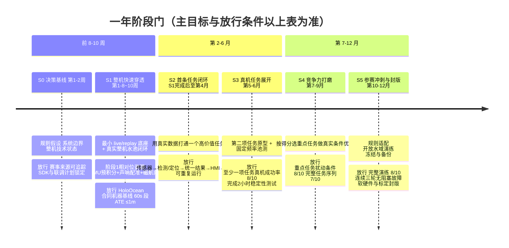

# ROV 平台落地路线图

> 一年期技术成熟路线图 · 由 ROV 竞赛场景牵引，不是某届赛事的冲刺排期
> 设计依据：`docs/archive/superpowers/specs/2026-08-24-rov-competition-driven-platform-roadmap-design.md`（状态：设计已确认）
> 草案日期：2026-08-24 · 状态：讨论稿 · 待定案
> 2026-09-02 修订：合同已签，硬件状态以 `docs/ROV平台参数.md` 为准；本次按 `docs/ROV平台到货前准备工作规格-2026-09-02.md`（下称"准备规格"）PREP-F-01 更新第 2、5、6、9、10 节，并同步第 2 节里已过时的代码基线描述

---

## 1. 文档定位与一年目标

`uw_slam` 是水下声光感知、定位、地图、录制回放和评测的**通用核心框架与工具链**，不是为某一届 ROV 大赛写的参赛代码。团队当前处于技术沉淀阶段，ROV 比赛是未来一年的牵引场景和阶段性验证目标——用比赛任务倒逼底座尽快接入真实硬件、尽快形成可复盘闭环，而不是反过来让比赛截止日期决定架构该怎么搭。

本文档不替代 `docs/archive/uw-slam-production-readiness-and-roadmap-2026-08-21.md`：后者继续记录长期技术债、成熟度和生产就绪度；本文档负责未来一年、由比赛场景牵引的平台落地节奏。比赛具体日期、正式规则和评分表冻结之后，再另建一份约 2–3 个月的参赛冲刺计划——本文档到那时候不改，冲刺计划是它的下游产物。

**团队规模**（2026-08-24 更正）：**3 名全职 + 1 名兼职 + 1 名实习生**，不是早期设计假设的 5 名全职——这是全文最重要的一次更正，第 5、7 节的周计划和人力分工已按这个实际规模重新核算，不是简单打折。同时覆盖软件/算法和机械电气集成；采购、商务与产品运营由外围团队支持。

**硬件状态**（2026-09-02 更正）：采购合同已签，技术附件转写在 `docs/ROV平台参数.md`。与本文档此前假设的差异：(1) **相机为单目 IMX462 云台相机**（IR-CUT 自动切换不可手控），不是 AI-D 双目，"相机方案 A/B"决策已由合同关闭；团队计划**后续另行挂载一套双目**，型号与时间待定。(2) **无 DVL，且后期也不加装**。(3) 外挂 IMU 定为维特 **HWT9053-485**，经 USB-RS485 接伴侣计算机。(4) 前视声呐 768 波束、140°×20°、40 Hz，**只出灰度图不出波束原始数据**；附件未写型号，参数与本文档此前按 SV1213 假设的配置一致，下文保留 SV1213 称呼。(5) ROV 供应商**不提供 SDK/ROS 节点，也不做任何飞控/SLAM/感知算法工作**，ROV 侧接入走 ArduSub/MAVLink 开源栈（SITL 可在到货前使用）；声呐 SDK 按合同 SON-03 提供。这些差异对代码基线的影响见第 2 节，对排期和风险的影响见第 5、9 节；到货前的具体准备工作（43 项）在准备规格里，本文档不重复。

**任务范围**（2026-08-24 更正）：团队决定**不参加"采集海床落物"任务**，只聚焦"寻找养殖区"和"按规定路径巡检结构物"两项。原因：落物采集是三项里技术门槛最高、且唯一依赖独立机械臂团队交付的一项（成本和交付节点核心团队均未掌握），砍掉它同时消除了一条跨团队协调风险，也让精简后的人力能更专注在另外两项任务上。本文档已按此从范围中移除机械臂接口/交接相关的开发工作、验收指标和行动项。

---

## 2. 当前基线与成熟度

这一节直接回答"现在的 codebase 框架够不够用"——结论是：**关键抽象已经是按这个方向设计的，不需要推倒重来；真正欠缺的是把已有原语接成一个在线运行时，以及新增硬件 adapter、HMI 和比赛检测器，这些是新增工作，不是改造工作。**

### 2.1 已经可以直接复用

- **跨语言规范消息模型**（`schemas/proto/uw/domain/`）：观测、量测证据、因子、状态、地图、健康、假设、标定的唯一真相源，C++/Python 两侧共用。
- **`measurement_api` 抽象接口**（`include/measurement_api/`）：`SonarFrontend`/`OpticalDepthFrontend`/`FactorBuilder`/`ResidualBlock` 四组接口边界清晰，`FactorBuilder` 独占"量测→权重"的建模权，`ResidualBlock` 是刻意留的 Ceres/GTSAM 替换口子。新增比赛检测器、换求解器后端，理论上都不需要动这一层。
- **`providers.hpp` 的非阻塞轮询 Provider 接口**：`SonarFrameProvider`/`CameraFrameProvider`/`LocalOdometryProvider`/`MapObservationProvider`——这正是"供应商 SDK 只能隔离在 adapter 层"这条分层要求在代码里的落点，接口已经定义好，等新 adapter 去实现。
- **声呐 CFAR+DBSCAN 前端**（`sonar_cfar_frontend`）：真实实现、有固定 fixture 回归测试，是目前唯一"随时可用、不依赖任何尚未拍板的硬件决策"的检测起点。
- **立体 VO 前端**（`stereo_landmark_vo_frontend`）：真实实现，在合成数据和真实 HoloOcean 录制上都验证过（真实 ATE rmse 0.667m），但依赖双目相机——按本文档第 9 节的原则，**不作为早期闭环的前提**。（2026-09-02：合同到货形态为单目，这条链在阶段 1 不可用；双目后续挂载后回归主线，见准备规格 D-1 分阶段表述与 PREP-B-08。）
- **位姿图 GN/LM 求解器、`SubmapManager` 建图、ATE/深度/融合/地图评测指标、分层 YAML 配置、`RunManifest`、MCAP 读写封装**：都是真实、已测试的通用能力，跟具体传感器/赛事规则无关。

### 2.2 已经设计但尚未打通的关键缺口

- **在线实时运行时**（四车道有界队列 + 在线辅助管线）曾在主线二下实现并在 Windows HoloOcean 上实跑过 14 分钟，但 2026-09 主线二整体剥离后已不在 main 上；快照在 `archive/rov-realtime-line2` 分支。S1 阶段若要恢复在线运行时，从该分支捡回起点比从零设计快。
- **`apps/replay_demo` 的执行体 `RunReplayPipeline()`（`src/application/replay_pipeline.cpp`，1051 行）是严格的多遍批处理**：按 topic 对同一个 MCAP 文件重复调用 `ReadMcapMessages<T>`（现存代码里至少 10 处独立调用），关键帧身份靠固定 `kKeyframeIntervalS = 0.2` 常量反推（第 339、421 行），全部关键帧处理完才调用一次 `GaussNewtonSolver::Solve()`。这不是"把读 bag 换成读实时 topic"就能解决的，需要把"多遍扫描 + 单次求解"的批处理控制流改造成"单次有序读取 + 增量身份关联"的结构。好消息：frontend/factor_builder/solver 这些数学核心可以原样复用，工作量集中在一个新的输入/编排层。**这项工作已经有具体实施计划**：`docs/archive/superpowers/plans/2026-08-24-live-replay-unified-ingress.md`，TDD 任务分解到文件级别，预计 2–3 周，是 S1 阶段的第一个软件实施包。（2026-09-02 更新：该计划已完成并归档至 `docs/archive/superpowers/plans/`，`replay_pipeline.cpp` 已改为单遍 `MCAP EventSource` 读取，与 live 共用 `event_source.hpp` 契约。）
- **ROS2 adapter 目前只有 HoloOcean 声呐桥接节点是真实代码**（编译通过、从未接过真实仿真数据流），SVIn 桥接节点整个类体注释掉、从未编译。面向真实硬件的 adapter 代码一行都没有，需要新写——但这正是 `providers.hpp` 接口存在的意义，是新增工作，不是重新设计接口。（2026-09-02 更新：HoloOcean 实时网关已接真实仿真数据流；真机 adapter 清单改为 **MAVLink adapter（BlueROV2/ArduSub 遥测、命令、外部导航回灌，准备规格 PREP-C-03）排在最前**，因为 ArduSub SITL 让它不等到货就能开发和验证；其后是声呐 SDK 接收端（PREP-B-04）、HWT9053 IMU 数据链（PREP-D-02/D-03）、相机流接收（PREP-E-04）。AI-D 相机 adapter 已不在方案内。）
- **`HealthReport`/`HealthStatus` protobuf 已定义，但全仓库零生产者/消费者**——本文档第 8 节要求的"健康/延迟/丢帧可观测"，需要真正把这条数据通路点亮，不是新发明格式。（2026-09-02 更新：声呐 CFAR、双目深度、回环前端和 HoloOcean 状态 JSON 已产出 `HealthReport`；真机侧的生产者——MAVLink 外部导航、IMU 转发服务——随对应 adapter 新增。）

### 2.3 完全不存在、需要新建

- 驾驶员操作台 / HMI（仓库里没有任何面向驾驶员的显示层代码）；
- 两个比赛任务专用检测器（养殖区标志物、结构物巡检辅助——海床落物定位已从范围移除，见第1节）；
- 面向真实硬件的 adapter：MAVLink（BlueROV2/ArduSub）、声呐 SDK 接收端、HWT9053 IMU 数据链、相机流接收（准备规格 WP-C/D/E）；
- **阶段 1 的相对位姿来源**：IMU 预积分 frontend + factor builder（PREP-B-01）、声呐帧间配准里程计（PREP-B-03）、磁航向因子（PREP-B-02）——到货形态无双目、无 DVL，没有这三项就没有可用的水平定位，也就没有 POSHOLD；
- 设定值层级的飞手/自主命令契约（PREP-C-02）：真机上推进器归 ArduSub 管，现有"8 推进器推力直发"通路只能留作仿真后端；
- 仿真侧的设备伪装层（PREP-A-13）：让 HoloOcean 按真机设备的线上格式输出，使上述 adapter 在到货前就有测试台。

### 2.4 尚未被吸收进风险登记表的具体技术项

- **声呐供电（合同 SON-01：18–30 VDC，平均 8 W、峰值 <30 W）与 BlueROV2 Heavy 原生供电（16.8V）之间需要隔离升压/稳压电源**，通常 1~2 轮返工，需要明确谁承担这项集成责任（供应商总集成，还是团队自己扛）。合同 ROV-04 表明 DVL 类集成供应商一概不含，声呐供电大概率同理，按团队自行承担准备。
- ~~**HoloOcean 录制器 `_write_keyframe()` 在缺少立体相机对的 tick 上会提前返回，静默丢弃 IMU/DVL/声呐数据**~~（2026-09-02：已修复，`record_session.py` 对单目/声呐/IMU 独立写入；单目配置的回归测试见准备规格 PREP-A-04。）
- **声呐带宽**：768×512×8 bit @40 Hz 约 126 Mbps，tether 实测 10–40 Mbps，声呐不压缩/抽稀塞不进链路（准备规格 PREP-E-01）。

---

## 3. 三层交付边界

| 层级 | 责任 | 典型内容 |
|---|---|---|
| **通用核心层** | 长期复用，不感知具体比赛规则 | 规范消息、时间/坐标/标定、live/replay、MCAP、运行时、状态估计、地图、评测、健康与降级 |
| **ROV 集成层** | 面向真实平台，不绑定某届赛题 | 声呐/相机/ROV 状态 adapter、算力部署、网络、HMI 数据接口 |
| **比赛应用层** | 按规则和评分快速迭代或替换 | 养殖区搜索、结构物巡检辅助、比赛界面、任务配置和操作流程 |

供应商 SDK 和 vendor 类型必须隔离在 adapter 层。更换设备时，原则上只替换 adapter、rig 标定和部署配置，不能让核心算法、比赛检测器或 HMI 直接依赖厂商消息。

```text
供应商 SDK / ROV 平台
          ↓
设备 Adapter
          ↓
规范消息 + 时间/TF/标定检查
          ↓
有界在线运行时
   ├── 定位/融合/地图
   ├── 比赛任务感知
   ├── Health/延迟/丢帧
   └── MCAP Recorder
          ↓
统一状态与目标结果
   ├── 驾驶员 HMI
   └── 评测与回放
```

MCAP replay 从规范消息位置重新注入，因此 live 和 replay 共用其后的算法、HMI 数据模型、状态语义和评测逻辑——这也是为什么 `live-replay-unified-ingress.md` 第一步先做"统一事件契约 + 单次扫描"，而不是先做 SDK adapter：先把 replay 和 live 的分岔点固定下来，两条路才不会各写一套。

**一年内必须沉淀：**

- live 与 replay 驱动同一套算法核心；
- 真机数据能够同步记录、回放和复盘；
- 传感器时间、坐标系、标定和质量状态使用统一契约；
- 检测器、定位后端和 HMI 可以替换，不污染核心层；
- 掉帧、失联和算法失效可观察、可记录并能进入明确降级状态；
- 每次有效池测都产出版本化数据、指标、失败案例和回归测试；
- 至少一条真实 ROV 在线感知闭环和若干按评分策略选择的比赛任务垂直闭环；
- 驾驶员和 HMI、检测结果之间形成稳定协作；
- 智能算法失效时仍保留完成基础任务的遥操作降级方案。

**一年内不要求完成：**

- 面向所有水下场景的生产级通用 SLAM；
- 全自主任务规划和推进器控制；
- 所有地图后端、回环、语义建图和研究方向；
- 把每个比赛检测器提升为通用平台核心组件；
- 在正式规则冻结前承诺覆盖所有可能任务。

---

## 4. 赛事规则假设与任务评分机制

> **尚未核实**——以下任务描述来自团队内部转述，不是官方规则文本。赛事来源、规则版本、任务取舍和计分假设必须版本化登记，不能用网页摘要或转述替代正式规则。

**任务取舍（2026-08-24 决策）**：官方转述的三项任务原为寻找养殖区、按规定路径巡检结构物、采集海床落物。团队已决定**不参加"采集海床落物"**，聚焦前两项——理由见第1节"任务范围"。如果后续官方规则显示三项任务并非各自独立计分（例如落物采集只是加分项而非必选项），这个决策不需要重新评估；如果规则要求必须完成全部三项才有参赛资格，需要在拿到正式规则后第一时间重新核实。

| 项目 | 当前状态 | 需要落实 |
|---|---|---|
| 赛事名称/届次/官方规则文档 | 未登记来源 | 找到官方规则原文并存档，标注获取日期和版本 |
| 评分表/计分权重 | 未知 | 官方评分表发布后逐项登记，用于第 9 节"优先级公式"里的"预期比赛收益"打分 |
| 比赛具体日期 | 未确定 | 一旦确定，触发第 11 节的参赛冲刺计划创建 |
| 两项任务的具体判定标准（如何算"找到"养殖区、"巡检完成"的路径精度要求） | 未知 | 随官方规则同步登记 |
| 三项任务是否都是参赛必选项 | 未知 | 直接决定"不参加落物采集"这个决策是否需要重新评估，随官方规则优先核实 |

正式规则延期时，S2–S4 使用官网最新任务和历史规则形成可配置应用；S5 再按正式规则收敛（见第 6 节）。

---

## 5. 前 8–10 周：真实整机闭环专项

> **本节时间轴已按更正后的人力（3全职+1兼职+1实习生）重新核算**，原设计文档按5名全职估算为7周；7个逻辑阶段本身不变，只是窗口从7周适当延长到8–10周，见本节末尾"人力核算"说明。

水池实时数据闭环是全年第一个硬里程碑。**目标不是完成 SLAM 或比赛任务，而是证明团队软件已经穿透供应商平台，形成可复盘的 live/replay 闭环。**

前提（2026-09-02 按合同修正）：**ROV 侧供应商不提供 SDK/ROS 节点**，只承诺技术交流；接入走 ArduSub/MAVLink 开源栈，到货前用 ArduSub SITL 替代真机开发（准备规格 PREP-C-01/C-03）。**声呐侧**按合同 SON-03 提供 Linux/Windows C++/Python SDK（含录制回放与时间同步），样例录制文件能否提前提供已列入 PREP-F-02 问题清单。供应商承担首轮整机装配与基础调试；声呐供电适配、HWT9053 IMU 接入按团队自行承担准备（第 2.4 节）。**到货前的软件准备（数字孪生、设备伪装层、IMU 预积分、声呐配准、MAVLink adapter）见准备规格，是本节各周工作的前置输入。**

| 时间 | 团队软件工作 | 供应商与联合工作 | 放行结果 |
|---|---|---|---|
| 第1周 | 冻结最小 live 消息、进程边界和 SDK 验收项；~~拍板相机方案（A/B）~~（已由合同定为单目 IMX462）；**起 ArduSub SITL，启动 MAVLink adapter 与设定值命令契约（PREP-C-01/C-02/C-03）** | 锁定整机技术状态、交付环境和联调日程；**明确电源适配/EMC集成责任归属**；发出 PREP-F-02 厂家问题清单 | SDK、文档、样例和整机路径明确 |
| 第2–3周 | 真实样例进入规范消息、MCAP 和基础 HMI（统一输入主链已完成，经 `EventSource` 契约接入）；准备规格 PREP-A-03 合同机器数字孪生、PREP-B-01 IMU 预积分启动 | 供应商解释数据格式、时间戳、坐标与配置；声呐厂家答复 PREP-F-02 问题清单 | 相机、声呐样例可记录、显示和回放 |
| 第4–5周 | MAVLink adapter（PREP-C-03，已在 SITL 上先行）接真机；声呐 SDK 接收端（PREP-B-04）按厂家答复定型；设备伪装层（PREP-A-13）让四个 adapter 在到货前已跑过——**SDK/adapter 仍是关键路径，原计划配2人，现只有1人全职+实习生打下手，是整段时间轴延长的主因** | 实际设备干式上电、通信和网络联调 | 台架数据持续进入团队软件 |
| 第6周 | 接入 `SonarCfarFrontend`（已真实、已测试，不依赖尚未落地的相机方案）并发布最小状态；SDK adapter 开发 | 完成整机基础显控、外参资料和接口核对 | `真实传感器→算法→HMI→录制` 干式闭环 |
| 第7周 | 修复同步、帧率、编码和恢复问题；验证回放一致性 | 整机功能、保护、配平和下水前检查 | 具备下水条件 |
| 第8–10周 | 运行最小在线管线并记录端到端指标；用首轮数据修复并按需复测 | 首轮浅水/水池下水和联合调试；供应商协助定位平台或 SDK 问题 | 完成可复盘的实时数据闭环——顺利则第8周即可达成，预留到第10周作为缓冲 |

> **人力核算**：原7周计划的隐含分工是"2人负责SDK/adapter/运行时（关键路径），1人负责HMI/MCAP/replay，1人接入现有轻量算法，1人负责供应商联调"，合计5人全职并行。实际是3全职+1兼职+1实习生，具体分工见第7节。缺口集中在关键路径——SDK/adapter/运行时改造从2人降到1人（实习生可以分担写测试、整理样例数据这类可独立验证的工作，但架构设计和核心实现仍是1人在扛），是本节从7周延长到8–10周的主要原因；HMI、算法接入、供应商联调这三块因为分别有独立的全职/兼职人力覆盖，压缩幅度较小。**建议在第5周（对应关键路径原定的阶段性节点）设一次人力/进度复核**：如果 SDK/adapter 明显落后，及时决定是缩小 HMI/算法接入的范围来腾人手支援，还是把里程碑目标从第8周顺延到第10周，不要等到第10周才发现问题。

里程碑达成（第8–10周内）必须做到：

- 真实相机流、声呐（正式 SDK）和 ROV 姿态/深度/电压/漏水（MAVLink）进入 `uw_slam`；外挂 IMU 经树莓派转发进入 `/raw/imu`；
- vendor 数据转换为规范化时间、坐标和消息；
- 在线运行时驱动至少一个现有轻量算法模块（推荐 `SonarCfarFrontend`）；
- HMI 显示实时流、算法结果和基本健康状态；
- 一次水池运行完整同步录制，并可离线回放复现主要输出；
- 非关键传感器断开时系统报告降级，不导致整套软件崩溃；
- 形成故障清单、数据集标识和下一轮回归项。

不要求：真实声光 SLAM 稳定、比赛检测完成、地图达到比赛精度。

---

## 6. 一年阶段门

| 阶段 | 时间 | 主目标 | 阶段放行条件 |
|---|---:|---|---|
| S0 决策基线 | 第1–2周 | 建立规则假设、系统边界和整机技术状态 | 赛事来源可追踪；任务取舍机制明确；SDK 和联合调试计划锁定 |
| S1 整机快速穿透 | 第1–8~10周 | 最小 live/replay 底座与真实整机水池闭环；**阶段 1 相对位姿来源（IMU 预积分 + 声呐配准 + 磁航向，替代双目 VO）在 HoloOcean 上验证并接入** | 达到第5节全部放行条件；IMU 预积分 + 声呐配准在 HoloOcean 合同机器基线上 60 s 段 ATE ≤1 m（准备规格 PREP-B-01/B-03 验收） |
| S2 首条任务闭环 | S1完成后至第4月 | 用真实数据打通一个高价值任务 | `传感器→检测/定位→统一结果→HMI→驾驶员` 可重复运行 |
| S3 真机任务展开 | 第5–6月 | 第二项任务（两项范围内的另一项）原型和固定频率池测 | 至少一项任务在真实 ROV 上成功率达到 8/10；完成2小时稳定性测试 |
| S4 竞争力打磨 | 第7–9月 | 按得分选择重点任务，开展真实条件优化 | 重点任务扰动条件成功率达到 8/10；完整任务序列达到 7/10 |
| S5 参赛冲刺与封版 | 第10–12月 | 最终规则适配、开放水域演练、冻结和备份 | 完整演练达到 8/10；连续三轮无阻塞故障；软件、硬件与标定封版 |



> 图只表达阶段顺序，**不表达依赖**——S1 的窗口是 8–10 周的弹性区间，S2 起点是
> "S1 完成后"而不是固定周数，S3–S5 用月度粒度本身就留了 1–2 周的吸收余量。放行
> 条件的准确表述以上表为准，图里的是缩写。

S1 只要求平台稳定接入、记录、回放、观测和替换算法，不要求完整 SLAM；但 2026-09-02 起 S1 交付物**增加**"IMU 预积分 + 声呐配准替代双目 VO 作为相对位姿来源"的仿真验证版本——原因是合同形态无双目、无 DVL，没有它 S2 的结构物巡检和任何 POSHOLD 都没有水平定位可用；真机精度验收放在 S2。S2 首条任务按预期得分、依赖数量、公共接口覆盖和验证成本选择。池测从 S1 里程碑达成后开始，此后持续滚动，不等到冲刺阶段才首次按任务下水。**S1 的窗口是8–10周的弹性区间（第5节人力核算的直接结果），S2 起点相应改成"S1完成后"而不是固定周数**，S3–S5 用月度粒度记录，本身留有吸收1–2周偏差的余量，不需要连锁调整。正式规则延期时，S2–S4 使用官网最新任务和历史规则形成可配置应用；S5 再按正式规则收敛。

**S2 任务候选技术依赖速览**（非正式排序，官方评分表出来后仍以第9节优先级公式为准，这里只补技术侧的参考事实。"海床落物定位"已按第1节的任务取舍决策移出候选范围，不再列入）：

| 候选任务 | 复用现有代码基础 | 需要新建 |
|---|---|---|
| 养殖区搜索 | `SonarCfarFrontend`（真实、已测试）可直接作为检测起点；不依赖双目 | 养殖区专用识别/分类逻辑，搜索过程的 HMI 提示 |
| 结构物巡检辅助 | 位姿图求解器 + `SubmapManager` 已有的在线路标发现能力，可用于路径叠加显示 | 结构物识别、路径偏离提示的 HMI 逻辑；比养殖区搜索更依赖 S1 产出的在线定位闭环是否稳定 |

按技术依赖看，"养殖区搜索"对 S1 产出的依赖最少（不依赖双目和在线定位精度），是两项里技术门槛更低、更适合作为"首条任务"来验证第3节那条软件主链是否真正闭环的候选——但这只是技术侧的参考事实，不替代官方评分表出来后的正式选择。

---

## 7. 现有人力责任域与并行限制

> 原设计按5名全职划分五个责任域；实际是**3名全职+1名兼职+1名实习生**，下表是按实际人力重新映射后的分工，责任域的工作内容本身不变，只是不再一人一域。

| 人力 | 覆盖职责 | 说明 |
|---|---|---|
| 全职 A（技术负责人） | 架构边界、在线运行时、SDK/平台集成（相机、声呐、ROV 状态 adapter，时间同步、供应商联调技术侧） | **关键路径专职，不兼第二摊工作**——第5节人力核算里"从2人降到1人"指的就是这个岗位，是全年最不能再稀释的一份人力 |
| 全职 B | 光学与任务感知（视觉检测、三维定位）+ HMI 与系统验证里的界面开发 | 两者本来就有依赖关系（检测结果要显示在 HMI 上），合并的影响相对小 |
| 全职 C | 声呐与融合 + 第5节"接入现有轻量算法"（`SonarCfarFrontend`）+ 协助全职 A 做 SDK adapter 的测试/联调 | |
| 兼职 | 供应商联调、验收、标定、复盘 | 这块工作本身有大量等待供应商响应的时间，天然适合非全职承担，不建议往这个岗位上加关键路径工作 |
| 实习生 | 在全职 A/C 指导下：写/跑 `live-replay-unified-ingress.md` 里的单元测试、整理真实样例数据、维护回归 fixture、协助文档记录 | 不独立承担架构决策或关键路径的核心实现，但能有效分担全职人员的执行负担，间接为关键路径腾时间 |

第8–10周里程碑达成后，保持"全职A+C偏平台、全职B偏任务、兼职偏供应商协调"的基本配置；水试前后全员（含实习生）进入数据采集、故障处理和复盘，不形成永久岗位墙。

**并行限制**：原设计"团队任何时候最多推进两个尚未形成闭环的重大能力"（① 平台主链：运行时、SDK 适配、数据、可靠性与 HMI；② 任务主链：任务检测、相对定位与任务验证）在5人时是合理上限，**在3全职+1兼职+1实习生的实际人力下更接近硬约束而不是留有余量的上限**——S1 期间建议只推进平台主链，任务主链（比赛检测器等）不要提前启动，即使有闲余人力也先投入第5节的关键路径或多做真实数据验证，不要靠同时开两条线来"抢进度"。新的检测器、地图或定位方向只有在前一条链达到可重复验收后才能进入主线。第7月后原则上不启动不能直接改善比赛得分或可靠性的大型研究方向；第10月后核心架构只接受阻塞参赛的修复，不再进行探索性重构。

---

## 8. 量化验收指标

验收分为平台级、任务级和竞争力三级，**禁止使用"不漂移、不丢失、仍可用、稳定走完"等不可判定表述**——这是对早期草稿的直接纠正，所有验收条款必须能用数字或明确布尔条件判定。

### 8.1 平台级指标

- 关键传感器有效消息比例不低于 99%，时间戳非零且时钟域可识别；
- 相机叠加显示 capture-to-display P95 不高于 250ms；声呐/目标结果 P95 不高于 500ms；
- 原始驾驶视频可以继续使用供应商低延迟链路，避免团队 HMI 成为操控单点故障；
- 队列深度、丢帧、处理延迟、设备健康和算法降级可实时查看并写入日志；
- 非关键传感器断开后1秒内报告降级，重新接入后10秒内恢复数据消费；
- 每次水试保留 MCAP、配置、标定和版本记录，replay 可复现主要检测数量、状态转换和失败原因；
- S1 里程碑达成（第8–10周内）时完成不低于30分钟水池运行，第6月达到2小时，第9月达到4小时；运行中无崩溃、无无界内存增长。

### 8.2 任务级指标

每条任务建立相互隔离的训练、调参和冻结验收数据，报告 precision、recall、误报/分钟、有效工作距离、相对位置/姿态误差及95%分位、单任务成功率和完成时间。

- 首条任务在冻结台架/回放数据上的 recall 和 precision 均不低于90%；
- 首条水池任务在已知目标条件下成功率不低于8/10；
- 第6月至少一项任务在真实 ROV 上达到8/10；
- 第9月选定重点任务在扰动条件下达到8/10；
- 每项智能能力都有人工确认或纯遥操作降级流程。

### 8.3 竞争力指标

- 规则和评分配置版本化；每轮演练记录得分、罚分、失败环节、耗时和人工干预；
- 第9月完整任务序列成功率不低于7/10；
- 第11–12月完整演练成功率不低于8/10；
- 平均完成时间不超过规则时限的80%，为异常恢复保留余量；
- 正式封版前连续三轮完整演练无阻塞性软硬件故障；
- 准备可快速恢复的软件镜像、关键配置和硬件备件方案。

SLAM、地图或智能辅助功能必须通过对照测试证明至少改善搜索耗时、巡检偏离、目标定位误差、驾驶员漏检率或任务成功率之一。连续两轮真实对照测试没有收益时，从比赛主链撤下并保留为长期研究分支。

---

## 9. 风险、决策门与降级策略

候选工作项按以下关系排序：

```text
优先级 = 预期比赛收益 × 多任务复用价值 × 当前不确定性降低程度 ÷ 实施与真机验证成本
```

最高优先级：SDK/原始数据穿透、live/replay、同步录制、HMI 基础显示和健康告警、首条任务垂直闭环，以及能服务多项任务的相对测距、定位和目标跟踪。较低优先级：没有真实数据的复杂算法、多个地图后端并行、不能改善任务指标的完整全局 SLAM、纯展示型可视化、正式规则冻结前对所有可能任务的全面覆盖。

每两周进行范围审查，执行以下停止规则：

- SDK 不完整时推动供应商补齐，不在核心层以逆向工程形成长期依赖；
- 新算法连续两轮真实测试无收益时退出比赛主链；
- 单项任务成本明显超过预期得分时降低等级或战略放弃；
- time/TF/标定审计失败时暂停算法调参，先修数据契约；
- 没有 MCAP、配置、标定和日志的数据不计为有效水试；
- 第7月后限制新研究方向，第10月后进入架构冻结。

### 风险登记表

| 风险 | 控制与决策门 |
|---|---|
| 供应商 SDK 与宣传能力不一致 | 第1–2周使用真实样例和开发环境验收；合同绑定原始数据、时间戳、授权和支持 |
| 第8–10周整机闭环延误 | 提前锁定供应商整机、测试机和联调日程；按周核对 SDK、设备与水池关键路径；第5周设人力/进度复核 |
| **实际人力（3全职+1兼职+1实习生）低于原设计假设的5名全职** | 已在第5、7节按实际人力重新核算排期（7周→8–10周）和分工（五个责任域映射到3.5~4人）；后续人力如再有变化，先更新这两节再改动其他章节的排期数字，不要让文档停留在过时假设上 |
| **声呐（合同 18–30 VDC）与 BlueROV2 Heavy（16.8V）供电不匹配** | 第1周内在合同/技术附件中明确电源适配与EMC验证的责任归属（供应商总集成 vs 团队自行承担）；不等到整机到货才发现 |
| ~~相机方案（单目 vs AI-D 双目）未及时定案~~（已关闭） | 合同定为单目 IMX462；双目后续挂载，机械/同步/基线约束第 2 周交采购（准备规格 PREP-B-08），到货后先过 `stereo-acceptance` 再进主线 |
| 双目在真实水下效果不足 | 不把双目 VO 作为早期闭环前提；保留声呐、姿态/深度和遥操作降级 |
| 精简团队被硬件问题吞没 | 供应商承担首轮装配联调；内部完成技术接管文档和必要维护能力；关键路径（全职A）不承担硬件装配工作 |
| 真实任务数据不足 | 从第一次水试开始版本化采集，建立失败样本库和冻结验收集 |
| 比赛规则变化或延期 | 规则、任务和计分配置版本化；比赛应用层可替换，核心层不绑定任务 |
| ~~机械臂协作滞后/成本不透明~~（已解除） | 团队已决定不参加"采集海床落物"任务（第1节），机械臂依赖和跨团队接口风险随之解除。若后续官方规则要求三项任务均为必选，需要重新评估这个决策，见第4节 |
| 过度追求 SLAM 完整性 | 任务成功率和操作收益是进入比赛主链的依据 |
| 水试无法复盘 | 缺少 MCAP、配置、标定或日志时不计为有效验证 |
| 后期持续重构 | 第7月限制新方向，第10月冻结核心架构 |
| ~~HoloOcean 录制器丢单目 tick 数据的 bug~~（已关闭） | 已修复；单目配置回归测试见准备规格 PREP-A-04 |
| **外部导航回灌 EKF3 的坐标系与延迟**（Z-up ↔ NED 转换、`VISO_DELAY_MS`、回环跳变） | 只回灌相对增量（`VISION_POSITION_DELTA`），回环修正不回灌；转换单独成模块并在 SITL 回读验证（PREP-C-03/C-04）；延迟 SITL 上先跑通流程、真机实测填参（PREP-C-05）；SLAM 停输出时 adapter 停发而非重发旧值 |
| **SITL–HoloOcean 桥接不可行或慢于实时太多** | 3 天时间盒验证（PREP-A-05）；失败则控制层用 HoloOcean 推力后端 + 简易控制器，飞控闭环只能在真机验证 |
| **UE5 工程拿不到或不可重新打包** | 第 1 周验证（PREP-A-02）；失败则比赛关卡降级为 `spawn_prop` 几何体近似，并提前采购真实网箱样品用于水池 |
| **声呐带宽超出 tether** | 声呐 adapter 必带抽稀/帧率/压缩三个旋钮；HoloOcean 上先出 CFAR 检测率随抽稀/压缩的退化曲线（PREP-E-01）；带宽 10 Mbps 下限的降级顺序：双目分辨率 → 双目帧率 → 飞手视频码率 → 声呐帧率 |
| **无双目、无 DVL（且后期不加装）时 IMU 预积分 + 声呐配准漂移超预期** | 无硬件兜底；PREP-B-01/B-03 在 HoloOcean 上先给漂移率基线，阶段 2 双目 VO 是唯一额外来源；S1 门槛见第 6 节 |

---

## 10. 近期两周行动清单

角色标签为占位，请对应到实际负责人。

### 本周内

- [ ] 冻结最小 live 消息、进程边界和 SDK 验收项草案。 `技术负责人`
- [x] ~~拍板相机方案（A：加购 AI-D 双目 / B：自建双目），写入询价单。~~ 已由合同定为单目 IMX462（准备规格 D-1 阶段 1）；双目后续挂载，第 2 周出机械/同步约束文档交采购（PREP-B-08）。 `光学与任务感知`
- [ ] 发出准备规格 PREP-F-02 的厂家问题清单（声呐图像格式/时间同步/录制样例、ArduSub 与 BlueOS 版本、云台可否锁定、HWT9053 丢包与重力扣除）。 `SDK/平台集成`
- [ ] 起 ArduSub SITL（PREP-C-01）；量 HoloOcean GPU/tick 预算（PREP-A-01）；验证 UE5 工程可重新打包（PREP-A-02）。 `SDK/平台集成 + HMI 与系统验证 + 光学与任务感知`
- [ ] 拍板准备规格第 12 节的 6 个开放问题（MAVLink adapter 语言、IMU adapter 归属、云台锁定角、水池尺寸与日期、DVL 已定不采购、双目型号/接口/时间）。 `技术负责人`
- [ ] 向供应商明确声呐电源适配（16.8V→18–30VDC）与 EMC 验证的责任归属，写进技术附件。 `SDK/平台集成`
- [x] ~~启动 `live-replay-unified-ingress.md` Task 1（冻结规范 topic 与 `CanonicalEvent` 契约）。~~ 该计划已完成归档；接替项：设定值层级命令契约 `command.proto`（PREP-C-02）。 `技术负责人`

### 两周内

- [x] ~~完成 `live-replay-unified-ingress.md` Task 2–3（MCAP EventSource、应用输入端口）。~~ 已完成。接替项：IMU 预积分设计短文 + frontend（PREP-B-01）；合同机器数字孪生基线 mono/stereo 两份配置（PREP-A-03）。 `技术负责人 + SDK/平台集成`
- [ ] 找到官方赛事规则原文并存档（版本、获取日期），登记进第4节的假设表。 `HMI 与系统验证`
- [ ] 询价单发出，明确到货周期分段（现货/生产/清关）和 SDK 样例数据能否提前提供。 `SDK/平台集成`
- [ ] 隔离升压电源选型询价启动，不等 ROV 到货。 `SDK/平台集成`

---

## 11. 滚动维护与参赛冲刺计划触发条件

本文档每两周随第9节的范围审查一起复核，随 S0→S5 阶段推进更新"当前基线与成熟度"（第2节）。

**触发独立创建约2–3个月参赛冲刺计划的条件**（满足即触发，由技术负责人牵头）：

- 官方比赛规则、任务清单和评分表正式冻结；
- 比赛具体日期确定，距今不超过约4个月；
- S2（首条任务闭环）已通过验收。

冲刺计划创建后，本文档的第4节（赛事规则假设）改为链接冲刺计划里的正式规则登记，不再维护"尚未核实"状态；本文档其余章节继续作为一年期技术路线的主文档，不因冲刺计划的存在而失效。

原路线图中"完成度驱动而非日期驱动""硬软并行""真实水试""供应商技术确认"和"AI 节省时间回投真实验证"等原则继续保留，体现在本文档第6节的阶段门定义和第9节的风险控制里，不再单独用一份约16周的冲刺排期表达。

---

*草案 · 供内部讨论，不构成采购或合同承诺 · 依据 `docs/ROV综合选型采购方案.docx`、`docs/archive/superpowers/specs/2026-08-24-rov-competition-driven-platform-roadmap-design.md`、`docs/archive/superpowers/plans/2026-08-24-live-replay-unified-ingress.md`（已归档）、`docs/ROV平台参数.md`、`docs/ROV平台到货前准备工作规格-2026-09-02.md`*
