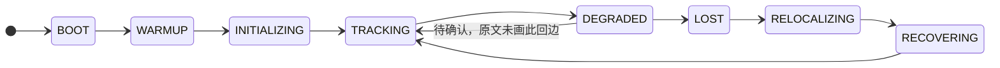
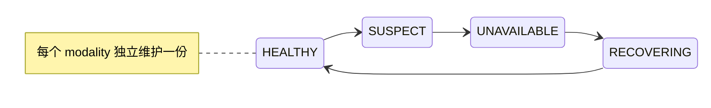
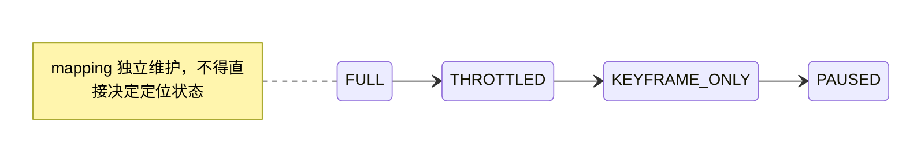

# 水下声光融合 SLAM 平台长期架构设计

> 2026-09-07 注记：主线二（ROV 实时闭环/在线辅助）已整体剥离，快照在
> `archive/rov-realtime-line2` 分支。本文中涉及在线辅助/实时闭环/HMI 的章节按
> 目标设计保留，不代表当前 main 的实现范围。

> **文档权威范围**：本文定义平台应该演进到的目标状态、长期不变量和阶段决策，
> 不代表所有模块已经实现。当前代码中实际存在的类型、算法、接线和验证结果以
> [代码库参考](./uw-slam-codebase-reference-2026-08-18.md)为准。第 22 节是后续逐文件
> 审计附录，其中对上游版本、接口和风险的修正优先于正文里的早期事实假设。

> 本文定义从 HoloOcean 水下实时仿真到声光融合 SLAM、三维重建和可视化演示的长期平台架构。SVIn、`sonar_camera_reconstruction` 以及未来论文代码均作为可替换 baseline 或 adapter，不拥有平台的规范化消息模型、算法接口、状态、地图和运行时控制权。

> 顶层定位：以可观测性和概率状态为核心，以几何方法保证下限，以学习方法提高测量与地图上限，以分层地图隔离实时性和展示质量，以数据证据闭环支持长期迭代的研究型可部署平台。

## 核心决策摘要

- 算法核心与 ROS2、仿真器和第三方消息隔离，外部系统只通过 adapter 接入。
- `schemas/proto/` 中的 Protobuf 是跨语言规范化消息模型的唯一事实源；算法的进程内接口定义于 `include/measurement_api/`。原始观测、量测结果、因子、状态和局部地图数据语义分层。
- 几何/概率估计器拥有权威状态，学习模型只能在校准、信息上限和 Gate 约束下增强测量。
- 地图保存局部证据及其状态版本，允许轨迹修正后重定位或重融合，而不是一次性烘焙到世界系。
- 录制、配置、随机 seed、模型与代码版本必须可追溯，确定性回放是平台级验收面。
- 光学紧耦合、学习前端和神经地图按阶段进入，不提前侵入定位关键路径。

## 当前实现映射

| 状态 | 架构内容 |
|---|---|
| 已落地端到端链路 | Protobuf 规范化消息模型、ROS 无关 core、声呐 CFAR、双目 VO/稠密深度、声光关联与后验融合、三类位姿图因子、SubmapManager、MCAP、分层配置校验、基础 RunManifest、确定性回放与 ATE；规范事件契约与单次有序 MCAP `EventSource`（`CanonicalEvent`/`PipelineInputPort`/`PumpEvents`，见 docs/archive/superpowers/plans/2026-08-24-live-replay-unified-ingress.md）统一了 replay 的输入读取路径，`ReadMcapMessages<T>` 不再是 replay 主链入口；合成闭环 136 项 CTest/35 项 Python 测试全绿（测试数量随后续改动增长，以实跑为准） |
| 部分落地 | HoloOcean Python 录制网关和真实双目+深度+GT 离线 VO 回放（50 keyframe、对齐 ATE RMSE 0.5596 m，但 solver stalled、无 sonar/IMU/DVL）；ROS2 ImagingSonar 纯传输桥；plumb-bob same-K 去畸变原语尚未接入 replay；声光稠密局部地图数据进入 submap 但不参与位姿图；点云地图指标已有小点集 API/单测；ASan+UBSan、gcov/cppcheck 已有 CI/脚本但后两者仅报告 |
| 仍是目标设计 | 全传感器真实数据闭环、实时 VIO/SLAM 与在线调度（供应商 SDK 的 live `EventSource` 实现、有界队列/背压调度、Start/Stop/Drain 生命周期、异步 recorder tap、HMI presentation adapter 均未实现——`EventSource`/`PipelineInputPort` 接口已经与来源无关，但目前只有 MCAP 一种实现）、原生紧耦合、多路自适应 reliability cap、正式 TSDF/surfel/occupancy 地图、RPE/地图 reference 与质量门禁、学习模型生命周期与神经地图 |

## 阅读导航

1. [背景与架构决策](#1-背景与架构决策)
2. [目标与非目标](#2-目标与非目标)
3. [技术路线选择](#3-技术路线选择)
4. [顶层逻辑](#4-顶层逻辑数据面控制面与证据面)
5. [模块依赖 DAG](#5-模块依赖-dag)
6. [推荐仓库边界](#6-推荐仓库边界)
7. [核心消息与接口](#7-核心消息与接口)
8. [估计骨架与相关性治理](#8-估计骨架与相关性治理)
9. [三层地图](#9-三层地图)
10. [AI 模型生命周期](#10-ai-模型生命周期)
11. [Sim-to-real 数据闭环](#11-sim-to-real-数据闭环)
12. [运行时状态与恢复](#12-运行时状态与恢复)
13. [线程、队列与 GPU 调度](#13-线程队列与-gpu-调度)
14. [部署与配置治理](#14-部署与配置治理)
15. [测试与评测矩阵](#15-测试与评测矩阵)
16. [第一阶段最小闭环](#16-第一阶段最小闭环)
17. [分阶段决策门](#17-分阶段决策门)
18. [Demo 叙事与验收](#18-demo-叙事与验收)
19. [第三方代码角色](#19-第三方代码角色)
20. [已冻结与延后决策](#20-已冻结与延后决策)
21. [架构不变量摘要](#21-架构不变量摘要)
22. [代码库审计与架构细化附录](#22-2026-08-18-三方代码库审计与架构细化)

---

## 1. 背景与架构决策

团队已经完成：

- HoloOcean 水下声光仿真环境搭建；
- ROS2 bridge 初步实现；
- SVIn 主分支在 ROS2 Jazzy 上的版本与依赖适配；
- `sonar_camera_reconstruction` 和 SVIn 官方数据集跑通；
- 对 SVIn ROS2 分支声呐未迁移、ROS1 分支使用 Imagenex 831L 测距声呐的代码审计；
- 对 HoloOcean imaging sonar 在 Windows 正常、Linux 异常的初步定位。

旧方案把 SVIn 作为前端定位、`sonar_camera_reconstruction` 作为后端建图，通过 ROS2 topic 松耦合串联。该方案适合作为第一阶段演示 baseline，但不适合作为长期架构：

1. 系统边界由论文代码的消息和状态定义；
2. VIO 输出与后端重复使用同源 camera/IMU 时存在相关信息重复融合风险；
3. 2D FLS 的 elevation ambiguity 容易被错误压缩成完整 6DoF pose；
4. 后端轨迹修正难以回灌已经转换并固定到世界坐标系、不再保留局部坐标引用的点云；
5. 学习模型缺少训练、校准、部署和失败样本回流机制；
6. ROS callback、dense mapping 和 GPU 推理容易互相阻塞；
7. 平均 FPS 和最终点云观感不足以支持质量、速度和声光贡献的判断。

本设计选择“ROS 无关算法内核 + 模块化单体 + 边缘适配器 + Hybrid 概率估计骨架”。理论依据与技术背景见：

- SLAM 与水下 SLAM 知识体系、技术框架与技术演进（外部知识库资料）；
- Factor Graph 在水下声光融合 SLAM 中的阐述框架（外部知识库资料）；
- [HoloOcean 到声光融合 SLAM demo pipeline 方案](./archive/holoocean-to-acoustic-optic-slam-pipeline-2026-08-05.md)；
- 仿真 + 声光融合 SLAM 难点清单（外部知识库资料）。

## 2. 目标与非目标

### 2.1 平台目标

平台必须支持：

1. HoloOcean、rosbag、公开数据集和未来真实设备使用同一算法入口；
2. 双目 camera、IMU、2D imaging/FLS sonar、depth 的标准化输入；
3. 高频局部定位、低频声学/回环修正、异步稠密建图；
4. 松耦合 baseline 与原生紧耦合模式共存但不重复计算同源信息；
5. 几何前端与学习前端可替换、可并行 shadow 运行；
6. 轨迹修正后子地图重定位或局部证据重融合；
7. 算力过载时优先保证定位，建图和展示有序降级；
8. 每次实验可追溯、可回放、可比较；
9. 清水、连续浑浊、视觉恢复和回环过程形成可观察的 demo 叙事；
10. 后续迁移到真实声呐、DVL、3D sonar 或神经地图时不重写平台骨架。

### 2.2 当前非目标

第一阶段不做：

- 从零重写完整双目 VIO；
- 端到端网络直接从声光 IMU 输出最终位姿与地图；
- 多图优化器或多地图后端的万能抽象；
- 跨编译器通用动态插件 ABI；
- 多机器人、水声通信或云端协同；
- 用 HoloOcean 结果证明真实海域泛化；
- 把 3DGS/神经渲染放入定位关键路径。

## 3. 技术路线选择

| 路线 | 优点 | 局限 | 结论 |
|---|---|---|---|
| 纯几何 SLAM | 可解释、测试边界清晰、数据需求低 | 复杂声呐关联、浑浊视觉和高质量重建存在上限 | 保留为运行下限与 baseline |
| 端到端神经 SLAM | 表达能力强、可能联合优化多模态 | 数据、泛化、不确定性和实时部署风险高 | 不作为平台骨架 |
| 概率骨架 + 学习增强 + 异步神经地图 | 状态一致性可控，学习模块可替换，质量与速度可分层 | 契约、校准和运行时设计要求更高 | 选定路线 |

学习模块优先承担：

- visual/sonar reliability 与 OOD 判断；
- 声呐帧间、帧到子地图匹配；
- 声光 correspondence、dense depth 或局部几何先验；
- 跨模态回环描述子与候选生成；
- 异步地图纹理和神经表示精修。

概率估计骨架拥有：

- 状态传播和权威状态版本；
- factor residual、noise model 和 robust policy；
- 可观测性与在线标定开关；
- 跨模态 innovation audit；
- 因子接受、降权、隔离和回滚；
- 局部与全局一致性。

## 4. 顶层逻辑：数据面、控制面与证据面

~~~text
Camera / IMU / Sonar / Depth
              │
              ▼
      Calibrated Observation
              │
       ┌──────┴──────────┐
       ▼                 ▼
Measurement Frontends   Map Observation Frontends
       │                 │
       ▼                 ▼
Evidence/Hypotheses     Local Map Evidence
       │                 │
       ▼                 │
Factor Builders          │
       │                 │
       ▼                 │
Probabilistic Estimator  │
       │                 │
       ▼                 ▼
Versioned State ─────→ Submap / Map Backends
       │
       ▼
Localization / TF / Trajectory / Diagnostics
~~~

三条横向平面：

- 数据面：观测、测量证据、因子、状态和地图证据；
- 控制面：配置、标定、生命周期、质量调度、降级与恢复；
- 证据面：录包、回放、指标、run manifest、模型与算法 provenance。

ROS2 topic 只是数据面的传输机制，不是算法内部 API。

## 5. 模块依赖 DAG

下图箭头表示“左侧模块依赖右侧模块”，不是在线数据流：

~~~text
apps / demo_bringup
  └─→ uw::application
        ├─→ frontend APIs
        ├─→ uw::estimation
        ├─→ uw::mapping
        ├─→ uw::runtime
        └─→ adapter APIs

frontend implementations
  ├─→ uw::measurement_api
  ├─→ uw::sensor_models
  └─→ uw::domain

factor_builders
  ├─→ uw::measurement_api
  ├─→ uw::sensor_models
  └─→ uw::domain

uw::estimation
  ├─→ factor APIs
  ├─→ uw::measurement_api
  └─→ uw::domain

uw::mapping
  ├─→ uw::measurement_api
  └─→ uw::domain

ml_runtime
  ├─→ frontend APIs
  ├─→ model manifests
  └─→ uw::domain

ROS2 / HoloOcean / datasets / third_party
  └─→ adapters
        ├─→ uw::measurement_api
        ├─→ uw::sensor_models
        └─→ uw::domain

uw::measurement_api ─→ uw::sensor_models ─→ uw::domain
~~~

（C++ 层面 `uw::sensor_models` 与 `uw::measurement_api` 是各自独立的 include 分区
`include/sensor_models/`、`include/measurement_api/`，但 CMake 里合并进同一个
`core`/`uw::core` target 一起编译——这里的箭头描述的是 API/namespace 边界，不是
物理 CMake target 拆分，见 `cmake/Libraries.cmake`。）

依赖不变量：

1. `uw::domain` 不依赖 ROS、仿真器、算法实现或第三方仓库；
2. `uw::estimation` 不依赖具体视觉/声呐前端实现；
3. `uw::mapping` 只消费版本化状态和地图证据；
4. HoloOcean、厂商消息和论文消息只存在于 adapters；
5. 数据流中的 map→loop→estimation 反馈不能形成代码依赖环；
6. application 负责用例组合，apps 只负责参数解析和进程入口；两者都不拥有算法状态；
7. 第一版使用编译期模块注册，不开发通用动态插件系统。

## 6. 推荐仓库边界

~~~text
uw_slam/
├── core/
│   ├── domain/
│   ├── sensor_models/
│   └── measurement_api/
├── algorithms/
│   ├── frontends/
│   ├── factor_builders/
│   ├── estimation/
│   ├── reliability/
│   └── mapping/
├── ml/
│   ├── datasets/
│   ├── tasks/
│   ├── training/
│   ├── calibration/
│   ├── export/
│   ├── runtime/
│   ├── model_registry/
│   └── failure_mining/
├── runtime/
├── adapters/
│   ├── holoocean/
│   └── third_party/
├── apps/
├── configs/
├── evaluation/
├── tests/
└── tools/
~~~

建议算法核心采用 C++17，以兼容 ROS2 Humble；训练、数据处理和评测使用 Python。ROS2 package 与算法 library 不强制一一对应，避免 package 数量代替真实模块化。

## 7. 核心消息与接口

### 7.1 ID、时间与标定

核心 ID：

- `SensorId`、`FrameId`、`SequenceId`、`ObservationId`；
- `EvidenceId`、`KeyframeId`、`StateId`、`SubmapId`；
- `CalibrationVersion`、`ModelVersion`、`StateVersion`。

时间戳必须声明 clock domain，并同时保存 capture time 与 receive time。系统使用 capture time 进行估计，receive time 只用于调度和延迟统计。

标定以不可变 `RigCalibrationSnapshot` 作为唯一事实源，包含 frame tree、内外参、time offset、sonar beam model、sound-speed/range 假设及其不确定性。ROS static TF 和节点 YAML 只能由该快照派生，不能各自维护另一份外参。

### 7.2 ObservationHeader

~~~text
ObservationHeader {
  observation_id
  sensor_id
  sequence_id
  capture_time
  receive_time
  clock_domain
  sensor_frame
  calibration_version
  validity
  provenance
}
~~~

### 7.3 SonarFrame

第一阶段主声呐是 HoloOcean 2D imaging/FLS sonar。它不能复用普通透视 `ImageFrame`：

~~~text
SonarFrame {
  header
  intensity_tensor
  encoding
  range_bins
  azimuth_angles
  min_range
  max_range
  range_resolution
  horizontal_fov
  elevation_aperture
  gain_metadata
  sound_speed_assumption
}
~~~

未来 3D sonar 使用独立 `SonarPointFrame`，不在 `SonarFrame` 内累积大量 optional 字段。

### 7.4 MeasurementEvidence

~~~text
MeasurementEvidence<T> {
  evidence_id
  source_observations[]
  typed_measurement
  estimated_noise
  quality_features
  observable_subspace
  valid_domain
  algorithm_version
  model_version
}
~~~

`estimated_noise` 是前端建议，不是后端最终 information matrix。typed measurement 保留 visual track、stereo depth、sonar range-bearing、sonar registration、pressure depth、IMU preintegration 等物理语义。

### 7.5 HypothesisSet

~~~text
HypothesisSet<T> {
  candidates[]
  calibrated_likelihoods[]
  rejected_candidates[]
  ambiguity_reason
  out_of_distribution
}
~~~

FLS elevation ambiguity、重复结构、多径和跨模态错位不能被前端过早压缩成唯一 6DoF pose。第一版算法可以只消费 top-1，但契约保留多假设能力。

### 7.6 FactorCandidate 与 FactorBuilder

~~~text
FactorCandidate {
  associated_state_ids[]
  measurement_type
  residual_model
  proposed_noise
  observable_subspace
  robust_policy_hint
  evidence_ids[]
  validity_interval
}
~~~

实际 factor 由 estimation 内部的 typed `FactorBuilder` 构造。前端不能直接向图注入任意权重。2D FLS 使用 range-bearing、arc、submap registration 或 partial-DoF factor，不把单像素解释成唯一 3D 点。

### 7.7 StateSnapshot 与 StateStore

~~~text
StateSnapshot {
  state_id
  state_version
  capture_timestamp
  pose_WB
  velocity_W
  imu_bias
  marginal_uncertainty
  tracking_status
  calibration_version
  contributing_measurements[]
}
~~~

系统只有一个权威 `StateStore`，采用单写多读和版本化机制。Mapping、TF、evaluation 和 visualization 都消费它，不能维护各自的“最终位姿”。真值只进入证据面/评测面。

### 7.8 MapEvidence

~~~text
MapEvidence {
  evidence_id
  keyframe_id
  state_version
  local_frame
  representation_type
  geometry_or_occupancy
  uncertainty
  source_observations[]
  reintegration_policy
}
~~~

第一阶段支持 stereo surface samples、sonar range/free-space 局部地图证据、local point cloud 和 semantic mask。局部地图证据保留局部坐标和原始观测引用，避免永久转换并固定到旧世界位姿、导致后续无法回溯。

### 7.9 HealthReport

所有模块发布统一健康报告：状态、原因码、输入有效率、队列深度、P50/P95/P99 延迟、残差统计、丢帧计数、valid-domain/OOD 结果和最近恢复时间。不能只通过“是否有 topic 输出”判断健康。

## 8. 估计骨架与相关性治理

### 8.1 黑盒里程计模式

~~~text
Camera + IMU
     ↓
SVIn / VIO adapter
     ↓
RelativePoseEvidence
     ↓
Pose/Submap Graph + Sonar + Depth
~~~

该模式用于第一阶段 baseline。后端不得再次把同源 camera feature 和 IMU 当作独立因子，否则会重复计算信息并产生过度自信。

### 8.2 原生紧耦合模式

~~~text
Visual tracks ──────┐
IMU preintegration ─┼─→ Local Factor Graph
声呐量测结果 ─────┘
~~~

该模式中 SVIn 位姿只用于初始化、回退或 shadow 对比，不能作为并行强约束。配置校验器必须拒绝“黑盒 VIO factor + 同源 IMU factor + 同源 visual factor”的非法组合，除非后续显式实现相关性建模。

### 8.3 Local、global 与 observability

估计层分为：

1. Local estimator：高频状态传播和固定窗口优化；
2. Global/submap graph：低频声呐配准、回环、语义和先验约束；
3. Observability manager：判断外参、时间偏移和状态自由度当前是否可估；
4. Reliability scheduler：控制因子接受、information、robust kernel 和恢复过程；
5. StateStore：提交通过健康审计的版本化状态。

在线标定不是常开变量。运动激励不足或 Jacobian/Hessian 条件不支持时应冻结外参、时间偏移和声呐参数，避免估计器把环境误差吸收到标定变量。

### 8.4 学习模型信息量上限

学习模型输出的 confidence 不是自动校准的协方差或信息量。模型建议的信息量需要经过校准和确定性上限：

~~~text
final_information = min(
  learned_information,
  physical_sensor_cap,
  calibration_cap,
  cross_modal_consistency_cap
)
~~~

当 audit reference 自身不健康时，不允许它审判其他模态。视觉与声呐冲突时先隔离并审计，不做简单平均。

## 9. 三层地图

| 地图 | 用途 | 更新策略 |
|---|---|---|
| Localization map | tracking、registration、loop | 关键帧、landmark、轻量 submap，小而快 |
| Geometric map | 几何测量、导航、结构检查 | TSDF、occupancy 或 surfel，异步融合 |
| Presentation map | demo 观感、纹理和渲染 | colored mesh、3DGS 或神经精修，可明显滞后 |

三层地图共享 keyframe/submap identity，但不要求共享同一种内部表示。定位不能依赖 presentation map 的及时更新。后端修正时优先更新 submap transform；超过容差时根据保留的 MapEvidence 重融合。

“重建效果好”必须分解为 geometry accuracy、completeness、floaters/outlier、纹理一致性和轨迹修正后的地图连续性，不能只用 PSNR、截图观感或点数判断。

## 10. AI 模型生命周期

AI 模型不是普通算法插件，必须经过：

~~~text
采集/生成
  → 数据切片与退化标签
  → 训练
  → 不确定性校准
  → 导出与延迟测试
  → shadow 运行
  → 正式启用
  → 失败样本回流
~~~

每个 `ModelManifest` 记录：

- task、输入 schema 与标定要求；
- 训练数据、切片和权重 hash；
- 支持的浊度、量程、分辨率和 sonar 参数范围；
- regression NLL、置信区间 coverage、OOD 指标；
- accuracy、P50/P95 latency、显存和运行设备；
- 导出格式、推理后端和已知失败模式。

AI 引入顺序：

1. visual/sonar quality 与 OOD；
2. sonar frame-to-submap matching；
3. acoustic-optic dense depth/correspondence；
4. cross-modal loop descriptor；
5. neural map refinement。

端到端 learned VIO 不是当前优先项。

## 11. Sim-to-real 数据闭环

HoloOcean 可以验证数据流、时序、坐标系、运动激励、故障恢复、算力调度和系统闭环，但不能单独证明真实声呐外观、真实浑浊视觉或模型不确定性泛化。

仿真随机化至少覆盖：

- turbidity、attenuation、backscatter、illumination、exposure；
- sonar speckle、range noise、beam/FOV、gain、材料回波代理；
- sound speed/range scale；
- time offset、extrinsic perturbation、packet loss、latency；
- camera 与 sonar 不同步退化；
- 结构丰富、重复、平面和无结构场景。

数据集严格隔离为 synthetic train、synthetic holdout、real calibration、real development、real final holdout。最终真实 holdout 不参与模型选择。

Windows/Linux HoloOcean sonar 问题需要 sensor conformance test：固定 scene、seed、参数和 pose，比较 tensor shape、dtype、数值范围、直方图、range/azimuth 顺序、非零率和渲染结果，先区分 simulation output 与 visualization bug，再允许下游接入。

## 12. 运行时状态与恢复

### 12.1 三个正交状态机

系统状态：

每个 modality 独立维护一份自己的健康状态机：

Mapping 也独立维护一份，且**建图状态不得直接决定定位状态**：

三张图正交的含义就是：任何一张图的状态转移都不能作为另外两张图转移的唯一依据。

状态转换必须使用时间窗口、不同进入/退出阈值、最小保持时间、reason code 和触发证据，避免权重在阈值附近震荡。

### 12.2 故障策略

| 故障 | 系统行为 |
|---|---|
| schema、单位、frame 非法 | 边界拒绝；关键输入严重不一致时 fail fast |
| camera 暂时丢帧 | IMU/sonar 降级定位，不阻塞 runtime |
| sonar 配准失败 | 隔离当前 factor，不永久禁用整类传感器 |
| 错误回环 | quarantine，跨模态与几何验证后入图 |
| 优化数值发散 | 回滚最近稳定 StateSnapshot，隔离新增因子 |
| mapping 崩溃/显存不足 | mapping 暂停，localization 继续 |
| 时间偏移异常 | 停止跨模态 factor，保留可用单模态里程计 |
| 标定变量不可观 | 冻结在线标定 |
| AI OOD | 回退几何前端或保守 noise model |

Estimator 维护 `last_committed_state`、`candidate_state`、`factor_quarantine` 和 `rollback_reason`。Candidate state 只有通过有限协方差、合理运动增量、残差分布、速度/姿态/深度跳变和回环地图形变检查后才能 commit。

## 13. 线程、队列与 GPU 调度

ROS callback 只做 adapter 转换和 bounded queue 入队。内部 time-aware scheduler 决定处理顺序，live 与 replay 复用同一调度逻辑。

| Lane | 内容 | 优先级 |
|---|---|---|
| Localization | IMU、local estimator、StateStore、TF | 最高 |
| Correction | sonar registration、graph、relocalization | 高 |
| Mapping | stereo/sonar integration、submap、mesh | 中 |
| Evidence | recorder、metrics、visualization、model log | 低 |

队列策略：

- IMU 短时间内不随机丢样；持续溢出触发异常；
- camera 可丢弃非关键旧帧，但保留最近完整 stereo pair；
- sonar 优先保留 keyframe/submap 所需帧；
- mapping 可按策略丢弃低价值局部地图数据，并记录原因；
- state consumer 使用最新版本，不堆积历史 TF。

GPU 预算等级：

- P0：定位必要推理；
- P1：声呐配准和 reliability；
- P2：dense geometry；
- P3：3DGS、纹理增强和展示。

过载时依次降低 P3 频率、暂停 P3、降低 dense 分辨率、mapping 退到 keyframe-only、降低非关键模型频率，最后仍需保证 local estimator。第一版使用确定性规则；基于 information gain/compute cost 的自适应调度属于后续研究，不进入初版。

## 14. 部署与配置治理

### 14.1 部署 profile

- Replay：单进程、确定性时间驱动、固定线程数；
- Single-machine demo：sensor/recorder、localization/graph、mapping、visualization 分离，定位与建图至少进程隔离；
- Two-host simulation：Windows 运行 HoloOcean 和 raw bridge，Linux 运行规范化消息 adapter、SLAM、mapping 和 evaluation。必要时先落 bag 再回放，以区分仿真、网络和算法问题。

### 14.2 配置层级

~~~text
defaults
  ↓
rig config
  ↓
scenario config
  ↓
experiment override
~~~

Rig config 是标定唯一事实源；scenario config 记录 world、控制、退化、故障和 seed；experiment config 选择 frontend、estimator mode、reliability policy、map backend、model version 和算力预算。

每次运行生成不可变 `RunManifest`：run ID、git commit、config/calibration/model hash、dataset/scenario、simulator、ROS、OS、CPU/GPU、seed 和起止时间。动态参数改变必须成为带时间戳的事件，不能静默覆盖。

## 15. 测试与评测矩阵

| 层级 | 内容 | 关键验收 |
|---|---|---|
| L0 核心消息与接口 | 单位、frame、时间、FLS schema、跨平台转换 | 输入错误在边界被检测 |
| L1 算法单元 | 投影、预积分、factor Jacobian、partial DoF、submap transform | 数值与解析结果在容差内 |
| L2 确定性回放 | 同 bag/config/seed 重跑 | 关键帧、factor 决策、轨迹和量测结果数量可重复 |
| L3 算法质量 | frontend、AI、trajectory、factor、map | 分层指标完整，不只 ATE/FPS |
| L4 故障注入 | 连续浑浊、多径、丢帧、时偏、外参、错误回环、GPU 过载 | 有序降级、恢复和原因日志 |
| L5 Sim-to-real | synthetic/real 分层 holdout | 报告 domain gap 和 claim 边界 |
| L6 Demo | 清水→浑浊→恢复→回环 | 声光贡献和系统状态可观察 |

核心指标：

- Frontend：inlier、matching precision/recall、depth error；
- AI：NLL、coverage、OOD recall、P95 latency；
- Localization：ATE、RPE、drift、lost duration、recovery time、pose jerk；
- Factor：residual、innovation、错误因子接受率；
- Map：accuracy、completeness、Chamfer、IoU、floaters、loop 前后 discontinuity；
- Runtime：P50/P95/P99 latency、CPU/GPU、显存、queue depth、drop rate、real-time factor。

CI 分为 per-commit L0/L1/小回放、nightly 全仿真与故障注入、milestone 长序列/GPU/真实数据、release 固定 demo 场景。

## 16. 第一阶段最小闭环

第一阶段是受控松耦合 baseline，不宣称已经完成 factor-level tight acoustic-optic SLAM：

~~~text
HoloOcean
  → 规范化传感器适配器
  → Recorder + GT Isolation
       ├─→ VIO Adapter → RelativePoseEvidence ─────┐
       ├─→ FLS Frontend → Partial-DoF Factor ─────┤
       └─→ Depth Frontend → Unary Depth Factor ───┤
                                                  ▼
                                   Incremental Pose/Submap Graph
                                                  │
                                                  ▼
                                      Versioned StateStore
                                                  │
                    ┌─────────────────────────────┴──────────────┐
                    ▼                                            ▼
     Stereo Surface + Sonar Range/Free-space              Trajectory / TF
                    │
                    ▼
             Submap Manager
                    │
                    ▼
       Geometric Map + Colored Demo Map
~~~

最低交付：

1. Windows/Linux sonar conformance report；
2. 统一 MCAP 录制格式可回放，并包含 camera/sonar/IMU/depth/GT；
3. 黑盒 VIO 模式且无同源 IMU 重复融合；
4. 至少一种 2D FLS typed measurement 和 partial-DoF factor；
5. versioned StateStore 和 submap correction；
6. localization map、geometric map、presentation output 分离；
7. visual-only、sonar-assisted 和 fusion 消融；
8. ATE/RPE、地图质量、P95 latency 和资源报告；
9. 清水→浑浊→恢复 demo；
10. 单命令 replay 和 RunManifest。

## 17. 分阶段决策门

### Gate 0：传感器事实可信

通过条件：schema、单位、时间、TF、标定、GT 隔离和 Windows/Linux sonar 行为有可复现实验。未通过前不优化下游重建观感。

### Gate 1：平台脊柱可信

通过条件：live/replay 共用管线，StateStore、健康状态、bounded queue、run manifest 和 baseline adapter 稳定。

### Gate 2：真正声学约束有效

通过条件：sonar factor 在可观测维度降低退化段 drift，错误接受率、残差和消融能够解释贡献。未通过时 sonar 只用于局部地图数据。

### Gate 3：原生紧耦合值得实施

通过条件：松耦合相关性、延迟或精度成为可测瓶颈，且原始 camera/IMU/sonar measurement contract 已稳定。此时替换黑盒 VIO，而不是同时保留两套强约束。

### Gate 4：AI 模型允许进入控制路径

通过条件：离线效果、uncertainty calibration、OOD、P95 latency 和 shadow 模式均通过；否则模型只记录建议，不影响 factor information。

### Gate 5：神经地图值得进入 demo

通过条件：相对 TSDF/mesh 在 geometry 或 presentation 指标上有明确增益，且不会挤占定位预算。否则保持异步离线精修。

## 18. Demo 叙事与验收

最终演示同时展示 camera、sonar、GT/estimate trajectory、模态健康、因子权重、快速几何地图、异步彩色地图和延迟。

~~~text
清水：视觉主导，近场细节和颜色稳定
  → 连续增浊：visual health 与 information 平滑下降
  → sonar factor 经质量门后约束可观测方向
  → dense mapping 降频但 localization 保持
  → 视觉恢复：RECOVERING 后平滑恢复权重
  → loop/global correction：submap 重对齐并更新展示地图
~~~

必须同场景对比 `no-sonar` 与 `fusion`。如果声呐只改善画面而未改善轨迹或几何指标，演示只能宣称声学建图增强，不能宣称声光 SLAM 定位增强。

## 19. 第三方代码角色

- SVIn：第一阶段 `LocalOdometryProvider` adapter、回归 baseline 和 shadow comparator；
- `sonar_camera_reconstruction`：声光 mapping baseline 或 `MapObservationProvider` adapter；
- 两者的 ROS/vendor 消息、全局单例和内部状态不得进入 core；
- 必要兼容修改保留为独立 fork/patch，不在平台核心复制论文代码；
- 相同 bag、相同 calibration 和相同 metrics 下比较第三方与原生模块；
- 替换顺序优先是原生 sonar measurement/factor、state/submap、mapping，再根据真实瓶颈决定是否替换 VIO。

## 20. 已冻结与延后决策

已冻结：

- Hybrid 概率骨架 + 学习增强；
- ROS 无关 core 与 adapter 边界；
- typed measurement → hypothesis → factor builder；
- 单一 versioned StateStore；
- 黑盒与紧耦合模式互斥；
- localization/geometric/presentation 三层地图；
- live/replay 同管线；
- 三个正交状态机、四条执行 lane 和有序降级；
- AI model manifest、calibration、shadow 与 failure mining；
- 分层测试、故障注入、sim-to-real holdout 和 no-sonar 消融。

延后到实施计划用实测选择：

- 第一版图优化库和具体 fixed-lag 参数；
- TSDF/occupancy 的具体实现库与体素分辨率；
- 模型推理后端和 mixed precision；
- ROS2 component container 的具体进程组合；
- 2D FLS 第一种 registration 算法；
- presentation map 是否在第一版使用 3DGS。

这些延后项不改变核心消息与接口的边界，也不改变依赖方向；应通过 benchmark 和决策门选择，不能由单个论文仓库反向决定平台结构。

## 21. 架构不变量摘要

1. 前端拥有测量证据，FactorBuilder 拥有数学模型；
2. Estimator 产生 candidate state，StateStore 拥有已提交版本；
3. Mapping 拥有局部地图证据，不拥有另一套轨迹；
4. ROS2 拥有传输，不拥有算法语义；
5. AI 可以建议置信度，不能无限授权自己的 information；
6. FLS 只在可观测维度约束状态，不虚构 elevation；
7. 同源观测不能作为独立信息重复融合；
8. 建图可以降频或暂停，定位不能被 dense pipeline 拖死；
9. 后端修正必须能传播到 submap 和 presentation output；
10. 每个结果必须绑定配置、标定、代码、模型、数据和运行环境版本。

## 22. 2026-08-18 三方代码库审计与架构细化

> 本节基于对 `SVIn`、`sonar_camera_reconstruction`、`ocean_t` 三个仓库的逐文件代码级 audit（而非仅读 README 或早期抽样审阅）产出。目的是修正此前基于文档/README 推断出的具体判断、把第 6/7/19 节的抽象契约落到真实字段，并重新评估 Gate 3 的实施成本。不改变第 20 节已冻结的路线决策，只修正支撑这些决策的事实前提，属于细化而非推翻。

### 22.1 关键结论修正表

| 结论对象 | 此前判断（08-05/08-17 文档） | 代码审计后的修正判断 | 对架构的影响 |
|---|---|---|---|
| SVIn ROS 版本 | 文档内 "ROS2 Jazzy/Humble" 表述不一致 | 确认 `main` 分支为 ROS2 Jazzy；仓库另有独立 `ros1` 分支 | `apps/demo_bringup` 与 CI 镜像需明确锁定 Jazzy；若平台其余部分基于 Humble，需要单独评估移植成本，不能默认二者互通 |
| SVIn sonar/depth 支持现状 | "sonar/depth modes 默认禁用"，隐含判断为大量待实现工作 | Ceres 残差层已完整实现：`SonarError`（1维 range 残差 cost function）、`SonarParameterBlock`、`ThreadedKFVio::addSonarMeasurement`/`addDepthMeasurement`、`VioParametersReader` 对 `isSonarUsed`/`isDepthUsed`/`T_SSo` 的解析均已就绪；main 分支只是 ROS2 `Subscriber.cpp` 里的 sonar/depth 回调整段被注释；`ros1` 分支的 sonar 回调是激活状态（`subSonarRange_` 订阅 `/imagenex831l/range` 并调用 `addSonarMeasurement`），depth 在两个分支都未接线 | Gate 3（原生紧耦合）的真实成本显著低于此前预估，见 22.3 |
| `sonar_camera_reconstruction` 可编译性 | 未提及构建依赖风险 | `sonar_camera_reconstruction_pkg/package.xml` 声明依赖同实验室 `bruce_slam` 包，仓库本身不能独立编译 | 必须先解决 `bruce_slam` 依赖（vendor 或最小裁剪 fork），是 pipeline 文档 Phase 1 Day 3 之前的硬阻塞项，此前的执行顺序估计偏乐观 |
| `sonar_camera_reconstruction` 点云姿态处理 | 未提及 | `merge.py` 的 `rotate_cloud` 显式丢弃 pitch，只用 roll+yaw 旋转点云到 `map` frame；`merge.launch` 还隐藏发布一条 `map -> odom` 恒等 static TF，把 `odom_topic` 直接当 `map` 位姿用 | 该 baseline 只适合近似水平姿态、近场高浊度场景；有明显俯仰角（爬升/下潜、非水平安装）时会产生系统性几何偏差，必须写进 evaluation 的已知局限，不能作为路线 B 稠密建图分支的无条件真值参考 |
| `ocean_t` 与 SVIn 的关系 | pipeline 文档假设团队会先跑通官方 SVIn 再评估 sonar/depth 可行性（Phase 1-2） | `ocean_t/src/svin2_pipeline.py` 并非对接官方 SVIn，而是团队自研的 Python/scipy 简化滑窗 BA + ORB 回环 + voxel-grid 声纳地图原型；其 FLS 前端对每个方位列 `elev = np.random.uniform(-vfov_half_rad, vfov_half_rad)` 随机赋值后当作真实 3D 点送入优化器 | 直接违反第 6/21 节 "FLS 只在可观测维度约束状态，不虚构 elevation" 的架构不变量。该原型不能作为 sonar factor 的实现参考，只能作为图优化契约（窗口化、边缘化先验、回环触发）的验证脚手架，且命名 `svin2_pipeline.py` 容易被误读为"已集成 SVIn"，需要在团队内部澄清 claim 边界 |

### 22.2 Gate 3（原生紧耦合）重新评估

第 17 节 Gate 3 的通过条件不变（松耦合相关性/延迟/精度成为可测瓶颈，且原始 measurement contract 已稳定），但成本模型需要更新：

- 原假设：实现声呐紧耦合残差需要新写大量估计器代码，风险集中在残差建模和可观测性调参。
- 修正后：残差数学（`SonarError`）、参数块（`SonarParameterBlock`）、接入点（`addSonarMeasurement`）在 SVIn 内部已经存在，且被 IMU/vision 状态传播路径调用；真正缺口是 ROS2 侧的一层消息桥接（新增 ROS2 sonar 消息类型 + 在 `Subscriber.cpp` 恢复/改写被注释的回调），属于 adapter 层的小补丁，不触碰 `okvis_ceres` 内部。depth 因子在两个分支都未接线，成本与 sonar 相当，仍需新写。

据此新增一条允许的并行动作（不改变 Gate 顺序，不阻塞 Gate 1/Gate 2）：

> 允许用一次限时 spike（建议 ≤3 人日）验证"SVIn ROS2 sonar 桥接补丁"的真实工作量和残差质量，产出记录到 Gate 3 的成本证据里；spike 产物按第 19 节要求，作为独立 fork/patch 维护，不进入 core，也不允许因为 spike 成功就跳过 Gate 3 的松耦合相关性证据要求。

`feature/pressure-sensor` 与 `feature/add-dvl` 两个远程分支名暗示可能已有相关工作，属于未审计线索，后续若考虑 DVL/压力传感器纳入 rig，应先单独 audit 这两个分支再决定是否参考。

### 22.3 `ocean_t` 整改清单

`ocean_t` 是 `adapters/holoocean` 和第一版 `apps/demo_bringup` 的现实基础，但当前实现与第 7 节契约存在具体冲突，进入平台前必须整改：

| 问题 | 位置 | 与契约的冲突 | 处理方式 |
|---|---|---|---|
| FLS elevation 随机虚构 | `svin2_pipeline.py` `SVIn2Frontend.extract_sonar_range_points` | 违反不变量 #6 | 重写为第 7.6 节 partial-DoF factor：只输出 range-bearing，elevation 维度用高不确定度表达而非采样具体值 |
| 每帧重新播种 | `svin2_pipeline.py:1226` `np.random.seed()` 无参数 | 破坏 L2 确定性回放验收 | 移除运行时重播种，随机性只允许来自 scenario config 的显式 seed |
| 无 capture/receive time 区分 | `main.py`/`svin2_pipeline.py` 用 `count/ticks_per_sec` 或 `state["t"]`，两处实现不一致 | 违反 7.1/7.2 节 ObservationHeader 契约 | 统一到 sensor gateway 层生成 `ObservationHeader`，两个时间戳都显式记录 |
| 无不可变标定快照 | `CoordTransformer._parse_sensor_extrinsics` 现场解析 JSON | 违反 7.1 节 `RigCalibrationSnapshot` 单一事实源要求 | `CoordTransformer` 的坐标转换逻辑可复用，但外参加载须改为消费不可变快照，不再现场解析 |
| 随机化维度过窄 | `water_control_panel.py` 只暴露 water_color/water_fog 两个 GUI 滑块和 4 个预设 | 远未覆盖第 11 节要求的 turbidity/attenuation/backscatter/sonar speckle/range noise/time offset/extrinsic perturbation 等维度，且不可脚本化批量生成 | 需要包装成可编程随机化 API，供 scenario config 驱动，GUI 面板保留作为人工调试工具 |
| 简化针孔近似 | `main.py` `CAM_K` 用 `fx=fy=width/2` | 与真实标定内参不符，影响几何精度评估 | 相机内参必须来自标定快照，不使用近似值 |

可直接复用（重构掉模块级全局状态后）：`CoordTransformer` 的 UE/body/world 坐标转换与 SE3 工具；`recorder.py` 的 CSV/NPY 落盘可作为证据面录制的过渡形态，补齐 `observation_id`/`receive_time`/`clock_domain` 字段即可升级为统一 MCAP 录制格式的前身。`SVIn2Backend`/`GlobalMapManager` 的滑窗 BA、边缘化先验、自适应关键帧、回环触发逻辑是有价值的算法原型，可用于验证规范化消息模型到 `FactorBuilder`/`StateStore` 组件的映射是否合理，但生产实现应替换为 Ceres/GTSAM 等成熟优化库，且需去除硬编码噪声参数。

### 22.4 核心消息字段细化：真实标定/消息字段到跨语言规范化消息模型的映射

第 7.1 节 `RigCalibrationSnapshot` 和 7.3 节 `SonarFrame` 此前是抽象结构，现基于两个第三方仓库的真实字段补充具体映射，避免实现时重新发明字段命名：

来自 SVIn config yaml（可直接映射，SVIn yaml 作为单向派生目标，不作为标定事实源）：

- `cameras[].T_SC`、`sonar_params.T_SSo`（均为 4x4 展平矩阵）→ `RigCalibrationSnapshot.frame_tree` 中对应外参边；
- `imu_params.{sigma_g_c, sigma_a_c, sigma_bg, sigma_ba, sigma_gw_c, sigma_aw_c}` → IMU 噪声模型字段；
- `sonar_params.T_SSo` 与 `isSonarUsed`/`isDepthUsed` 开关 → 标定快照里 sonar/depth 是否启用的标志，配合第 8.3 节 observability manager 使用。

来自 `OculusPing`（`sonar_oculus` msg，含此前文档未展开的 `OculusFire` 子消息）：

- `fire_msg.speed_of_sound`、`fire_msg.salinity` → `SonarFrame.sound_speed_assumption` 及其不确定性来源；
- `fire_msg.range`（设定量程）、`fire_msg.gain` → `SonarFrame.max_range`、`gain_metadata`；
- `bearings`（int16，单位 0.01°，需保证严格升序，`sonar_camera_reconstruction` 内部用 `interp1d(assume_sorted=True)` 隐含此假设且不做校验，非升序会静默产生错误重映射）→ `SonarFrame.azimuth_angles`，adapter 层必须显式校验升序而不是信任上游。

SVIn 输出位姿的已知缺口：`okvis_ros` 的 `okvis_odometry`（`nav_msgs/Odometry`）在代码中未见对 covariance 字段的有效填充。第 7.7 节 `StateSnapshot.marginal_uncertainty` 若来自黑盒 VIO 模式，不能假设 SVIn 输出自带可用协方差，`LocalOdometryProvider` adapter 必须自行估计或标定一个协方差代理，不能直接透传空/零协方差进入 `RelativePoseEvidence`。

### 22.5 Adapter 最小接入点细化（细化第 19 节）

- `LocalOdometryProvider`（SVIn）：黑盒模式下最小接入直接消费 ROS2 `okvis_odometry`；若需要低频全局修正，改消费 `pose_graph` 的 `uber_odometry`。接入时必须补齐 22.4 节提到的协方差代理，不能假设消息自带。`svin_health`（自定义 `okvis_ros/msg/SvinHealth`：`is_tracking_ok`/`num_tracked_kps`/`kps_per_quadrant`/`covisibilities`/`quality`）可直接映射到第 7.9 节 `HealthReport`，无需自建视觉健康指标。
- `MapObservationProvider`（sonar_camera_reconstruction）：跳过 `merge_node.py` 的 ROS I/O 层，直接复用 `merge.py` 中的纯函数 `MergeFunctions.merge_data()`；在其调用 `rotate_cloud`（丢 pitch、把点云直接转换并固定到 `map` frame，不保留局部坐标引用，后续轨迹修正无法回溯）之前截获局部点云，改由我们自己的 versioned `StateStore` 提供 pose 并按 7.8 节 `MapEvidence` 的 `local_frame` 语义变换，不复用其内部把点云转换并固定到世界坐标的逻辑。接入前必须先解决 `bruce_slam` 构建依赖（vendor 最小子集或独立 fork/patch，记录在第 19 节的 fork/patch 台账中）。

### 22.6 新增风险登记

| 风险 | 来源 | 建议缓解 |
|---|---|---|
| `bruce_slam` 依赖阻塞 `sonar_camera_reconstruction` 独立编译 | 22.1 | Phase 1 启动前先裁剪/vendor 该依赖，作为独立任务排期，不与 adapter 开发并行摸索 |
| SVIn `Odometry` 消息无可用 covariance | 22.4 | `LocalOdometryProvider` wrapper 自行标定协方差代理，不能假设上游提供 |
| `sonar_camera_reconstruction` 丢弃 pitch 的几何简化 | 22.1 | 在 evaluation claim 中显式声明适用姿态范围，非水平场景需要额外验证或替换为原生 submap 融合 |
| `ocean_t` 每帧重新播种破坏确定性回放 | 22.3 | 整改后加入 L2 回放测试防止回归 |
| `svin2_pipeline.py` 命名与实际不符，易被误读为"已集成 SVIn" | 22.1 | 团队内部文档和汇报中统一改称"自研原型紧耦合估计器"或迁移/重命名，避免与官方 SVIn 集成进度混淆 |
| `feature/pressure-sensor`、`feature/add-dvl` 分支未审计 | 22.2 | 列入后续 backlog，纳入 rig 前先单独 audit |
