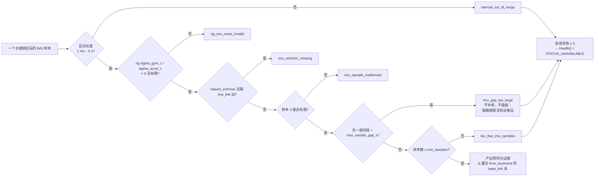

# IMU 预积分 frontend / factor builder 设计短文（PREP-B-01）

> 状态：v4 2026-09-03 · 第 2、3 周数学/frontend/factor/状态扩展保持有效；第四周按重写后的第 7–9 节收口，落地记录与四处设计偏差见第 8.6 节。**本地已验证，外部（HoloOcean 200 Hz / 30 s）待验收。**
> 出自 `docs/ROV平台到货前准备工作规格-2026-09-02.md` PREP-B-01；架构决策 D-1（阶段 1 相对位姿来源：IMU 预积分 + 声呐配准）
> 参考文献：Forster, Carlone, Dellaert, Scaramuzza, "On-Manifold Preintegration for Real-Time Visual-Inertial Odometry", IEEE T-RO 2017。**公式按论文自行推导并用数值测试验证，没有移植 GTSAM/OKVIS/VINS 任何代码**（与 `sonar_range_residual` 雅可比同一规则，见 CLAUDE.md）。

## 0. 一句话

把两个关键帧之间的 `ImuSample` 序列在机体系里预积分成一条 `ImuPreintegrationMeasurement` 证据（ΔR、Δv、Δp、15×15 协方差、五个偏置雅可比），作为因子图里第三类相对运动约束；估计器为每个关键帧增加速度 + 偏置 9 维状态，残差 15 维。到货形态（单目、无 DVL）下这是唯一的高频相对位姿来源。

## 1. 已落地的部分（第 2 周）

| 文件 | 内容 | 测试 |
|---|---|---|
| `schemas/proto/uw/domain/measurement.proto` | `ImuPreintegrationMeasurement` 追加字段 7–15：`from_keyframe`/`to_keyframe`、五个 3×3 偏置雅可比、`gravity_mps2`、`sample_count`；协方差/残差顺序定为 `[δR(3), δv(3), δp(3), bg(3), ba(3)]` | contract round-trip |
| `include/sensor_models/so3.hpp` + `.cpp` | `Hat/Vee/Exp/Log/RightJacobian/RightJacobianInverse`，小角度分支 | `tests/core/so3_test.cpp`：Exp/Log 往返（含近 π）、Jr 有限差分、Jr·Jr⁻¹ = I |
| `include/sensor_models/imu_preintegration.hpp` + `.cpp` | `ImuPreintegrationNoise::FromRig`、`PreintegratedImuDelta`（含一阶偏置修正 `Corrected*` 和 proto 往返）、`ImuPreintegrator`（增量积分 + 协方差 + 偏置雅可比） | `tests/core/imu_preintegration_test.cpp`：静止/匀角速闭式解、解析轨迹定义式对照、偏置雅可比对比重积分（误差 < 2%）、2000 次蒙特卡洛协方差对角/耦合项（±15%）、proto 往返/拒绝 |
| `include/measurement_api/frontend.hpp` | 新窄接口 `InertialFrontend` + `ImuPreintegrationRequest` | — |
| `include/frontends/imu_preintegration_frontend.hpp` + `.cpp` | `ImuPreintegrationFrontend`：窗口选样、零阶保持、imu_link 外参（旋转 + 向心杠杆臂）、fail-closed 规则、健康状态、证据封装 | `tests/frontends/imu_preintegration_frontend_test.cpp`：区间/关键帧 id/样本计数、确定性、外参旋转与杠杆臂、缺口/样本不足/区间非法/畸形样本/rig 噪声为零全部拒绝 |
| `cmake/Libraries.cmake`、`cmake/Tests.cmake` | 并入 `core`/`frontends` target | `tools/lint/check_layer_dependencies.py` 通过 |

## 2. 约定（所有后续代码必须一致）

- **坐标系**：world/body 均 Z-up（仓库不变量），重力 `g_w = (0, 0, −gravity_mps2)`，常数取 rig `imu_noise.gravity_mps2`。所有 Δ 量在 **`from_keyframe` 的 base_link 系**下，frontend 已把 imu_link 读数转到 base_link（陀螺/加速度计旋转 + 向心项 `ω×(ω×r)`，忽略角加速度项 `α×r`）。
- **定义**：`ΔR_ij = R_iᵀ R_j`，`Δv_ij = R_iᵀ (v_j − v_i − g Δt)`，`Δp_ij = R_iᵀ (p_j − p_i − v_i Δt − ½ g Δt²)`。
- **积分格式**：零阶保持；旋转按 `ΔR ← ΔR·Exp(ω dt)`；加速度项用**半步旋转** `ΔR·Exp(ω dt/2)`——论文原式用步首 ΔR，在 200 Hz、0.5 rad/s 下会留下每秒约 1 cm/s 的系统性速度漂移（`DeltasMatchAnalyticTrajectoryDefinitions` 首次实跑抓到 6 mm/s@1.2 s），改半步后降到 1e-4 量级。协方差与偏置递推按半步旋转重新推导（`.cpp` 注释有推导），蒙特卡洛和有限差分都通过。
- **噪声**：连续时间密度（rad/s/√Hz、m/s²/√Hz），离散方差 `σ_c²/dt`。偏置随机游走只取 rig `sigma_*_bias_walk_c`；`sigma_*_bias` 只作 anchor 偏置先验。任一所需白噪声或随机游走密度 ≤0/非有限时**直接拒绝**，不再跨字段回退，不给奇异协方差或语义混淆留门。
- **扰动模型**：右扰动 `R ← R·Exp(δφ)`，与 `rigid_transform_fit.hpp`、`camera_body_conjugation.hpp` 注释一致；残差里位姿块仍用现有 7 参数 `[t, q_xyzw]` 布局。
- **证据**：`estimated_noise_scale = 1.0`（估计器可再缩放）；`source_observations` 只放区间内首末样本 id（200 Hz × 数秒否则上百条）；`quality_features`：`sample_count`、`delta_time_s`、`max_hold_s`、`mean_rate_hz`、`held_backwards_at_start`、`lever_arm_m`。

下图把本节几个容易混淆的时间跨度画在同一条轴上——**区间**（关键帧边界之间）、
**保持段**（相邻两个 IMU 样本之间）、**静止预卷**（首个边界之前）各自有独立的
拒绝规则：

```text
                静止预卷 ≥ 0.5 s                    关键帧区间 i→j
     |<--------------------------->|<------------------------------------>|
IMU  ●●●●●●●●●●●●●●●●●●●●●●●●●●●●●●●●●●●●●●●●●●●●●●●●●●   ●●●●●●●●●●●●●●●●
     200 Hz                        ↑                    ↑  ↑             ↑
                                   |                    |__|             |
                          /keyframe/boundary            保持段 > 50 ms   /keyframe/boundary
                          header.capture_time =         → imu_gap_too_large  (下一个边界)
                          唯一的预积分边界时间             整条边被拒，不插值补桥

     静止判据（连续保持 ≥ 0.5 s）：|‖a‖ − g| < 0.05 m/s² 且 ‖ω‖ < 0.01 rad/s
     通过 → v₀ = 0；bg₀ = 静止段陀螺均值；ba₀ = 静止段平均比力 − 重力方向预测比力
            三者由独立惯性先验残差约束，不把整个惯性块固定
     失败 → v₀ = 0 但施加宽先验 σ_v = 0.5 m/s，
            并把 initialization = wide_velocity_prior 写进运行诊断
            （「初值为零」≠「已知为零」）

     区间长度门：≤ 1 ms 或 > 5 s → interval_out_of_range
     样本数门  ：< min_samples(2) → too_few_imu_samples
     连续失败 ≥ 3 次 → Health() = STATUS_UNAVAILABLE
```

## 3. Frontend 的 fail-closed 规则

| 条件 | 结果 | `last_rejection_reason()` |
|---|---|---|
| 区间 ≤ 1 ms 或 > 5 s（可配） | 拒绝 | `interval_out_of_range` |
| rig `sigma_gyro_c`/`sigma_accel_c` ≤ 0 或非有限 | 拒绝 | `rig_imu_noise_invalid` |
| `require_extrinsic` 且无 `imu_link` 边 | 拒绝（默认不严格：按单位阵） | `imu_extrinsic_missing` |
| 样本向量非 3 维或非有限 | 拒绝 | `imu_sample_malformed` |
| 任一保持段 > `max_sample_gap_s`（默认 50 ms = 200 Hz 丢 10 样本） | 拒绝 | `imu_gap_too_large` |
| 区间内样本数 < `min_samples`（默认 2） | 拒绝 | `too_few_imu_samples` |
| 连续失败 ≥ 3 | `Health()` = `STATUS_UNAVAILABLE` | — |



不做任何"常加速度补桥"或插值：缺数据就没有这条边，由声呐配准/深度/航向兜底。

## 4. 残差设计（已落地，`include/factor_builders/imu_preintegration_residual.hpp` + `.cpp`）

参数块（沿用 `ResidualBlock` 的 Ceres 式多块接口）：`[pose_i(7), inertial_i(9), pose_j(7), inertial_j(9)]`，其中 `inertial = [v(3), bg(3), ba(3)]`（世界系速度，机体系偏置）。

残差 15 维，按线性化偏置 `b̄` 与当前偏置差 `δb = b_i − b̄` 用证据里的雅可比一阶修正（`PreintegratedImuDelta::Corrected*` 已实现）：

```
r_R = Log( (ΔR̄ Exp(J_R^{bg} δbg))ᵀ · R_iᵀ R_j )
r_v = R_iᵀ (v_j − v_i − g Δt) − (Δv̄ + J_v^{bg} δbg + J_v^{ba} δba)
r_p = R_iᵀ (p_j − p_i − v_i Δt − ½ g Δt²) − (Δp̄ + J_p^{bg} δbg + J_p^{ba} δba)
r_bg = bg_j − bg_i
r_ba = ba_j − ba_i
```

白化：`Σ^{-1/2}` 来自证据 15×15 协方差的 LLT（偏置块为随机游走 `σ_walk² Δt`）。雅可比对 `[δφ_i, δp_i, v_i, bg_i, ba_i, δφ_j, δp_j, v_j, bg_j, ba_j]` 手推（r_R 用 `JrInv`），再用链式法则接到 7 参数四元数原始块——与 `relative_pose_residual` 现在的做法一致，并按 `sonar_range_residual` 惯例写数值差分测试。**若第 6 节选择 GN 改流形更新，则直接输出切空间雅可比。**

## 5. Factor builder（第 3 周，已落地）

`ImuPreintegrationFactorBuilder`（`kResidualModel = "imu_preintegration_v1"`）：从证据 payload `FromProto`（失败即拒绝，不默认零协方差），`proposed_noise` 由估计器按 `estimated_noise_scale` 缩放，返回上面的残差块；`involved` 列表扩到 4 块（见第 6 节）。

## 6. 状态扩展（已落地，技术负责人 2026-09-03 拍板取方案 A）

现状：`PoseGraphProblem::Keyframe` 固定 7 参数；GN 求解器直接在 7 参数上做增量并归一化四元数（v1 有意简化）；Ceres 适配器同样按 7 参数块。

**方案 A（推荐）：独立 9 维惯性参数块，按需添加。**
- `PoseGraphProblem::AddInertialState(keyframe_id, v, bg, ba)`，内部 `inertial_states_` 与 `keyframes_` 平行；`GetInertialState/SetInertialState`。
- `AddResidualBlock` 的 `involved_keyframes` 泛化为 `ParameterRef{kind: kPose|kInertial, keyframe_id}`，保留旧签名重载（全 `kPose`），现有 factor builder 一行不改。
- `MutableParameterBlocks()` 返回 `{id, kind, double*, size, fixed}`；GN 求解器的自由变量索引按块大小累计，只对 `kPose` 块做四元数归一化。纯位姿图（没有惯性块）的求解路径**逐字节不变**，`synthetic_smoke*` 的 ATE 数字不会动，这是选它的主要理由。
- Ceres 适配器：惯性块作为普通 9 维参数块添加。
- 代价：GN `EvaluateAll` 的列装配要从"每关键帧 7 列"改成"按块偏移"，约 60 行。

**方案 B：把 Keyframe 扩成 16 参数。** 改动集中但所有残差的 `ParameterBlockSizes()` 都要从 7 变 16 或做偏移映射，且合成 demo 数值会因自由度增加而变（即使没有 IMU 因子，也需要给多出的 9 维加先验或固定）。不推荐。

**顺带决策**：是否趁机把 GN 位姿更新改成 6 维切空间（`Exp(δφ)·q`）。现在 7 参数 + 归一化对小步长可用，但 15 维 IMU 残差的雅可比若直接对切空间推会更干净；建议**本任务不改**（保持 v1 求解器行为、避免同时动两处），把切空间更新列为 PREP-B-01 之后的独立项，用 `tools/bench/solver_benchmark.sh` 对比。

## 7. 初值与 anchor 陷阱（CLAUDE.md z 轴 anchor 的惯性版）

- anchor 关键帧的位姿 z 可按首个有效深度证据设置；不得从 `/gt/state` 或旧 relative-pose evidence 取位姿/速度初值。
- 合成输入在首个关键帧前必须有不少于 0.5 s 静止预卷。静止检测规则为：加速度计模长与 g 偏差 < 0.05 m/s²、陀螺模长 < 0.01 rad/s，连续保持 ≥ 0.5 s。
- 静止检测通过时：`v_0 = 0`，`bg_0` 取静止段陀螺均值，`ba_0` 取“静止段平均比力减去按重力方向预测的比力”；三者通过独立惯性先验残差约束，不能把整个惯性参数块固定。
- 静止检测失败时：速度初值可为零，但必须施加宽先验（σ_v = 0.5 m/s）并把 `initialization=wide_velocity_prior` 写入运行诊断；偏置使用 rig 零均值先验。禁止把“初值为零”误当成“已知为零”。
- `sigma_gyro_bias`/`sigma_accel_bias` 只表示 anchor 偏置先验标准差；`sigma_gyro_bias_walk_c`/`sigma_accel_bias_walk_c` 只表示相邻状态偏置随机游走密度。配置加载时不再互相回退。
- 重力方向由深度 + 加速度计静止段共同可观；roll/pitch 有绝对参考后 yaw 仍是规范自由度（与现在一致），PREP-B-02 航向因子接管。
- 每个惯性块在图里必须至少被一条 IMU 边或先验约束，否则奇异——`AddInertialState` 只在 frontend 真的产出证据时调用。

## 8. 管线接入与验收（第 4 周）

- `estimator_mode: imu_preintegration` 在配置选择器注册；IMU-only 模式即使 rig 没有相机也必须加载 rig 的 IMU noise 与 frame tree。
- 新增 canonical `/keyframe/boundary`，payload 为 `KeyframeBoundary { ObservationHeader header; KeyframeId keyframe_id; string source; }`。header.capture_time 是唯一预积分边界时间；payload 不含位姿。重复 id、非递增时间、首个边界前静止覆盖不足都要显式诊断。
- `ReplayInputAccumulator` 把关键帧边界和 IMU 样本作为算法输入积累；`reference_states` 保持 evaluator-only。`RunReplayPipeline` 的 IMU 模式不得读取 `reference_states` 建图，也不得扫描 `RelativePoseMeasurement` 提供初值。
- `synth_bag_gen` 使用独立 salt 的 `imu_rng`，先生成 ≥0.5 s 静止预卷，再按 rig `rate_hz` 生成含重力和偏置随机游走的运动段；同时写 `/keyframe/boundary`。已有 pose/sonar/landmark RNG 的 salt 与抽样顺序不得变化。
- 深度和 sonar range evidence 通过关键帧 id 关联到同一图；IMU 模式不得跳过 sonar range frontend/builder。运行摘要打印 `keyframe_boundary_count`、`imu_factor_count`、`depth_factor_count`、`sonar_range_factor_count`、初始化来源、solver 状态、迭代数和 ATE。
- 本地硬验收：不存在 GT 时算法输出不变；改变 GT 位姿/时间时算法输出仍不变；增加冲突 relative-pose evidence 时算法输出仍不变；三类因子计数均 >0；solver converged；ATE ≤0.15 m。迭代数仅记录，形成稳定基准后再决定是否恢复硬门槛。
- 外部表征：HoloOcean fidelity 200 Hz、30 s 录制必须给出逐秒 ATE/端点误差、时间倒退数、缺口拒绝数和初始化模式；“有界”不再单独构成通过条件。

## 8.5 第 3 周实际落地记录（2026-09-03）

| 文件 | 内容 | 测试 |
|---|---|---|
| `include/estimation/pose_graph_problem.hpp` + `.cpp` | 方案 A：`ParameterKind{kPose,kInertial}` + `ParameterRef`、`AddInertialState/Set/Get/Has/IsInertialFixed`、`MutableAllParameterBlocks()`（位姿在前、惯性块在后）、`ResidualBinding.involved_parameters` | `PoseOnlyGraphExposesTheSameBlocksThroughBothAccessors`、`InertialBlocksAreOrderedAfterAllPoses`、`InertialStateApiRejectsUnknownKeyframesAndUnbackedRefs` |
| `include/estimation/gauss_newton_solver.hpp` + `.cpp` | 列装配从"每关键帧 7 列"改成按块偏移（`FreeBlock{offset,size}`），只对 `kPose` 块归一化四元数；备份/回滚按 `free_order` 插入序遍历（不再遍历 hash map，去掉一处非确定性） | 既有 10 条估计器测试全绿；`synthetic_smoke` 实跑 ATE 0.0999 m / 4 迭代，落在 README 记录的 0.08–0.10 m 区间内 |
| `include/factor_builders/imu_preintegration_residual.hpp` + `.cpp` | 15 维残差 + 全解析雅可比 | `imu_preintegration_residual_test.cpp` 7 条：零残差一致性、偏置行、白化、两组中心差分（含远离线性化偏置）、四元数列投影回极小雅可比、参数列表过短拒绝 |
| `include/factor_builders/imu_preintegration_factor_builder.hpp` + `.cpp` | `imu_preintegration_v1`，LLT 白化，fail-closed | `imu_preintegration_factor_builder_test.cpp` 7 条：白化矩阵反演协方差、wire 往返、两个噪声旋钮只能放大不能收紧、错载荷/畸形消息/奇异协方差全部返回 nullptr |
| `adapters/ceres/src/ceres_pose_graph_solver.cpp` | 惯性块作为 9 维欧氏参数块加入，位姿仍带四元数流形；两个后端共用 `GaussNewtonSolver::ParameterKey` | `CeresPoseGraphSolver.ImuOnlyChainRecoversPosesAndInertialStates` |

三处实施中与原设计不同、值得记下的地方：

1. **`AddResidualBlockOnParameters` 而不是 `AddResidualBlock` 重载**。原计划"保留旧签名重载"在 C++ 里行不通：`{"kf0", "kf1"}` 这样的花括号实参对 `vector<string>` 的 initializer_list 构造和 `vector<ParameterRef>` 的 `(InputIt, InputIt)` 构造同时可行（`const char*` 在重载决议阶段就是合法的输入迭代器），GCC 直接报 ambiguous。改成不同函数名后，现有 factor builder 调用点确实一行没动。
2. **四元数列的链式法则是精确的，不是近似**。残差只看 `Pose3::FromParameterBlock` 归一化后的四元数，所以沿 q 方向本来就不变；正交方向上 `dr/dq_raw = (dr/dδφ)·2Q(q̂)ᵀ/|q_raw|`，其中 `Q = [wI+[v]_x ; -vᵀ]` 满足 `QᵀQ = I`、`Qᵀq = 0`。Ceres 的 `EigenQuaternionManifold` 会再右乘 `dq/dδφ = 0.5Q`，正好还原极小雅可比——`QuaternionColumnsProjectBackToTheMinimalJacobian` 就是在验证这一点，也是两个后端能对同一个因子看到同样曲率的原因。GN 侧沿 q 方向那一列为零（真实导数就是零），LM 阻尼保证正定，无害。
3. **两个噪声旋钮只放大不收紧**。`relative_pose_factor_builder` 那套"各向同性上限 + SVD 截断"在这里不适用——IMU 协方差是真实传播出来的量而不是配置猜测，所以 `estimated_noise_scale` 和 `proposed_noise` 一律作为方差膨胀系数相乘，没有任何路径能让因子比积分出来的协方差更自信。

## 8.6 第 4 周实际落地记录（2026-09-03，本地验证通过）

在干净工作树 `.worktrees/week4-b01-clean` 上按第 7、8 节重做，不复用被判不合格的实验补丁。

| 文件 | 内容 | 测试 |
|---|---|---|
| `schemas/proto/uw/domain/keyframe.proto` + canonical topic/event/validation/MCAP/live source/`PipelineInputPort`/`ReplayInputAccumulator` | 显式 `KeyframeBoundary` 合同：topic `/keyframe/boundary`、角色 `kAlgorithmInput`、进 localization 车道；accumulator 校验空 id/重复 id/capture_time 严格递增（**不**从 log time 派生） | `CanonicalTopics.KeyframeBoundaryIsDistinctAlgorithmInputWithExactSchema`、3 条 validation、MCAP round-trip、live lane、event pump、accumulator、event source parity |
| `apps/synth_bag_gen.cpp` | IMU experiment 专属：0.75 s 静止预卷（规格要求 ≥0.5 s，刻意留余量，见下面第 5 条）、`/raw/imu` 按 rig `rate_hz` 从 t=0 生成（含重力、初始偏置、`sigma_*_bias_walk_c` 随机游走）、每关键帧写 `/keyframe/boundary`、关键帧整体平移 0.5 s；独立 salt 的 `imu_rng`；`has_bias`/`bias_*` 刻意不写（那是真值通道）；四个泄漏探针 flag | `integration.synthetic_imu_fixture` |
| `apps/bag_audit.cpp` + `include/runtime/bag_audit_checks.hpp` | `/keyframe/boundary` 纳入审计（id 唯一、capture 严格递增）；新增 `== machine summary ==` 的 `key=value` 块（逐 topic 计数/时间跨度/速率、IMU 预卷统计、逐 topic payload digest） | `BagAuditChecks` 11 条新用例 |
| `include/frontends/imu_stationary_initializer.hpp` + `.cpp` | 静止初始化：窗口为边界前 `stationary_window_s`（默认 1.0 s）且含边界本身；阈值按第 7 节，**按窗口均值判定**；`rotation_WB` 由实测比力最小旋转给出（yaw 恒零）；`bias_accel` 只取沿重力分量 | `ImuStationaryInitializer` 12 条 |
| `include/factor_builders/inertial_prior_residual.hpp` + `.cpp` | 9 维对角先验 `diag(1/σ)·(x − target)`，解析雅可比 | `InertialPriorResidual` 7 条 |
| `src/application/replay_pipeline.cpp` | IMU 分支：anchor 取首个边界的 keyframe id（x/y/yaw 规范零、z 取自身 depth、roll/pitch 取静止重力方向、pose 固定而惯性块由先验约束）；后续状态只由上一个已估状态经 `PreintegratedImuDelta` 传播；求解前的结构奇异检查；`ReplayRunSummary` 机器可读摘要 | `ReplayPipelineImu` 4 条 + `CheckGraphObservability` 3 条 + `FormatReplayRunSummary` 1 条 |
| `tests/integration/imu_preintegration_smoke_test.sh` | 无泄漏端到端硬门槛 | `integration.imu_preintegration_smoke` |

**本地验收实测**（`configs/experiment/synthetic_imu_preintegration.yaml`）：

```
初始化      initialization=stationary，151 样本 / 0.750 s 窗口
            均值陀螺模长 4.530e-04 rad/s（阈值 0.01）
            均值比力模长 9.802616 m/s²（与 g 差 0.0040，阈值 0.05）
因子        imu 11 / sonar_range 36 / depth 12 / relative_pose 0，0 个区间被拒
结构        12 关键帧 + 12 惯性状态，174 自由维 / 218 残差维，无自由块悬空
            （自由维按最小自由度算：位姿 6 而非存储的 7；残差维只计入至少触及一个
             自由块的 residual，anchor 自己那几条只连固定块的不计）
求解        gauss_newton_v1，13 迭代收敛，cost 40.362825593 -> 22.676808641
精度        ATE rmse=0.085823429 m mean=0.0706 m max=0.1465 m（12 匹配位姿）
无泄漏      原始 / 删除 GT / GT 位姿偏移 3 m / GT 时间偏移 5 s 四次算法轨迹逐字节相同
非回归      synthetic_smoke 的 bag 与轨迹逐字节不变，4 迭代、ATE 0.0999721 m
全仓        708 条 CTest 全绿，layer lint 通过（历史验收时点记录）
```

迭代数 13 只作诊断记录，按第 8 节不设 4–10 硬门槛。

### 与本文档原设计不同、值得记下的六处

1. **合成运动段的角度剖面改成五次 smoothstep**（`ArcFraction`）。原来按匀角速度圆弧走，则 t=0.5 s 那一刻体速度从 0 跳到 `R·ω ≈ 5.09 m/s`——静止预卷判出的 `v₀ = 0` 会和真值差 5 m/s，任何估计器都救不回来。改成 `θ(s)=arc·(10s³−15s⁴+6s⁵)` 后 `θ̇(0)=θ̈(0)=0`，比力与角速度在预卷/运动交界处连续，`v₀ = 0` 才是真的。几何仍是同一条圆弧，只有沿弧的采样点不再等角度间隔，且只影响这一个新 experiment。
2. **静止模式下偏置先验 σ 做了膨胀**：`σ = sqrt(rig_σ_bias² + σ_c²/window)`，中心仍是第 7 节规定的窗口均值。实测 `bg0` 模长 5.1e-4 rad/s，而 rig 的 `sigma_gyro_bias` 只有 1.94e-5——`bg0` 里绝大部分是 0.5 s 平均后剩下的白噪声（标准误 2.4e-4）。照字面用 rig σ 等于把陀螺偏置钉在离真值约 26σ 的位置；膨胀后 σ=2.41e-4，落在 ~2σ 内。永远不会比 rig 更自信。
3. **静止判据必须按窗口均值算，不能逐样本**。rig 的 `sigma_accel_c = 2.0e-3 m/s²/√Hz` 在 200 Hz 下离散到每轴约 0.028 m/s²，阈值 0.05 只有 1.77σ——逐样本判定会有约 8% 的样本超阈，一段完全正确的静止录制反而初始化不了。0.5 s 窗口均值的标准误是 2.8e-3，比阈值小一个多量级。`bag_audit` 的 `ImuWindowStats` 与 initializer 用的是同一条口径。
4. **`AccumulateHeader` 原先把全零 Stamp 当"未填充"整条跳过**，导致仿真时钟里 t=0 这个真实时刻不进时间跨度，预卷会少算一个样本。现改为跨度含 t=0，而"是否曾经填充"仍是整 topic 属性。全零 Stamp 只有出现在**已有带戳消息之后**才判为缺陷（`HasMixedStampPopulation`）——领头的全零无法与"这条流从 t=0 开始"区分，而后者正是静止预卷产生的形态。
5. **静止窗口有了下界**（`stationary_window_s`，默认 1.0 s）。原实现把边界之前的**所有**样本都折进均值：真实录制可能在首个关键帧前机动几分钟才停稳，振荡运动的均值趋近于零，无界窗口会在几乎全是运动的数据上判出 `kStationary`，而且 `window_duration_s` 变成几分钟，`σ_c/√window` 会把偏置先验收紧一个量级。同时合成预卷从 0.5 s 改为 **0.75 s**：0.5 s 恰好等于下限，`window_duration_s >= 0.5` 只靠浮点严格相等成立，任何不能整除 0.5 s 的采样率（150 Hz 的最后一个预卷样本落在 0.4933 s）都会静默退回宽速度先验，唯一症状是 ATE 变差。
6. **结构奇异检查按最小自由度计数**。`MutableAllParameterBlocks()` 给位姿报的 `size` 是 7，但位姿只有 6 个自由度。按 7 计会把一条完全可解的纯相对位姿链（每条边 6 行、每个关键帧 7 "列"）判成奇异——而这个检查对**所有** estimator mode 生效，等于把没有深度/声呐因子的实验全部硬失败。同时只统计"至少触及一个自由块"的 residual：只连固定块的因子（anchor 自己的深度因子）是常量，计进去会虚高行数、掩盖别处真实的秩亏。

### 仍为外部待验收

HoloOcean fidelity 200 Hz、30 s 录制的逐秒 ATE/漂移曲线、时间倒退数、缺口拒绝数尚未产出（本机无仿真器）。**本地 synthetic smoke 通过不等于 B-01 已外部验证**，第 8 节最后一条的外部表征要求不因本次收口而降低。

## 9. 开放问题（需拍板）

1. ~~第 6 节方案 A/B~~ — 2026-09-03 拍板取**方案 A**，已实施，见第 8.5 节。
2. ~~GN 是否改切空间更新~~ — 2026-09-03 决定**不在本任务内做**，列为 PREP-B-01 之后的独立项，用 `tools/bench/solver_benchmark.sh` 对比后再定。当前 7 参数 + 归一化在 IMU-only 链路上收敛到 cost < 1e-12，没有暴露出必须先改的问题。
3. ~~`sigma_*_bias` 与 `sigma_*_bias_walk_c` 的语义~~ — 2026-09-03 拍板分离：前者只用于初始偏置先验，后者只用于随机游走；缺少 walk 字段时配置校验失败，不再回退。
4. 杠杆臂角加速度项：当前忽略；若 IMU 安装距机体原点 > 10 cm 且需要高动态机动，再加 `α×r`（需要陀螺差分）。
5. HoloOcean 30 s 漂移的最终数值门槛在首次无泄漏录制形成基线后确定；当前该项是量化表征，不作为 B-01 本地收口阻断项。
