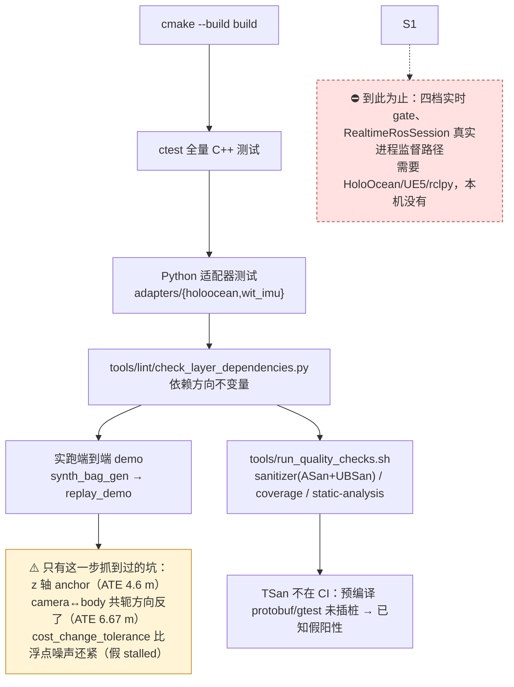

# 测试与验证指南

> 状态：**当前说明**。回答"每一块功能怎么测、需要加载什么运行环境、怎么判断跑对了"。
> 不是构建入门——先看[根 README](../README.md)的「快速开始」。这里假设依赖已经装好
> （`./tools/setup_dev_env.sh` 已跑过），只讲验证流程本身。
> 最近核对：2026-08-22，基于 `8df083b` 及当前工作区。

## 先跑一键验证

大多数场景只需要这一条命令，它按顺序跑完 README「构建 / 运行端到端 Demo / 测试
策略」三节描述的每一步，并把每步的命令、完整日志、耗时和 PASS/FAIL 状态写到
`--out-dir` 下：

```bash
tools/verify_pipeline.sh --out-dir /tmp/uw_slam_verify/check
cat /tmp/uw_slam_verify/check/summary.txt
```

当前复核：1～6 步全部 PASS（历史数字，以实跑为准）；最新 CTest/Python
`35/35`，默认
合成回放 ATE RMSE `0.0665821 m`，并生成 trajectory、manifest 与 synthetic MCAP。
旧记录保留用于追溯，不应再作为当前测试数量或数值基线。

下图是这条脚本背后的验证顺序，以及**本机能跑到哪一步**的分界——最后那一步
"实跑 demo"不能省：仓库里几个最贵的 bug 都是单元测试全绿、实跑才暴露的。



## 分项验证：每个功能怎么单独测

改动只涉及某一模块时，不必每次跑全量脚本，按下表挑对应命令即可（ctest 用例现在按
架构层分组注册为 `unit.<layer>.*`/`contract.*`/`integration.*`，用 `-L <label>` 选层比
拼单个用例名字更稳）；跨 `include/`/`src/` 架构层接口的改动仍建议跑一次全量
`verify_pipeline.sh`。

| 功能 | 验证命令 | 需要的运行环境 | 判定标准 |
|---|---|---|---|
| 消息格式与接口一致性测试（Protobuf round-trip + `measurement_api` 接口） | `ctest --test-dir build -L contract` | `uw_slam_build` conda env 在 `PATH` 里 | 通过 |
| 声呐 CFAR 前端 | `ctest --test-dir build -R SonarCfarFrontend` | 同上 | 通过（fixture 回归） |
| 因子构建（雅可比数值验证） | `ctest --test-dir build -L factor_builders` | 同上 | 通过 |
| 状态估计（Gauss-Newton/LM） | `ctest --test-dir build -L estimation` | 同上 | 通过 |
| 地图 + 轨迹评测 | `ctest --test-dir build -L "mapping|evaluation"` | 同上 | 通过 |
| 点云地图指标原语 | `ctest --test-dir build -R MapMetrics` | 同上 | 6 项通过；覆盖已知点集与空输入约定，不代表已接入真实回放或可处理百万点地图 |
| 相机 plumb-bob 去畸变原语 | `ctest --test-dir build -R "PlumbBob\|Undistort"` | 同上 | 9 项通过；只证明 same-K remap 原语，不代表已接入 replay 或支持任意离轴双目 rig |
| 端到端声呐 pipeline demo（`estimator_mode: black_box_vio`，默认） | 见下方「手动跑端到端 Demo」 | 同上 | 6 次迭代收敛，ATE rmse 约 0.06~0.07m |
| 端到端声呐 pipeline demo（`estimator_mode: stereo_landmark_vo`） | 同上，`--experiment` 换成 `configs/experiment/synthetic_smoke_vo.yaml`，见下方「手动跑端到端 Demo」 | 同上 | 7 次迭代收敛，ATE rmse 与 `black_box_vio` 路径量级相当（约 0.06m） |
| 光学立体深度 baseline（acoustic-optic plan 2） | `build/bin/synth_stereo_gen --out /tmp/stereo.mcap`，再 `build/bin/optical_baseline_eval --bag /tmp/stereo.mcap --experiment configs/experiment/synthetic_smoke.yaml --max-rmse-m 0.05 --min-coverage 0.9` | 同上 | 打印一行 `rmse_m=... coverage=... OK`；退出码 0 |
| 声光融合场景矩阵（plan 5） | `build/bin/acoustic_optic_scenario_matrix --experiment configs/experiment/synthetic_smoke.yaml --seed 4242 --trials-per-scenario 8` | 同上 | 退出码必须为 0；四个 fail-closed/消融场景预期 0 accepted，其余五个场景必须非零；固定 seed 双跑除墙钟延迟外一致 |
| 确定性回放（集成测试） | 已含在 ctest 里：`integration.replay_determinism`、`integration.optical_baseline_smoke`、`integration.acoustic_optic_scenario_matrix_determinism`（`ctest --test-dir build -L integration`）；也可单独 `bash tests/integration/<name>.sh <对应二进制路径...>` | 同上 | 同 seed 两次运行输出逐字节一致（scenario matrix 一项排除 `p95_latency_ms`，因为它是真实墙钟耗时，本来就不该要求确定性） |
| HoloOcean Python 网关（坐标变换 / 相机与状态转换 / MCAP writer / 场景随机化 / `record_session.py` 录制拼装逻辑，不含真实仿真器调用） | `(cd adapters/holoocean && .venv/bin/pytest -q)`（首次需要 `.venv/bin/pip install -e ".[dev]"`，见 [HoloOcean 适配器 README](../adapters/holoocean/README.md)） | `adapters/holoocean/.venv`，**不能**用 conda env 里的 `pytest`——会解析到 base conda 环境，既缺 `uw_holoocean_adapter` 包，又会因为 protobuf gencode/runtime 版本不一致直接报 `VersionError` | 35/35 通过 |
| Protobuf schema 改动后重新生成 Python 绑定 | `tools/codegen/gen_py.sh` | `adapters/holoocean/.venv` | 生成/更新 `schema_pb2/`；跑完之后 pytest 应仍然全过 |
| 依赖方向不变量（`include`/`src` 生产代码不许 include ROS/HoloOcean，也不许用旧 `uw/...` 手写头路径） | `tools/lint/check_no_ros_in_core.sh`（等价于 `tools/lint/check_layer_dependencies.py .`） | 无特殊环境 | 打印 `OK: ...` |
| ASan+UBSan | `tools/run_quality_checks.sh sanitizer` | conda C++ 工具链；独立使用 `build_asan/` | 全量 CTest 通过且无 sanitizer 报告 |
| Coverage 报告 | `tools/run_quality_checks.sh coverage` | gcc/gcov；独立使用 `build_cov/` | CTest 通过并打印仓库源码行覆盖摘要；当前不设覆盖率门槛 |
| 静态分析 | `tools/run_quality_checks.sh static-analysis` | 可选 `cppcheck` | 输出 warning/performance/portability 发现；当前只报告、不作为失败 gate |

### 手动跑端到端 Demo

```bash
export PATH="$HOME/miniconda3/envs/uw_slam_build/bin:$PATH"

build/bin/synth_bag_gen \
  --experiment configs/experiment/synthetic_smoke.yaml \
  --out /tmp/synthetic.mcap

build/bin/replay_demo \
  --bag /tmp/synthetic.mcap \
  --experiment configs/experiment/synthetic_smoke.yaml \
  --out /tmp/demo

cat /tmp/demo_trajectory.tum
```

期望输出里能看到 `solver: N iterations, cost ... -> ... (converged)`、
`sonar frame processing latency: p95_ms=...` 和一行 `ATE: rmse=...m ...`；其中声呐
P95 是离线批处理 pass 的 CPU 耗时代理，不是 live capture-to-pose 延迟。默认合成场景
（seed 固定为 42）求解器通常 6 次迭代收敛，
ATE rmse 约 0.06~0.07m，不同 seed/配置下会有波动，这不是验收阈值（原因见根
README「运行端到端 Demo」一节：sonar_range_factor 目前不联合优化路标，首次观测的
elevation 误差会摊到 x/y 上）。

把 `--experiment`/`--bag`/`--out` 换成 `synthetic_smoke_vo.yaml` 对应的路径，可以
验证 `estimator_mode: stereo_landmark_vo` 路径——相对位姿因子改由
`include/frontends/stereo_landmark_vo_frontend.hpp` 从 `synth_bag_gen` 写入的合成
左右相机帧实时计算（角点/blob 检测 + NCC 匹配 + RANSAC 刚体拟合），而不是从 bag
里直接读 ground-truth+noise 证据：

```bash
build/bin/synth_bag_gen \
  --experiment configs/experiment/synthetic_smoke_vo.yaml \
  --out /tmp/synthetic_vo.mcap

build/bin/replay_demo \
  --bag /tmp/synthetic_vo.mcap \
  --experiment configs/experiment/synthetic_smoke_vo.yaml \
  --out /tmp/demo_vo
```

期望能看到一行 `stereo_landmark_vo_frontend: computed relative-pose evidence
from camera frames ...`，求解器 7 次迭代收敛，ATE rmse 与默认路径量级相当
（约 0.06m）。

真实 HoloOcean 离线回放使用 `configs/experiment/real_holoocean_vo.yaml` 和单独保存的
约 78 MB、50-keyframe bag。当前观测是 49 条 VO 相对位姿、50 个深度 factor、对齐
ATE RMSE `0.5596 m`，求解器 30 次迭代后 `stalled`；因为该 bag 没有 sonar/IMU/DVL，
声呐 factor 和稠密地图为 0。这是路径诊断证据，不是通过门限，也不是仓库内可移植的
自动回归（bag 未版本化）。

## 目前测不了的部分（不是环境配置问题，是仓库当前阶段本来没做）

- **本机上的 HoloOcean 真实仿真器回归**：这台机器没有 Unreal Engine 二进制和 Epic
  Games 账号联动，不能重跑 `HoloOceanSession`。原生 Windows HoloOcean 2.3.0 已产生过
  一份真实录制并完成上述离线回放，但还没有版本化、全传感器的自动回归数据集。
  测试。
- **大规模地图质量回归**：`ComputeMapMetrics` 已有小点集单测，但还是 `O(NM)` 暴力
  最近邻，也没有版本化 reference map；不能直接用于回放产生的数百万局部地图数据点。
- **可信 TSan**：CMake 保留 `-DUW_SANITIZER=thread`，但当前 conda-forge
  protobuf/gtest 动态库未用 TSan 插桩，会产生假阳性；CI 只跑 ASan+UBSan。要启用 TSan
  门禁需先从源码重编这些依赖，并在本沙箱处理 ASLR 限制。

## 环境速查

| 环境 | 用途 | 加载方式 |
|---|---|---|
| `uw_slam_build` conda env | C++ 构建、ctest、所有 `build/` 下的可执行文件 | `export PATH="$HOME/miniconda3/envs/uw_slam_build/bin:$PATH"` |
| `adapters/holoocean/.venv` | Python 适配器 pytest、`gen_py.sh` | 直接用 `.venv/bin/pytest` / `.venv/bin/python`，不要指望 `PATH` 上的全局 `pytest` |

三个环境互不重叠，也不需要同时加载——按你要测的那一项对号入座即可。
