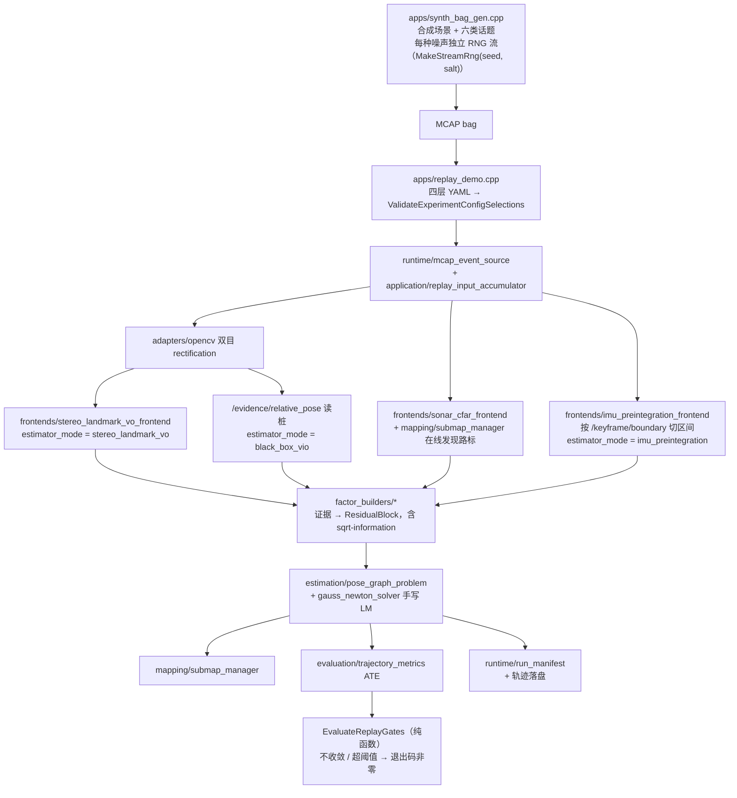
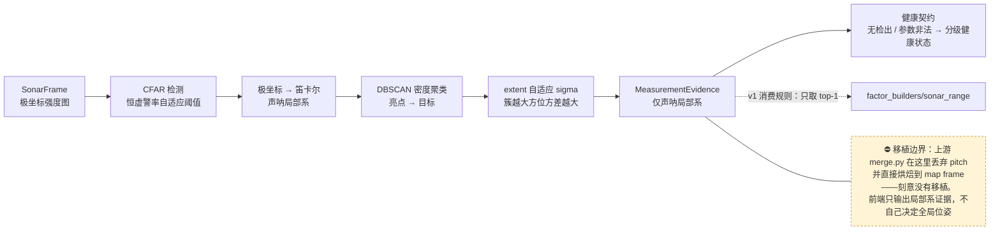
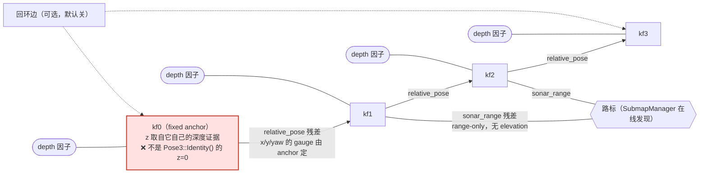

# uw_slam 离线 SLAM 管线深度走读（主线一）

> 逐文件、逐阶段拆解离线 SLAM 管线（`synth_bag_gen` → `replay_demo`）的代码与逻辑，
> 与[新人上手指南](./uw-slam-newcomer-guide.md)互补：那篇先建立"两条主线共享的地基"
> （消息模型、规范 topic、统一事件契约、分层依赖）和 60–90 分钟上手路径，本文只讲
> 主线一，但对每个阶段给出更细的机制、数学和"为什么这么写"。
> 核对于当前工作树（HEAD `f4d3f3e`），2026-08-28。文中 `file:line` 以该版本为准，
> 后续会漂移——以函数名/文件为准。

## 目录

- [术语速查表](#术语速查表)
- [0. 全景：一条 bag 的旅程与分层](#0-全景一条-bag-的旅程与分层)
- [1. 数据生成端：`apps/synth_bag_gen.cpp`](#1-数据生成端appssynth_bag_gencpp)
- [2. 入口与配置分层](#2-入口与配置分层)
- [3. 统一事件入口：McapEventSource → PumpEvents → ReplayInputAccumulator](#3-统一事件入口)
- [4. 立体校正前置](#4-立体校正前置)
- [5. 相对位姿证据：`estimator_mode` 的两条路](#5-相对位姿证据estimator_mode-的两条路)
- [6. 回环闭合（可选，默认关）](#6-回环闭合可选默认关)
- [7. 声呐前端：CFAR → 首触 → DBSCAN → 假设集](#7-声呐前端)
- [8. 数据关联与地标发现：SubmapManager 在线查询](#8-数据关联与地标发现)
- [9. 深度因子与 z 轴 anchor](#9-深度因子与-z-轴-anchor)
- [10. 因子图与求解器](#10-因子图与求解器)
- [11. 状态落盘与轨迹输出](#11-状态落盘与轨迹输出)
- [12. 声光融合 pass（可选，不入图）](#12-声光融合-pass)
- [13. ATE 评测、RunManifest 与 gates](#13-ate-评测runmanifest-与-gates)
- [14. 运行命令与期望输出](#14-运行命令与期望输出)
- [15. v1 简化边界汇总](#15-v1-简化边界汇总)

---

## 术语速查表

正文里反复出现的机器人/SLAM 行话，在此给中文对照与一句解释。**代码标识符（类型名、函数名、文件名）保留英文**——它们要与代码对得上、可全文检索，不做翻译；需要解释的是它们背后的概念。

| 术语 | 中文 | 一句话解释 |
|---|---|---|
| bag | 数据包 | 一段按时间排序的多传感器消息记录（本仓库用 MCAP 格式） |
| MCAP | 数据包文件格式 | 一种开源的机器人日志容器格式，等价于 ROS1 时代的 rosbag |
| RNG / RNG 拆流 | 随机数生成器 / 随机数流拆分 | `std::mt19937_64` 这类带种子的伪随机数产生器；"拆流"= 给每种噪声用途各开一条独立种子流，互不干扰 |
| seed | 随机种子 | 决定伪随机序列的初始整数；同 seed 必须产出逐位相同的"随机"序列（可复现性的根基） |
| rig / rig calibration | 传感器rig / 传感器标定配置 | "rig"源自影视/钻探行业的"设备架"：刚性固联的一组传感器及其相互几何。本仓库指 `RigCalibrationSnapshot` proto——各传感器到机体的外参、相机内参、声呐几何、时间偏移的集合 |
| 外参 / 内参 | 相机外参 / 相机内参 | 外参 = 相机坐标系相对机体坐标系的安装位姿；内参 = 焦距、主点、畸变等相机自身的成像参数（K 矩阵） |
| keyframe | 关键帧 | 从连续传感器流中抽出的、代表一个时刻的"锚点"数据单元；SLAM 的优化变量就是每个关键帧的位姿 |
| pose / Pose3 | 位姿 | 位置 + 朝向的组合；本仓库 `Pose3` = 平移向量 + xyzw 单位四元数 |
| 四元数 (quaternion) | 四元数 | 用 4 个数 (x,y,z,w) 表示三维旋转的数学对象，无万向锁问题（仓库禁用欧拉角的原因） |
| factor / factor graph | 因子 / 因子图 | "因子"= 一条带权重的软约束（如"两帧相对位姿应约等于这个测量"）；因子图 = 所有关键帧位姿 + 所有权重约束组成的最小二乘问题 |
| residual / residual block | 残差 / 残差块 | "测量值 − 模型预测值"的差；优化目标就是把所有残差的加权和降到最小 |
| Jacobian | 雅可比矩阵 | 残差对状态变量的导数——告诉求解器"这个测量对各位姿的敏感方向" |
| sqrt-information | 根信息矩阵 | 权重矩阵（= 协方差之逆的开方）：越可信的测量权重越大 |
| gauge freedom / gauge | 规范自由度 | 图里没有绝对参考、整体随便平移旋转解都等价的那几个维度；必须人为"钉住"一个锚点消掉 |
| anchor | 锚帧 | 被 fixed 钉住、不参与优化的关键帧，用来消规范自由度 |
| dead reckoning | 航位推算（死推） | 只靠相对测量一步步外推位姿、没有绝对参考修正的状态 |
| VO (visual odometry) | 视觉里程计 | 从相机图像序列算出相对位姿的方法 |
| loop closure | 回环闭合 | "我回到了来过的地方"检测：在历史关键帧中找到重访并补一条约束，拉回累积漂移 |
| CFAR | 恒虚警率检测 | 声呐/雷达里"自适应阈值找亮点"的经典算法：按周围背景噪声动态定门限，让虚警率恒定 |
| DBSCAN | 密度聚类 | 把相邻的点聚成一簇、孤立的点当噪声的无监督聚类算法 |
| bearing / range | 方位 / 距离 | 相对传感器的角度 / 直线距离；声呐原始观测就是 (range, bearing) 极坐标对 |
| elevation | 仰角 | 相对方位角（水平面内角度）的俯仰方向角度；本型号声呐测不到，是 v1 误差来源 |
| polar / Cartesian | 极坐标 / 笛卡尔坐标 | 极坐标 = (距离,角度)；笛卡尔 = (x,y,z) 直角坐标。声呐前端刻意只在极坐标里出证据 |
| stereo / disparity | 双目 / 视差 | 双目 = 左右两台相机；视差 = 同一点在左右图中的水平像素差，深度 ∝ 焦距×基线/视差 |
| rectification / rectified | 立体校正 / 已校正的 | 把左右图像重采样到"行对齐"的规范几何上，使视差搜索变成同一行内的一维查找 |
| triangulation | 三角化 | 已知左右相机位姿 + 同一点在两图中的位置，解出该点的三维坐标 |
| RANSAC | 随机抽样一致 | 从含外点的对应关系中稳健拟合模型的方法：随机抽最小样本集→拟合→数内点，重复取最优 |
| Kabsch / Procrustes | Kabsch 拟合（刚体对齐） | 已知两组对应 3D 点，求最优旋转+平移对齐它们的经典 SVD 算法（也叫 Umeyama，不带尺度时） |
| landmark | 路标 | 世界中被多帧观测到的固定 3D 点，SLAM 地图的基本单元 |
| data association | 数据关联 | 判断"这次检测是不是上次那个目标/路标"的问题；SLAM 最容易错的环节之一 |
| submap | 子地图 | 地图的分段管理单元；本仓库 v1 的 `SubmapManager` 名字有 historical 成分，实际只是关键帧索引的证据库 |
| ATE | 绝对轨迹误差 | 估计轨迹与真值轨迹对应点的距离统计（rmse/mean/max），SLAM 精度的标准指标 |
| TUM 格式 | TUM 轨迹格式 | `时间戳 x y z qx qy qz qw` 每行一位姿的文本格式，因 TUM 机器人组广泛使用得名 |
| AUV / ROV | 自主水下机器人 / 遥控水下机器人 | 前者自主航行；后者（本项目）由操作员/飞手驾驶 |
| FLS (forward-looking sonar) | 前视声呐 | 朝前方成像的声呐，输出"距离×方位"的强度图像（本项目的 SV1213） |
| solver | （位姿图）求解器 | 迭代最小化因子图总残差的数值优化器（高斯-牛顿 / LM / Ceres 等） |
| GN / LM | 高斯-牛顿 / Levenberg-Marquardt | 两种经典非线性最小二乘算法；LM = GN + 阻尼项防步子过大 |
| LDLT / SVD | LDLT 分解 / 奇异值分解 | 两种矩阵分解：LDLT 解对称正定线性方程组（快）；SVD 提取矩阵的方向/奇异值（稳健） |
| quaternion double cover | 四元数双覆盖 | q 和 −q 表示同一个旋转；代码里 `w<0 时翻转残差` 就是在防这个引起的跳变 |
| MANIFOLD update / renormalize | 流形更新 / 重归一化 | 正确做法是在旋转流形上做增量更新；v1 简化为"普通加法后把四元数除以自己的模" |
| HMI | 人机界面 | 给操作员看的显示层：overlay 叠加图 + 状态 JSON |
| proto / protobuf | Protobuf 消息 | Google 的跨语言序列化格式；本仓库 `schemas/proto/` 是全部消息定义的唯一事实源 |
| provenance | 溯源信息 | "这数据/这配置从哪来"的元数据（版本、hash、来源声明） |

---

## 0. 全景：一条 bag 的旅程与分层

```
apps/synth_bag_gen.cpp              ① 造合成数据 → synthetic.mcap（已知真值 + 噪声测量）
        │
apps/replay_demo.cpp                ② 薄壳，只做 CLI 参数解析
        │
src/application/replay_pipeline.cpp   RunReplayPipeline() —— 全部编排逻辑
        │
   ③ 配置分层加载        ④ 统一事件入口       ⑤ 立体校正
   ⑥ 相对位姿证据        ⑦ 回环闭合(可选)     ⑧ 声呐前端+数据关联
   ⑨ 深度因子            ⑩ 因子图求解         ⑪ 状态落盘+轨迹输出
   ⑫ 声光融合(可选)      ⑬ ATE+gates+manifest
```

同一条链按数据流展开（框里写的是文件/组件名，方便直接跳到对应小节；根 README 的离线数据流图是概念级的同一条链，两张图分工不同）：



架构分层（`tools/lint/check_layer_dependencies.py` 强制单向依赖）：

```
domain → core → {frontends, factor_builders, estimation, mapping,
                 runtime, evaluation, adapters, opencv_adapters} → application → apps
```

主线一各阶段落在哪一层：

| 阶段 | 层 | 关键文件 |
|---|---|---|
| ① 数据生成 | apps | `apps/synth_bag_gen.cpp` |
| ② 入口 | apps | `apps/replay_demo.cpp` |
| ③ 配置 | runtime | `include/runtime/config.hpp` + `src/runtime/config.cpp` |
| ④ 事件入口 | runtime + application | `runtime/mcap_event_source.hpp`、`application/event_pump.hpp`、`application/replay_input_accumulator.hpp` |
| ⑤ 校正 | opencv_adapters | `adapters/opencv/`（`stereo_rectifier`） |
| ⑥⑦ 前端 | frontends | `stereo_landmark_vo_frontend`、`loop_closure_frontend` |
| ⑦ 声呐前端 | frontends | `sonar_cfar_frontend` + `cfar_detector` + `dbscan` |
| ⑧ 关联 | application + mapping | `replay_pipeline.cpp` 声呐 pass + `mapping/submap_manager` |
| ⑨⑩ 估计 | factor_builders + estimation | `factor_builders/*`、`estimation/{pose_graph_problem,gauss_newton_solver,state_store}` |
| ⑪ 状态 | estimation + application | `state_store`、`BuildStateSnapshot` |
| ⑫ 声光 | frontends + mapping | `stereo_optical_depth_frontend`、`acoustic_optic_*`、`mapping/acoustic_optic_map_bridge` |
| ⑬ 评测 | evaluation | `evaluation/trajectory_metrics.cpp` 等 |

基础类型 `Pose3`（`include/sensor_models/geometry.hpp`）：平移 + xyzw 单位四元数，提供 `operator*`（compose）、`Inverse()`、`Apply()`，以及与 7 参数块 `[tx,ty,tz,qx,qy,qz,qw]`（`ToParameterBlock`/`FromParameterBlock`）和 protobuf `Transform3D`（`ToProto`/`FromProto`）的互转。7 参数块布局刻意对齐 SVIn/OKVIS 的参数块约定（移植 `sonar_range_residual` 时对接用的）。禁欧拉角是仓库级铁律。

---

## 1. 数据生成端：`apps/synth_bag_gen.cpp`

**为什么存在**：本机没有 HoloOcean/ROS2（开发机环境限制），需要一条带已知真值的合成 bag 让 `replay_demo` 端到端跑通 FactorBuilder → PoseGraphProblem → GaussNewtonSolver → StateStore → SubmapManager 整条链（文件头注释，`synth_bag_gen.cpp:1-26`）。

### 1.1 场景与轨迹

默认场景（`ScenarioOptions`，可被 `--experiment` 的 scenario 层覆盖，CLI 最后）：12 个 keyframe、5 Hz（200 ms 间隔，`synth_bag_gen.cpp:409`）、沿半径 8 m 的圆弧走 1.4 rad、深度 12 m。轨迹由 `BuildGroundTruthTrajectory` 解析生成：z = `-depth_m` （Z-up、正向下约定），朝向沿弧线切向。

### 1.2 写入的六类话题

| 话题 | 消息 | 说明 |
|---|---|---|
| `/gt/state` | `StateSnapshot` | 每帧真值。**仅供评测支路**（ATE），永不进估计状态 |
| `/evidence/relative_pose` | `MeasurementEvidence(RelativePoseMeasurement)` | 真值相对位姿 + 高斯平移噪声——这就是 `black_box_vio` 模式读的"黑盒 VIO 桩" |
| `/raw/sonar_frame` | `SonarFrame` | 合成成像声呐 ping。**不是**预计算的 range-bearing 证据——回放侧跑的是真实 CFAR 前端 |
| `/evidence/depth` | `MeasurementEvidence(PressureDepthMeasurement)` | 正向下水深，σ=0.05 m；z 轴唯一绝对参考 |
| `/raw/camera/left,right` | `ImageFrame` | 合成立体对，仅 `--experiment` 的 rig 带相机时写 |
| `/scenario/sonar_targets` | `MapEvidence` | 场景级目标点表（float32 xyz 点云载荷），v1 审计/复现用 |

### 1.3 RNG 拆流（重要，踩过坑）

`MakeStreamRng(seed, salt)`（`synth_bag_gen.cpp:127-131`）：pose / sonar / landmark 三种噪声各开一条独立 `std::mt19937_64`，由 `{seed, salt}` 播种，互不干扰。

历史上三种噪声共用一条流：每个 keyframe 循环里 sonar 噪声抽取次数 = 该帧量程内的目标条数，这个数一变，后续所有帧的 pose 噪声抽样跟着错位——同一个 `seed: 42`，两个只差目标数量的 experiment 烘焙出的相对位姿噪声实现完全不同，ATE 差几倍，曾被误读成"声光融合让 ATE 变差"（实际无因果关系）。修法即拆流。代价是：拆流换了噪声实现，CLAUDE.md/README 里 2026-08-26 之前的 ATE 数字都是旧实现下的值（已回填新基线），`docs/` 下归档文档的历史数字未逐一回填。

### 1.4 合成声呐

对每个 keyframe，遍历场景目标：把目标投到当前位姿的局部系，range > 12 m 跳出；否则按 (range, bearing) 加噪后调 `RenderSyntheticSonarFrame`（`runtime/synthetic_sonar`）渲染一帧极坐标声呐图像。**每个在量程内的目标写一帧**（不是一帧覆盖全部）——这是配 `replay_demo` 的 v1 "top-1 假设消费"规则的刻意简化，不是通用多目标声呐模型。目标落在声呐帧外时打 warning、写背景帧。

### 1.5 合成立体对（`BuildStereoPair`）

只有 rig 带相机才执行：

- 路标云 `BuildVisualLandmarks`：每个 keyframe 沿弧线位置聚簇撒 10 个 3D 路标（半径/深度抖动避免共面——共面点集会让 Kabsch 拟合退化）。聚簇密度锚定 keyframe 是实测教训：早期均匀撒点在弧长变大后相邻帧重叠路标塌到 1 个，VO 链断。
- 每个路标的 patch 图案由 `LandmarkPatchIntensity(landmark_id, du, dv)` 的位置哈希生成——按 id 唯一、可复现、彼此可区分，是给 `bright_blob` 检测器 + NCC 匹配调的外观假设。
- 双目绘制：背景纹理右图相对左图移 `background_disparity_px`（对应 15 m 背景深度）；每个路标 patch 按各自深度视差**同时画进左右两图**（早期只 warp 右图的 trick 给不出单帧可检测的 blob，已被替换）。
- 场景气度：声呐目标若碰巧在相机（窄）视场内，也以大 id 偏移（100000+）画进立体对——否则声光关联的 range 门永远找不到匹配的光学候选，ACCEPTED 场景无法演示。

---

## 2. 入口与配置分层

`apps/replay_demo.cpp` 只有 45 行：解析 `--bag/--experiment/--out/--max-iterations/--align-ate`，调 `uw::application::RunReplayPipeline`。用例编排在 `application` 层——"apps 只做入口"规则的样板。

### 2.1 四层 YAML

`LoadExperimentConfig`（`src/runtime/config.cpp`）按 `defaults → rig → scenario → experiment` 合并。experiment YAML 里的 `defaults:`/`rig:`/`scenario:` 三个 key 是**相对 `configs/` 目录**的路径（不是相对 experiment 文件所在目录——踩过的坑）。rig 层直接解析进 `RigCalibrationSnapshot` protobuf 消息（rig 配置的唯一事实源在 `.proto`，不另建平行 struct）。

`ValidateExperimentConfigSelections` 对六个选择器 fail-fast：`sonar_frontend`/ `optical_frontend`/`map_backend`/`estimator_mode`/`landmark_detector`/`defaults.solver` 。真正驱动分支的只有三个：`estimator_mode`、`landmark_detector`、`solver`；sonar/optical frontend 与 map_backend 当前各只有一个被接受的实现——**fail-fast 不等于已有多后端**。

### 2.2 关键配置默认值（`configs/defaults/platform.yaml` ↔ `PlatformDefaultsConfig`）

| 组 | 字段 | 默认值 |
|---|---|---|
| 求解 | `solver` / `max_iterations` / `initial_lambda` | `gauss_newton_v1` / 30 / 1e-3 |
| sqrt-info | `relative_pose.{translation,rotation}` / `sonar_range` / `depth` | 20 / 20 / 15 / 20 |
| 立体校正 | `alpha` / `crop_policy` / `frame_suffix` | 0.0 / `full_canvas` / `_rectified` |
| VO | `max_consecutive_failures` / `max_condition_number` / `residual_variance_floor_m2` / `max_inlier_rmse_m` | 3 / 1e8 / 1e-8 / ∞(关) |
| 回环 | `enabled`（默认关）/ `candidate_search_radius_m` / `min_keyframe_index_gap` / `max_accepted_translation_m` / `max_accepted_rotation_rad` / `huber_delta` | false / 3.0 / 15 / 5.0 / 0.6 / 1.5 |
| 立体匹配 | `min_texture_variance` / `min_uniqueness_margin` / `left_right_max_diff_px` | 25 / 2 / 1 |
| 声呐前端 | `training_cells` / `guard_cells` / `probability_false_alarm` / `detector_threshold` / `dbscan_eps_m` / `dbscan_min_samples` / `default_range_sigma_m` / `default_bearing_sigma_rad` | 16 / 4 / 0.01 / 50 / 0.20 / 2 / 0.05 / 0.01 |
| warmup | `warmup_seconds` | 0（关） |
| gates | `require_converged` 默认**开**；其余（ATE 上限、最少匹配帧数、非空地图、声光最少接受数等）默认关 | — |

CLI `--max-iterations` 最后覆盖 defaults。

---

## 3. 统一事件入口

```
McapEventSource (runtime)                MCAP bag → CanonicalEvent 流
   → PumpEvents (application/event_pump) 唯一做 payload switch 的地方
      → ReplayInputAccumulator           PipelineInputPort 实现：拍平 + 身份校验
         → ReplayInputData               images/sonar_frames/evidence/reference_states/... 平铺向量
```

这是回放链路的输入契约：`EventSource` 抽象了"事件从哪来" （MCAP/内存/实时），`PipelineInputPort` 抽象了"事件到哪去"，算法代码对来源无感。一致性由 `tests/integration/event_source_parity_test.cpp` 把关：同一批事件走 MCAP 与内存两种 source，应用侧看到的顺序必须一致。

`ReplayInputAccumulator`（`include/application/replay_input_accumulator.hpp`）的 **身份校验**：

- 空 `observation_id`、重复 (sensor_id, observation_id)（除 SonarFrame 刻意允许——合成/真实声呐一帧一目标的建模合法复用同一观测身份）、悬空 `evidence.source_observations` 引用，各自计数并生成人类可读消息；
- `HasErrors()` 为真则 `RunReplayPipeline` 直接失败返回——**绝不静默丢坏数据**；
- 跨引用校验延迟到 `Flush()`（evidence 可以合法地先于它引用的原始观测出现在 log_time 顺序里）；
- `EvidenceLogTimeNs()` 与 evidence 平行存储，作为 keyframe 时间戳的最后兜底（见 §11 的优先级层）。

关键设计：**keyframe 身份一律来自 wire 字段**（`header.observation_id`、`evidence.source_observations`），从不从时间戳反推。这是回放源和将来的实时源能共用同一套下游的前提。

---

## 4. 立体校正

`replay_pipeline.cpp:343-359`：rig 带相机时，用 `opencv_adapters:: StereoRectificationContext::Create()`（参数来自 `defaults.stereo_rectification`）建校正上下文。**失败 = 整个 run 立即失败**——下游所有相机消费路径都硬性要求 `is_rectified()==true`，校正不了就意味着每条相机链路都会静默产出零证据，宁可 fail-fast。

原始帧在整个 run 里保持 RAW；校正（`ConvertToMono8` + `Process()`）按需进行并经 `get_rectified` lambda 缓存（`replay_pipeline.cpp:509-523`），保证 VO pass 和声光 pass 不重复重采样同一像素。单帧校正失败是**逐帧条件**（返回 nullptr、跳过该帧），不是 fatal——与上下文创建失败区分开。

---

## 5. 相对位姿证据：`estimator_mode` 的两条路

`replay_pipeline.cpp:574-676`。这是第一个真正的分支选择器。

### 5.1 `black_box_vio`（默认）

直接消费 bag 里的 `/evidence/relative_pose`（synth_bag_gen 烘焙的"真值+噪声"）。对每条 evidence：

```cpp
initial_guess = problem.GetKeyframePose(from) * measured_relative;  // dead-reckoning 链式外推
problem.AddKeyframe(to, initial_guess);
block = relative_pose_builder.Build(candidate, evidence, {});
problem.AddResidualBlock(std::move(block), {from, to});
```

初始猜测只用于给图变量一个初值；因子本身只含测量。

### 5.2 `stereo_landmark_vo`

`StereoLandmarkVoFrontend` 从校正后立体对**现算**相对位姿（`include/frontends/stereo_landmark_vo_frontend.hpp`）：

```
左图检测路标（bright_blob 或 harris_corner，由 landmark_detector 选）
  → 左右匹配（PatchMatcher，行约束/epipolar）→ 三角化出本帧 3D 路标
  → 与上帧路标做时序外观匹配（同样本帧不知道路标身份）
  → RANSAC + Kabsch/Procrustes SVD 拟合刚体变换（rigid_transform_fit）
  → RelativePoseMeasurement + 6x6 协方差估计
```

要点：

- **有状态前端**：`reference_landmarks_` 保存的是**最后一个成功匹配帧**的路标，不是 "上一处理帧"——失败帧不得覆盖它，否则一个坏帧会切断整条 dead-reckoning 链（只该损失那一条边）。
- `consecutive_failures_` 计数连续失败次数，驱动 `Health()` 在 SUSPECT 与 UNAVAILABLE（"vo_tracking_lost"）之间区分；成功拟合清零。
- `vo_health_by_keyframe[kf]` 在**处理该帧时**记录——`DecideTrackingStatus` 的每帧快照用的是当时健康度，不追溯改写历史。
- RANSAC 的随机抽样用实例自带的 `rng_`（seed 12345），构造后不再 reseed——L2 确定性测试的契约。
- `harris_corner` 路径（真实相机）额外收紧匹配参数（`max_row_diff_px=4.0`、`min_score_margin=0.02/0.05`）：真实水下图像局部重复性强，纯外观贪心匹配曾把真实 bag 跑出 ATE=587 m（RANSAC 多数共识在错误对应和正确对应一样多时失效）。这些阈值是对现有唯一真实 bag 的第一版经验值，不是标定常数。

### 5.3 warmup 窗口

`defaults.warmup_seconds > 0` 时，窗口内 keyframe 仍进图、仍拿相对位姿（死推）因子，但**不发** sonar-range/depth（两类"绝对参考"）因子——批量位姿图版的 "VIO bias 未收敛前不融合绝对修正"。`kf0` 锚帧不受 warmup 影响（见 §9）。翻译成 keyframe 数用的是固定的 5 Hz 间隔假设（`kKeyframeIntervalS=0.2`，`replay_pipeline.cpp:383`）——这是全文件仅剩一处假设 kf 命名/间隔约定的地方，其余 keyframe 身份全部来自 wire 字段。

---

## 6. 回环闭合（可选，默认关）

`replay_pipeline.cpp:691-737`。前置条件与 VO 相同（rig + `stereo_landmark_vo`），再加 `defaults.loop_closure.enabled`。

**第二个独立 pass，在 VO 死推全部完成之后**（不穿插）：这样"逐边推进 dead reckoning"和"在整个历史档案里搜重访"保持关注点分离，候选检索时查到的就是 **求解前**的死推位姿——位姿邻近检索要的正是插入时刻的估计。

`LoopClosureFrontend`（`include/frontends/loop_closure_frontend.hpp`，受 SVIn pose_graph 启发但为原创实现，无逐行移植）：

- **候选检索是位姿邻近**（对死推位置暴力扫），不是 DBoW2/外观检索——v1 刻意边界：死推漂移超过 `candidate_search_radius_m`（3 m）的重访永远找不到；在 "个位数到低百位 keyframe"的 v1 规模下够用，且避免引入新第三方依赖。
- `min_keyframe_index_gap=15`：按档案插入序排除近邻帧——空间近但不是真重访。
- 复用 VO 同一套几何验证机器（Harris + PatchMatcher + RANSAC Kabsch），只是匹配对象从上一帧换成档案里的候选帧。每 keyframe 最多验证 `max_loop_edges_per_keyframe=1` 个最近候选。
- RANSAC 之外再加恢复位姿的 sanity 门（`max_accepted_translation_m=5.0` / `max_accepted_rotation_rad=0.6`）——拦几何上看似合理、实际不可能的重访跳变。
- 找到的边作为 `RelativePoseMeasurement` 因子入图，绑定 `RobustPolicy::kHuber`：错误回环不该毁掉整个图（`huber_delta` 配置进 `GaussNewtonOptions`；Ceres 适配器目前不读 robust_policy，见其 TODO）。
- 每帧无条件把本帧路标存进前端自己的档案（`archive_`）——这是代码库里唯一跨多帧保留路标描述子的地方（VO 前端只留上一帧）。
- 找不到候选是**常态**，不是健康问题——`Health()` 恒报 HEALTHY。

CLAUDE.md 的告诫：此前端**固定用 HarrisCornerDetector**（真实图像假设），与 synth_bag_gen 给 bright_blob 调的合成图案不是一套外观假设；放宽 `candidate_search_radius_m` 在合成场景上会放进错误匹配、ATE 反而恶化——v1 默认保守是刻意的，别当 bug 修。

---

## 7. 声呐前端

`SonarCfarFrontend`（`src/frontends/sonar_cfar_frontend.cpp`，移植自 `sonar_camera_reconstruction`，MIT，见 NOTICE）。这是唯一在**所有** estimator_mode 下都跑的逐帧前端。

### 7.1 处理流水线



逐步细节：

```
SonarFrame(极坐标 intensity tensor, num_ranges × num_beams)
  ① 边界校验：azimuth_angles 必须严格递增，否则整帧拒绝（out_of_distribution），
     不静默重映射
  ② CFAR（默认 SOCA 变体，训练 16/保护 4/Pfa 0.01）→ 检测掩码
     背景噪声均值 = 未检测单元的强度均值（进 HealthReport）
  ③ 首触提取：每个 bearing 列取最低的、同时过 CFAR 掩码与附加强度门槛
     （detector_threshold=50）的 range bin → Detection{range, bearing, intensity}
     （语义等价上游 imaging_sonar.py 的 extract_line_scan，直写而非 rot90 技巧）
  ④ DBSCAN(eps=0.2 m, min_samples=2) 在 (r·cosθ, r·sinθ) 平面聚类
  ⑤ 每簇 → 一条 SonarRangeBearing 候选证据：
       range/bearing 取成员均值；
       sigma = max(default_sigma, extent/√12)   ← extent 自适应
  ⑥ 按簇大小（似然 = n）降序排入 HypothesisSet.candidates；
     簇 >1 时写 ambiguity_reason；noise 点进 rejected_candidates
```

**架构不变量**（文件头注释）：前端**只在声呐局部极坐标里工作**，永不转笛卡尔图像空间、永不烘焙进世界/地图 frame——对应架构不变量 #6/#21（"FLS 只在可观测维度约束状态，不虚构 elevation"）和 #1。上游 `merge.py` 丢 pitch 直接投世界系的写法被刻意没移植：前端只输出局部证据，全局位姿是后端的事。

### 7.2 extent 自适应 sigma

`ExtentAdaptiveSigma(extent, default_sigma) = max(default_sigma, extent/√12)` （√12 是均匀分布方差分母——把簇成员近似看作在簇 own range/angular extent 上均匀分布，均值的 std ≈ extent/√12）。`default_*_sigma` 是窄/单波束簇的下限——只看 extent 会低估传感器基础分辨率。动机（见 `docs/archive/rov-realtime-closed-loop-code- review-2026-08-27.md` finding D3）：过紧的 sigma 会让下游 TargetAssociator 在声呐与视觉矛盾时过度信任声呐。

### 7.3 健康契约

`Health()` 聚合：背景噪声均值、虚警密度（noise/总检测）、有效测量数（簇数）、处理延迟 p50/p95/p99（32 帧滚动窗）、config hash 一致性（参数哈希 vs 部署期望值）。逐级降级：hash 不一致 / 噪声高 / 虚警高 / 无有效测量 / 延迟超标 → STATUS_SUSPECT 并附 reason_code；从未处理过帧 → UNSPECIFIED。

### 7.4 v1 top-1 消费规则

`replay_pipeline.cpp:782-786`：`hypothesis_set.candidates(0)`——只消费最大簇。wire 契约（`hypothesis.proto`）保留多假设空间，v1 消费方不实现。本 demo 的合成数据一帧一目标，所以不丢信息；但这是 demo 简化，不是通用模型。

---

## 8. 数据关联与地标发现

`replay_pipeline.cpp:795-824`。v1 没有联合路标估计，数据关联 = 对 `SubmapManager` 的一次在线查询：

```cpp
// 声呐无 elevation：z 补 0
local_detection = (r·cosθ, r·sinθ, 0)
// 用当前（尚未优化的死推）位姿投影到世界系
predicted_point_W = problem.GetKeyframePose(kf).Apply(local_detection)
// 固定欧氏门 1.5 m 内找已知地标
existing = submap_manager.QueryNearestPoint(predicted_point_W, kLandmarkGateM)
// 命中 → 复用已存位置（跨帧稳定，不用本帧更噪的单次检测重推）
// 未命中 → 插入新地标（z 与传感器齐平的占位值，之后无人精化）
```

`SubmapManager`（`include/mapping/submap_manager.hpp`）尽管名字叫 submap，v1 只是 keyframe 索引的局部地图证据库：不创建/切换/合并/退役真正的 submap。它的核心设计（架构不变量 #3/#9）：**MapEvidence 存局部系，世界系坐标只在查询时按该 keyframe 当前位姿现算**——后端位姿修正自动传播到地图输出，前端无需重跑。这是对上游 `merge.py` 把点直接烘进 map frame 的反模式。

把 `{landmark_W}` 装进 `FactorBuildContext.nearby_points_W` 交给 `SonarRangeFactorBuilder` 建因子。这条链就是 CLAUDE.md 里"路标关联换成真实 SubmapManager 在线发现之后，v1 没有联合路标估计的 elevation 误差会摊到 x/y 上" 的出处——新插地标的 z 占位（传感器齐平）误差最终摊进位姿 x/y，是 `synthetic_smoke` ATE 从 ~0.06-0.07 m 涨到 ~0.08-0.10 m 的原因（README 已记）。

SonarRangeFactorBuilder 的权重逻辑（`src/factor_builders/sonar_range_factor_builder.cpp`）：`sqrt_information = min(cap, 1/range_sigma_m)`——**传感器自报 sigma 优先**，`candidate.proposed_noise` 只是调用方配置的上界/回退。bearing sigma 刻意不进来：这是 range-only 残差，不假装自己是 2D bearing 因子。

---

## 9. 深度因子与 z 轴 anchor

### 9.1 因子本体

最简单的因子（`src/factor_builders/depth_residual.cpp`）：

```
residual = sqrt_information * (measured_depth_m + tz)
```

`tz` 是世界系位姿 z（Z-up 下为负），`depth_m` 正向下——所以是 `+tz`。雅可比只有 tz 分量 = sqrt_information，其余精确为零。权重同声呐：`min(cap, 1/sigma_m)`，传感器自报 sigma 优先、配置 cap 兜底。

**z 轴的唯一绝对参考**：相对位姿 + range-only 声呐对 x/y/yaw 有真 gauge freedom，但深度一进图 z 就被钉住。`PressureDepthMeasurement`（正向下）与 `OpticalDepthPriorMeasurement`/`FusedDepthMeasurement`（相机 optical frame 正向前）字段同名、语义不同——不可混用。

### 9.2 kf0 锚帧的 z（踩过的坑）

x/y/yaw 是真 gauge freedom → 固定 `kf0 = Identity()` 对那三维是合法的任意 gauge 选择。但 z **不是** gauge freedom（有 depth 因子）——把 kf0 的 z 钉在 0、其他帧被 depth 证据拉向真实深度，就是约束冲突：求解器 30 次迭代不收敛、ATE 4.6 m。修法（`replay_pipeline.cpp:408-423`）：扫一遍 depth evidence，用 kf0 自己的深度测量设锚帧 z（`kf0_z = -depth_m`）。这个修法与 warmup 无关——它直接 seed 固定顶点，不是加 depth 因子，所以不算被 warmup 门控的"融合"。

把图画出来就能一眼看出冲突在哪——`kf0` 被固定，但图里每个 keyframe 都挂着 depth 边，所以 `kf0` 的 z 也必须来自它自己的深度证据：



给图加新的绝对参考因子（如未来的绝对朝向）时留意同类陷阱：固定顶点必须与绝对参考自洽。

---

## 10. 因子图与求解器

### 10.1 图结构：`PoseGraphProblem`（`include/estimation/pose_graph_problem.hpp`）

- **图变量只有 keyframe 位姿**（每帧 7 个 double：`tx,ty,tz,qx,qy,qz,qw`），**没有联合优化的 3D 路标**（架构 §10.4.5）。声呐路标是 `FactorBuildContext` 传入的固定外部上下文。
- `AddKeyframe(id, pose, fixed)` 注册顶点（幂等）；`fixed` 顶点不参与优化（去 gauge）。`AddResidualBlock(block, involved_keyframes, robust_policy)` 挂边——`involved_keyframes` 顺序必须匹配 `ResidualBlock::ParameterBlockSizes()`。
- **求解器访问是公开接口而非 friend**：`MutableParameterBlocks()` 返回每帧 7 double 裸指针数组（指针在下次 AddKeyframe 前有效），`ResidualBindings()` 返回每个 block 的 `{block, keyframes, robust_policy}`。任何求解器（GN、Ceres 适配器、将来的 GTSAM）都走这两个访问器。
- `RobustPolicy {kNone, kHuber}` 在 AddResidualBlock 时绑定（镜像 Ceres 把 LossFunction 与 CostFunction 分离的做法）；`ResidualBlock::Evaluate()` 本身保持纯数学，不含鲁棒核。

### 10.2 残差契约：`ResidualBlock`（`include/measurement_api/residual_block.hpp`）

Ceres 风格的最小接口：

```cpp
virtual int ResidualDim() const;
virtual std::vector<int> ParameterBlockSizes() const;
virtual bool Evaluate(const std::vector<const double*>& parameters,
                      double* residuals,
                      std::vector<double*>* jacobians) const;  // jacobians 项可为 null
```

这个间接层是"换求解器不动 factor_builders"的全部机制——求解器只认识它。

### 10.3 三种残差

| 残差 | 维度 | 参数块 | 数学核心 | 雅可比 |
|---|---|---|---|---|
| `RelativePoseResidual` | 6（3 平移+3 旋转） | 2×7 | 见下 | 数值中心差分（±1e-6） |
| `SonarRangeResidual` | 1 | 1×7 | 见下 | 解析，仅平移非零 |
| `DepthResidual` | 1 | 1×7 | `sqrt_i·(depth+tz)` | 解析，仅 tz=sqrt_i |

**RelativePoseResidual**（`src/factor_builders/relative_pose_residual.cpp`）：

```
predicted = T_i⁻¹ · T_j
translation_error = predicted.t − measured.t
q_err = measured.q.conjugate() · predicted.q
rotation_residual = 2·q_err.vec()；若 q_err.w < 0 则整体取负   ← 防四元数双覆盖跳变
r = sqrt_information · [translation_error; rotation_residual]
```

旋转残差是四元数误差向量部分的小角度近似（×2 ≈ 轴角），符号固定避免 w 翻转时残差不连续。雅可比用中心差分——v1 简化，换来实现简单且自动与残差定义一致。

**SonarRangeResidual**（`src/factor_builders/sonar_range_residual.cpp`，SVIn 移植）：

```
mean = mean(landmark_points_W)          // 外部固定上下文，非图变量
r = sqrt_i · (range_measured − ‖T.t − mean‖)
∂r/∂t = −sqrt_i · (T.t − mean)/‖T.t − mean‖；旋转列精确为零（残差不依赖姿态）
```

移植说明：残差公式来自 SVIn 的 `SonarError`，但**雅可比是独立重推导的**——上游雅可比与其自身残差数学上不自洽，直接抄会引入错误（见 NOTICE）。

### 10.4 FactorBuilder：证据 → 残差（含 sqrt-information 数学）

架构 §7.6/§21 不变量 #1："FactorBuilder 拥有数学模型"——前端只提 `FactorCandidate` + `MeasurementEvidence`，只有 builder 把它变成残差；前端不能直接注入权重。`CanBuild()` 按 `candidate.residual_model` 匹配。

**RelativePoseFactorBuilder**（`src/factor_builders/relative_pose_factor_builder.cpp`）的权重是三个因子里最精细的：

1. 平移/旋转**各自独立**的 sqrt-info cap（`RelativePoseSqrtInformationCaps`，默认各 20）——单一标量会在两个噪声尺度间互相迁就。
2. `candidate.proposed_noise` 是单线标量（wire 无类型拆分），语义是调用方的 **合并上界**：replay 端设为 `max(translation_cap, rotation_cap)`，builder 里取 `effective_cap = min(构造cap, candidate_cap)`（candidate_cap > 0 时）——保证候选不会把任何一维收紧到 builder 构造值之下。
3. 若 evidence 带 36 值协方差（VO 前端实测协方差）：
- 对称化 → 自伴特征分解 → `W_raw = V·Λ^(−1/2)·Vᵀ`（白化矩阵）；
- `W_raw·D⁻¹`（D = diag cap 矩阵）做 SVD，**奇异值 clamp 到 ≤1**；
- `sqrt_information = U·clamp·Vᵀ·D`。
效果：协方差导出的加权**只可能比各向同性 cap 更保守、绝不更激进**，同时保留协方差的真实方向性（不像对角 clamp 那样丢方向）。协方差非正定/含非有限值 → 回退对角 cap。

**Sonar/DepthFactorBuilder**：`CappedSqrtInformation(sigma, cap) = min(cap, 1/sigma)`（sigma 有限且 >0 时），否则用 cap。语义一致：传感器自报 sigma 优先，配置 cap 是防"过度自信 sigma"的上界。

### 10.5 求解器：手写 LM（`src/estimation/gauss_newton_solver.cpp`）

名字叫 GaussNewtonSolver，实际是带对角阻尼的 Levenberg-Marquardt。v1 刻意简化（架构 §20 延后决策）：直接在 7 参数块上更新、每步接受后四元数重归一化，**不是** 切空间/流形更新；稠密 O(N²) 线性代数（LDLT），对 v1 规模（个位数到低百位 keyframe）够用。

主循环：

```
free_index：非 fixed 关键帧 → 列索引（fixed 顶点不在方程里）
cost = EvaluateAll(...)                                    // 初始评估
for iter in [0, max_iterations):
    JᵀJ, Jᵀr ← EvaluateAll(带雅可比)                        // 在当前线性化点
    for retry in [0, max_inner_retries):                   // 默认 8
        damped(i,i) += λ·max(JᵀJ(i,i), 1e-12)              // 对角阻尼，防零对角
        δ = damped.ldlt().solve(−Jᵀr)
        备份全部自由帧 → params += δ → 四元数重归一化
        trial_cost = EvaluateAll(仅残差)
        trial_cost ≤ cost_at_linearization → 接受；λ /= 3；break
        否则恢复备份；λ ×= 5
    迭代耗尽仍未接受 → stalled（诚实上报，不假装收敛）
    |cost_at_linearization − current_cost| < 1e-9 · max(1, |cost|) → converged
```

细节：

- `EvaluateAll` 只对 free 关键帧累积 JᵀJ/JᵀR（fixed 列跳过）；`kHuber` 绑定做 IRLS 式重加权（‖r‖ > δ 时残差与全部雅可比同乘 `sqrt(δ/‖r‖)`——Ceres Corrector 的简化版，无曲率项），`kNone` 绑定逐位不变。
- 收敛容差是**相对值**（`1e-9 · max(1,|cost|)`）：绝对 1e-12 贴着 EvaluateAll/LDLT 的浮点噪声下限，真正收敛后最后一两次迭代里"容差跌破"与 "噪声让任何 trial 都不改进"在赛跑，同一问题会随机报 converged/stalled （`require_converged` 默认开 → replay_demo 直接 gate failure）。RNG 拆流修复曾把一个具体 experiment 从险胜侧推到险负侧才暴露——实跑 demo 发现的，单测没覆盖这种 cost 量级。demo 报 stalled 但 ATE/cost 看着已稳定时，先怀疑这类假阴性。
- 求解器切换：Ceres 适配器（`ceres_v1`）与基准脚本已随 2026-09 精简移除，快照在 `archive/rov-realtime-line2` 分支；当前 `gauss_newton_v1` 是唯一受支持值。

---

## 11. 状态落盘与轨迹输出

求解后（`replay_pipeline.cpp:904-948`），按 `problem.KeyframeOrder()` 遍历：

- `BuildStateSnapshot`（纯函数，可单测）：state_id、位姿、capture_timestamp、calibration_version、tracking_status、contributing_evidence（**排序去重**——同一逻辑输入必须产出逐字节相同的输出，这是 determinism_test.sh 的实际契约）。
- `DecideTrackingStatus`（纯函数）：LOST > DEGRADED > TRACKING。VO STATUS_UNAVAILABLE → LOST；solver 未收敛或 VO SUSPECT → DEGRADED；否则 TRACKING。 stalled 的 solver 永远不能报 TRACKING，VO UNAVAILABLE 也不能因 solver 碰巧收敛被降级成 DEGRADED。
- `StateStore.Commit(snapshot)`：唯一权威、版本化的状态库（架构 §7.7 / 不变量 #2），互斥锁 + 容量 256 的历史 deque，`Latest()`/`AtVersion()` 读端永不看到半写快照。
- `submap_manager.UpdateKeyframePose(kf, pose)`：位姿修正回写地图——地图证据存局部系，`WorldPointsForKeyframe` 按当前位姿现算，修正自动传播。
- 轨迹写 TUM 格式（`<timestamp> tx ty tz qx qy qz qw`）。

**capture_time_by_keyframe 的三层优先级**（`replay_pipeline.cpp:476-571`）：

1. 原始左相机 `capture_time`（有 rig 时）；
2. `/gt/state` 自己的 `capture_timestamp`（按 state_id 匹配；GT 用于**计时**可以，用于位姿永远不行）;
3. 首条引用该 keyframe 的 evidence 的 MCAP `log_time_ns`（兜底，有 warning）。
4. 全都没有 → epoch 默认值 + warning 计数。

固定顺序的三次 `.emplace()` 即优先级实现：高优先层先填，低层只补空位。

---

## 12. 声光融合 pass

`replay_pipeline.cpp:950-1081`。**求解之后**的独立 pass：密集深度不变成新因子、不碰 PoseGraphProblem/求解器/ATE——它产出的是**地图证据**，不是约束。

```
每 keyframe（有左右相机帧的）:
  SynchronizeAcousticOptic(left, right, sonar, rig)     // 跨模态时间同步判定
      kSynchronized / kTimeDeltaExceeded → 把真声呐假设 + 真 Δt 交给 Fuse()
        （过大的 Δt 由关联器自己的首个时间门变成 REJECTED/TIME_DELTA 记录，
          编排层不得伪造零 Δt 绕过该判定）
      kNoSonar / kInvalidTimestamp → 空假设 → Fuse() 返回纯光学-only
        （跨模态配对失败不停止光学链——声呐 dropout 的优雅降级是文档化行为）
  StereoOpticalDepthFrontend.Process(rectified pair)    // 稠密立体深度
  AcousticOpticDepthFusionFrontend.Fuse(...)            // 声光关联 + 后验深度
  BuildMapEvidenceFromFusedDepth → submap_manager       // 第三个 MapEvidence 桶
```

**Fuse 的 fail-closed 语义**（`include/frontends/acoustic_optic_depth_fusion_frontend.hpp`）：关联（`AcousticOpticAssociator`）只做几何关联；只有 ACCEPTED 记录进入有界后验深度优化；几何拒绝 / 后验非有限 / 方差未改进（`min_variance_improvement_fraction=0.05`）/ innovation 门（`innovation_gate_sigma=3.0`）任一失败，该像素的融合深度都退回光学先验（`DEPTH_CONTRIBUTION_OPTICAL_ONLY`），**从不捏造修正值**。

**关联器判定链**（`include/frontends/acoustic_optic_associator.hpp`，默认参数）：

1. 时间门（`max_time_delta_s=0.05`，先于一切几何投影；真实 Δt 记录进记录）；
2. 声呐检测投到左相机像素（arc_samples=16 的弧采样），range 门（`range_gate_m=0.5`）+ bearing 门（`bearing_gate_rad=0.1`）筛光学候选（最多 8 个）；
3. 几何分排序；第二与第一分差 < `ambiguity_margin=1.0` 时本应 AMBIGUOUS，**但** 若前两名深度也在 `depth_agreement_sigma=3.0` 个合并标准差内一致则仍 ACCEPTED。

第 3 条是几何上正确的行为：近 boresight 时 elevation 对 bearing 无影响、对 range 只有二阶影响，同一平面上的弧采样点会合理打平——并列分不必然是两个真实假设。**不要**删深度一致性判定，也**不要**靠放宽 ambiguity_margin 让场景矩阵变绿（CLAUDE.md 告诫）。

`CountDepthContributions` 在 `BuildMapEvidenceFromFusedDepth` **之前**按 contribution_mask 统计光学-only / 声光点数（后者不保留逐点来源）——gates 里的声光指标都以此为准。

---

## 13. ATE 评测、RunManifest 与 gates

### 13.1 ATE（`src/evaluation/trajectory_metrics.cpp`）

- **时间戳最近邻匹配**（0.05 s 窗，v1 线性扫——合成场景 GT 很小）配对估计与真值平移；
- 可选 `--align-ate`：Kabsch/Umeyama 刚体对齐（无尺度）后再算误差；
- 输出 rmse/mean/max 与 matched 数。
- 细节：对齐的 Kabsch **刻意在 evaluation 层重实现**而不复用 `frontends::FitRigidTransform` 的相同数学——evaluation 不得依赖 frontends（两层是 `core` 的平行消费者，lint 强制）。

### 13.2 RunManifest

provenance 元数据：run_id、git commit（编译期注入）、config/calibration/ derived-calibration 的 FNV-1a hash（非加密，只为检测"文件字节变了"）、数据集路径、OS/CPU/GPU、scenario seed、起止 ISO8601 时间。seed 反映的是 experiment 声明的 scenario seed——外来 bag 不保证由此 seed 生成（诚实记录，`replay_pipeline.cpp:286-289`）。

### 13.3 Gates（`EvaluateReplayGates`，纯函数）

| Gate | 默认 | 语义 |
|---|---|---|
| `require_converged` | **开** | solver stalled 即失败（stalled 从不是可接受输出） |
| `max_ate_rmse_m` | 关（<0） | ATE rmse 上限 |
| `min_matched_ate_poses` | 关（≤0） | 最少时间戳匹配帧数 |
| `require_nonempty_map` | 关 | 发现地标数 + 地图证据点数 > 0（光学-only 即可满足） |
| `min_acoustic_optic_accepted` | 关（≤0） | 声光 ACCEPTED 关联数下限（只给预期有可见目标的 experiment 用） |
| `min_acoustic_optic_map_points` | 关（≤0） | 声光贡献地图点数下限 |

关键行为：**输出永远先写盘再判 gate**——轨迹/manifest 在失败时也留得下，只有退出码变化（gate 失败 = 2）。CI gate 失败仍有可检查的产物。最低有效覆盖 gate 的预期拒绝场景（`time_offset_fault` 等四类）不是回归——它们验证 fail-closed 语义。

---

## 14. 运行命令与期望输出

```bash
# 端到端 demo（black_box_vio）
build/bin/synth_bag_gen --experiment configs/experiment/synthetic_smoke.yaml --out /tmp/synthetic.mcap
build/bin/replay_demo --bag /tmp/synthetic.mcap --experiment configs/experiment/synthetic_smoke.yaml --out /tmp/demo
# 期望：4~7 次迭代内收敛，ATE rmse ~0.08-0.10 m（跨 seed 有波动；elevation 误差摊进
# x/y 的 v1 边界，见 §8。2026-08-26 前记录的 ~0.06-0.07 m 是旧噪声实现的值）。

# stereo_landmark_vo 变体（相对位姿从立体对现算，不从桩读）
# configs/experiment/synthetic_smoke_vo.yaml —— ATE 量级相当。

# 回环对比（两份 experiment 只差 loop_closure 开关）
build/bin/synth_bag_gen --experiment configs/experiment/synthetic_loop_closure_vo.yaml --out /tmp/loop.mcap
build/bin/replay_demo --bag /tmp/loop.mcap --experiment configs/experiment/synthetic_loop_closure_vo.yaml --out /tmp/loop_off
build/bin/replay_demo --bag /tmp/loop.mcap --experiment configs/experiment/synthetic_loop_closure_vo_enabled.yaml --out /tmp/loop_on
# 期望（production 默认参数）：off ≈0.48 m ATE；on ≈0.48 m + 2 条回环边——改善小是
# v1 位姿邻近检索的边界，不是回归（见 synthetic_loop_closure_vo_enabled.yaml 头注释）。
```

验证顺序（CLAUDE.md）：编译 → C++ 测试（`ctest --test-dir build --output-on-failure`）→ Python 测试（碰了对应 adapter 才需要）→ lint （`tools/lint/check_no_ros_in_core.sh`）。**端到端 demo 值得实跑**——z 轴 anchor bug、相机外参共轭方向 bug、收敛容差假阴性都是单测全绿、实跑才发现的。

---

## 15. v1 简化边界汇总

| # | 边界 | 出处 |
|---|---|---|
| 1 | 图变量只有 keyframe 位姿，无联合路标优化；声呐地标是固定上下文 | `pose_graph_problem.hpp` |
| 2 | 新插声呐地标 z 是占位（传感器齐平），无人精化；数据关联是固定欧氏门，无 Mahalanobis | `replay_pipeline.cpp` 声呐 pass |
| 3 | sqrt-information 是固定常量配置，不是标定的可靠性调度器 | `replay_pipeline.cpp` 头注释 |
| 4 | 声呐只消费 top-1 假设（wire 保留多假设空间） | `hypothesis.proto`、`replay_pipeline.cpp` |
| 5 | 声光融合不入图（密集深度不是因子），只产地图证据 | §12 |
| 6 | 求解器：7 参数块 + 四元数重归一化，非流形更新；稠密 O(N²)；默认不换 Ceres（§20 延后决策） | `gauss_newton_solver.hpp` |
| 7 | 相对位姿残差雅可比是数值中心差分（sonar/depth 是解析） | `relative_pose_residual.cpp` |
| 8 | 回环候选检索是位姿邻近暴力扫，非外观检索；漂移超 3 m 的重访找不到 | `loop_closure_frontend.hpp` |
| 9 | warmup→keyframe 数换算假设 5 Hz 固定间隔（全文件唯一时间推导身份处） | `replay_pipeline.cpp:383` |
| 10 | sonar/optical frontend、map_backend 各只有一个实现；fail-fast 不等于多后端 | `config.hpp` |
| 11 | `camera_rectifier` 是有限去畸变原语，非通用 rectifier（未接 replay_demo；真实 bag 用 opencv_adapters 的一般双目校正） | CLAUDE.md |
| 12 | replay 的逐帧延迟统计是批量 pass 内的 CPU 成本代理，不是在线 capture-to-pose 延迟 | `replay_pipeline.cpp:745-756` |
